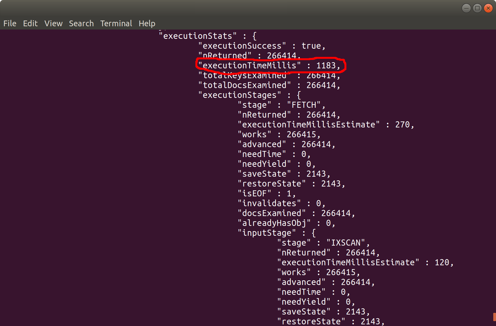

# FAST-ANALYTICS

__Ability to aggregate an average value for a common ‘total’ field occurring for a matching 25% of all X records, within Y seconds (average record size of Z KB).__

__SA Maintainer__: [Jim Blackhurst](mailto:jim@mongodb.com) <br/>
__Time to setup__: 30 mins <br/>
__Time to execute__: 15 mins <br/>


## Description

This proof  shows how MongoDB can efficiently aggregate data across a large data-set with a flexible schema, running in an Atlas database. Specifically, the first aggregation shows that an average value for a ‘total’ field occurring for __25% of 1 Million records__, can successfully complete __within 500 milliseconds__ where the __average record size is 0.4 KB__)

The proof uses a _customer bank accounts_ sample data-set from which aggregate values, such as Averages or Totals, are derived. The data-set has these fields present within sub-documents in an array of 'accounts'. For each customer document, any one of these sub-documents may, or may not be present, illustrating that the aggregation can occur without concern over documents of different shapes and sizes.

Although this proof uses Mongo Shell-based aggregation pipeline queries, these aggregations could be executed in the Visual Pipeline Builder of __MongoDB Compass__, instead.

There are actually two variations of the data-sets made available. These are provided as Mongo Dump files which can be restored to an Atlas cluster. Both data-sets are effectively the same collection of synthetic customer records from a fictional bank. The first data-set has __1 Million records__, the second data-set has __10 Million records__. 

The test aggregations will demonstrate that the following execution times can be achieved (average record sizes are 0.4KB): 

|                | 1m Documents  | 10m Documents  |
|----------------|---------------|----------------|
| Aggregation 1  |  0.5 seconds  |     6 seconds  |
| Aggregation 2  |  1.2 seconds  |    17 seconds  |
| Aggregation 3  |  0.8 seconds  |    12 seconds  | 
| Aggregation 4  |    3 seconds  |    37 seconds  | 


## Setup
__1. Configure Laptop__
* Ensure MongoDB version 3.6+ is already installed your laptop, mainly to enable MongoDB command line tools to be used (no MongoDB databases will be run on the laptop for this proof)

__2. Configure Atlas Environment__
* Log-on to your Atlas account (using the MongoDB SA preallocated Atlas credits system) and then choose either to use an existing project or to create a new project
* In the project's Security tab, choose to add a new user called __main_user__, and for User Privileges specify __Read and write to any database__ (make a note of the password you specify)
* Create an __M30__ based 3 node replica-set in a single cloud provider region of your choice, close to your current location, with default storage settings.
* In the Security tab, add a new __IP Whitelist__ for your laptop's current IP address
* In the Atlas console, for the database cluster you deployed, click the __Connect button__, select __Connect with the Mongo Shell__, and in the __Run your connection string in your command line__ section copy the connection command line - make a note of this connection command line to be used later

__3. Import Sample Data__
* Download the [customers.bson.gz](https://drive.google.com/open?id=1_1LtjT3zTeBtXA2TPtR42phE9LcWLFa9) (10 Million documents - 628Mb) or the [customers_1m.bson.gz](https://drive.google.com/open?id=1PbzMwn6-FWsidYaQwEYYb9S8A1YLHcJK) (1 Million documents - 64Mb) dump files from Google Drive, and run the following command from a terminal/shell in the same directory as the _.gz_ file, to restore it to the Atlas database (changing the host MongoDB URL address to the full *non-SRV* version shown in the Atlas Cluster's ___.../Command Line Tools__ menu option, and providing the password recorded earlier, when prompted)
  ```bash
  mongorestore --host TestCluster-shard-0/testcluster-shard-00-00-abcd.mongodb.net:27017,testcluster-shard-00-01-abcd.mongodb.net:27017,testcluster-shard-00-02-abcd.mongodb.net:27017 --ssl --username main_user --password Password1 --authenticationDatabase admin --gzip customers.bson.gz
  ```

&nbsp;&nbsp;&nbsp;*NOTE 1* If you choose the 1 Million document data set, rename *customers_1m.bson.gz* to *customers.bson.gz* before running the following command, and in the rests of this README, wherever the collection name *customers_10m* is reference, change the name used to *customers_1m*

&nbsp;&nbsp;&nbsp;*NOTE 2* You can also download the [Bank data generating script](https://github.com/jimb-cc/BankGen) and run it yourself to generate the data

__4. Create Index__
Some of the Aggregation Pipelines that will be executed will first filter the data-set based on country, and so an index should first be created based on the _country_ field belonging to each document.

From a terminal/shell, launch the Mongo Shell against the database cluster by running the first command below (changing the host MongoDB URL address and providing he password, when prompted, with the values you recorded earlier), followed by the commands to create the required index:
  ```js
  mongo "mongodb+srv://testcluster-abcd.mongodb.net/test" --username main_user
  use test
  db.customers_10m.createIndex({country:1})
  ```


## Execution

From the same Mongo Shell session used to create the indexes earlier, show an example of one of the account records:
  ```js
  db.customers_10m.findOne()
  ```

Then from this Mongo Shell session, execute each of the aggregations in this *Execution* section below...

__Aggregation 1. What is the average credit score (rankLevel) for customers in England?__

*Aggregation*:
  ```js
  db.customers_10m.aggregate([{ $match: { "country":"EN"} }, { $group: {_id: "$country", avgRank: {$avg: "$rankLevel"}} }])
  ```

&nbsp;&nbsp;_NOTE_: The proportion of records which are for the country 'EN' is 25% or slightly greater (actually 266414 records for the 1m data-set). 

The result should be similar to:
  ```json
  { "_id" : "EN", "avgRank" : 4.495924982426205 }
  ```

__Aggregation 2. What is the total value of bank's holdings in each account type in the England?__

*Aggregation*:
  ```js
  db.customers_10m.aggregate([{ $match: {"country":"EN"} }, { $unwind: {  path: "$accounts",} }, { $group: {_id: "$accounts.accountType", total: {$sum: "$accounts.balance"}} }])
  ```

&nbsp;&nbsp;_NOTE_: The proportion of records which are for the country 'EN' is 25% or slightly greater (actually 266414 records for the 1m data-set). 

The result should be similar to:
  ```js
  { "_id" : "Mortgage", "total" : -111264379917.01 }
  { "_id" : "Savings", "total" : 37973829103.02 }
  { "_id" : "ISA", "total" : 37842003995.77 }
  { "_id" : "Current", "total" : 7299579827.89 }
  ```

__Aggregation 3. What is the average credit score (rankLevel) for customers across all the bank's operating territories, sorted by highest credit score first__

*Aggregation*:
  ```js
  db.customers_10m.aggregate([{ $group: {_id: "$country", avgRank: {$avg: "$rankLevel"}} },{$sort:{"avgRank":-1}}])
  ```

The result should be similar to:
  ```json
  { "_id" : "DN", "avgRank" : 4.499913779271937 }
  { "_id" : "PT", "avgRank" : 4.499837366201849 }
  { "_id" : "ES", "avgRank" : 4.499768091490534 }
  { "_id" : "EN", "avgRank" : 4.499717220449537 }
  { "_id" : "IT", "avgRank" : 4.498204011689652 }
  { "_id" : "FR", "avgRank" : 4.497076997785138 }
  { "_id" : "DE", "avgRank" : 4.497012429283665 }
  { "_id" : "SE", "avgRank" : 4.496934744516999 }
  { "_id" : "GR", "avgRank" : 4.495924982426205 }
  ```

__Aggregation 4. Which countries have the most products with the bank.__

*Aggregation*:
  ```js
  db.customers_10m.aggregate([{$project: {country: 1, numProducts: { $size: "$accounts" }}},{ $group: {_id: "$country", productCount: {$sum: "$numProducts"}} },{$sort:{"productCount":-1}}])
  ```

The result should be similar to:
  ```json
  { "_id" : "EN", "productCount" : 6220517 }
  { "_id" : "IT", "productCount" : 3116449 }
  { "_id" : "DE", "productCount" : 3114276 }
  { "_id" : "FR", "productCount" : 3106767 }
  { "_id" : "PT", "productCount" : 1557275 }
  { "_id" : "DN", "productCount" : 1556009 }
  { "_id" : "ES", "productCount" : 1554960 }
  { "_id" : "GR", "productCount" : 1553926 }
  { "_id" : "SE", "productCount" : 1553642 }
  ```


## Measurement

Inserting `.explain("executionStats")` between the collection name and `.aggregate` will allow you to see the execution time for the aggregation. For example:

  ```js
  db.customers_10m.aggregate([{ $group: {_id: "$country", avgRank: {$avg: "$rankLevel"}} },{$sort:{"avgRank":-1}}])
  ```
becomes:
  ``` js
  db.customers_10m.explain("executionStats").aggregate([{ $group: {_id: "$country", avgRank: {$avg: "$rankLevel"}} },{$sort:{"avgRank":-1}}])
  ```

Below shows an example of where to see the aggregation' execution time in the _explain_ output:



