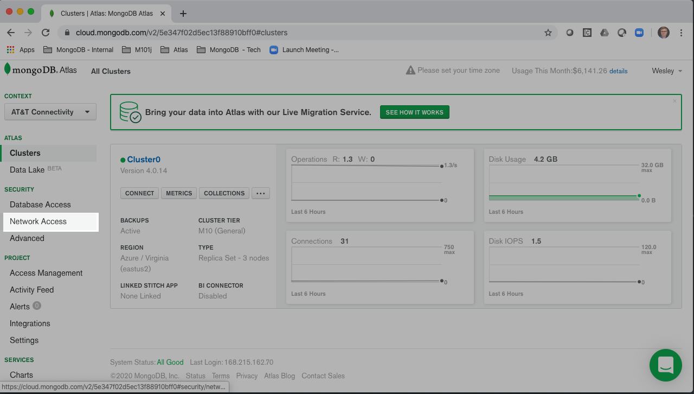
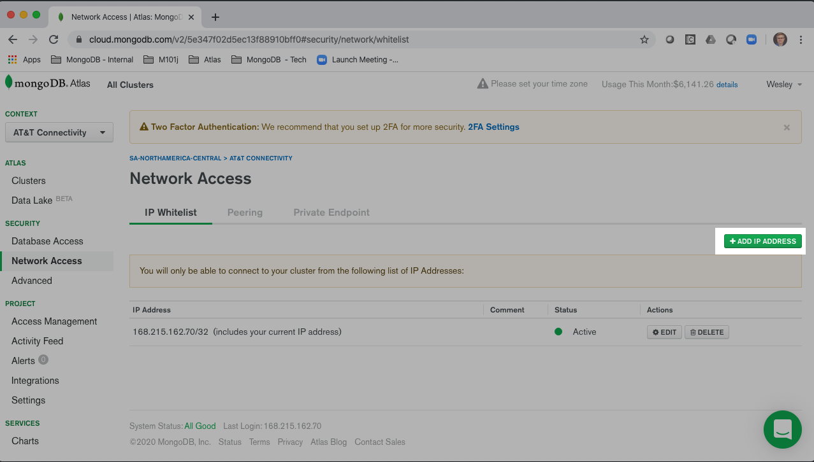
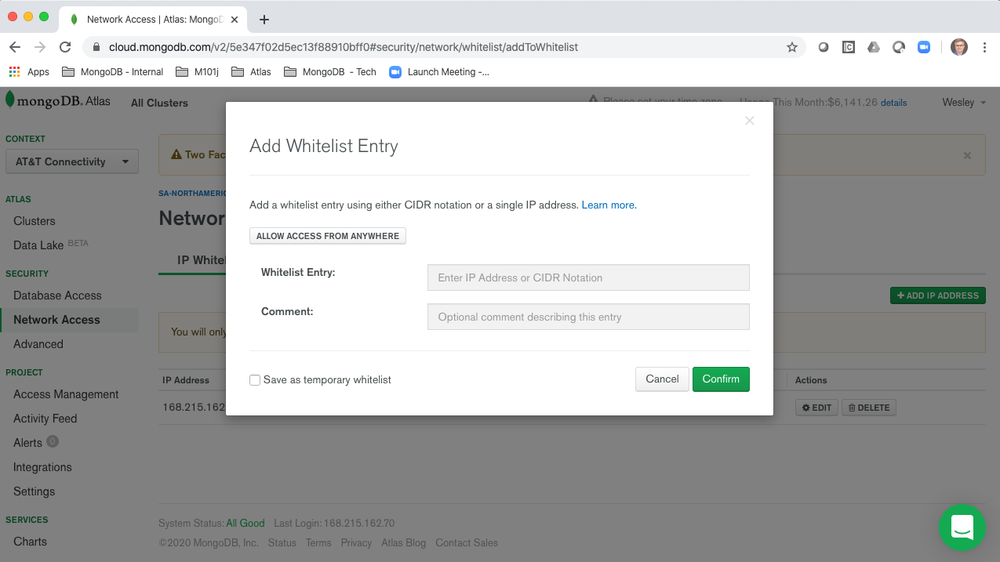
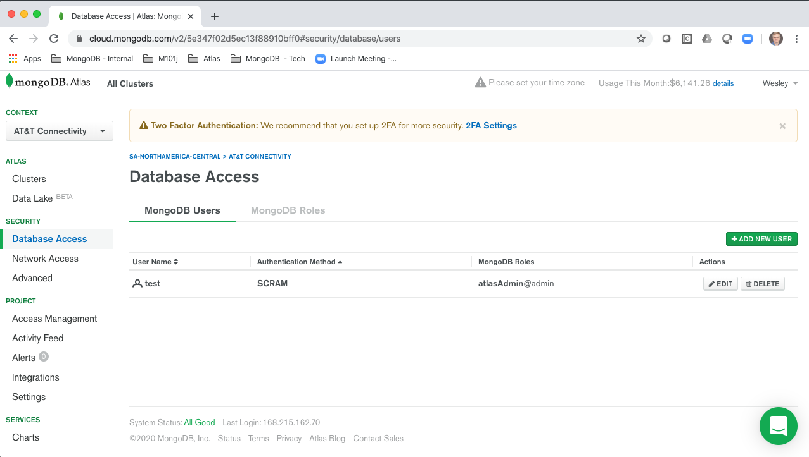
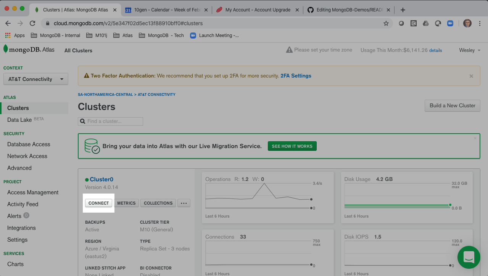
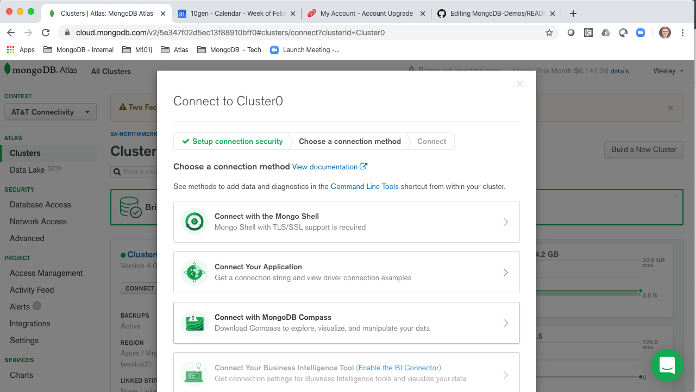
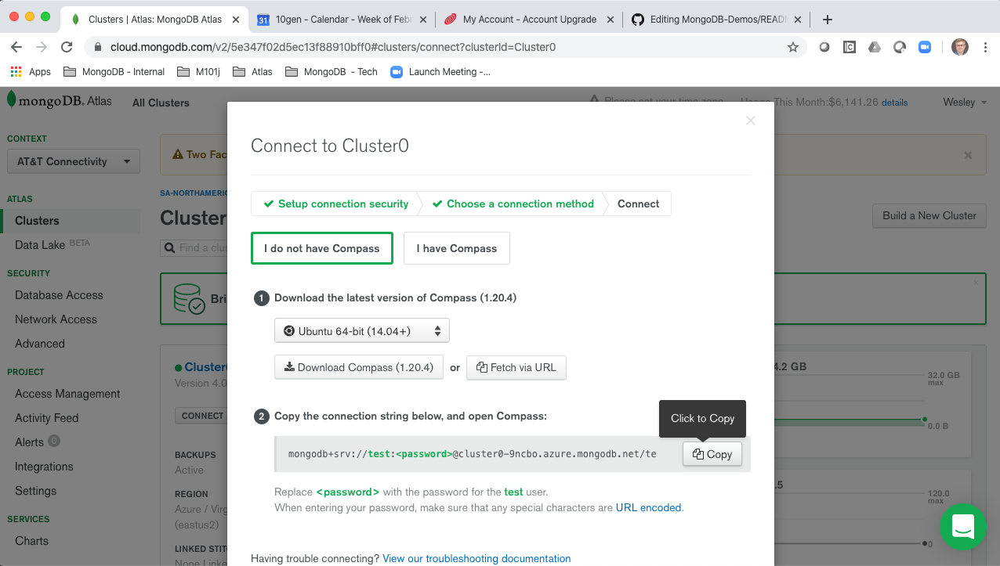
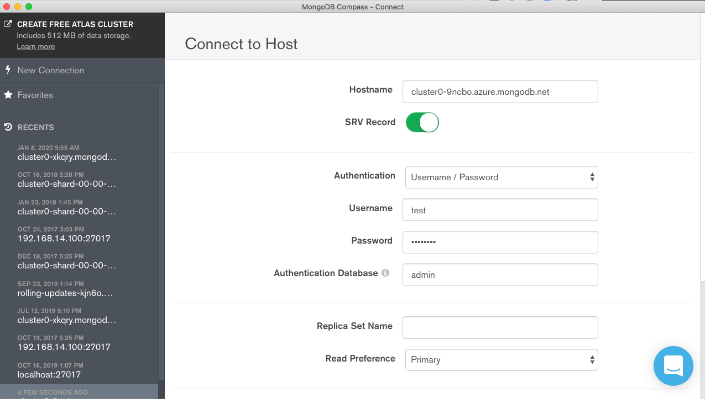

# Connecting to an Atlas instance from MongoDB Compass

Complete the registration process by clicking the link sent to your email address.  You have been given project owner permissions which gives you full control to perform the following steps.

## Log in
Go to https://cloud.mongodb.com   
and login with the username of your email address and the use the password you specified during registration.  In order to connect compass to the database you will need to configure network access and create a database user.

## 1. Network Access
Click the __"Network Access"__ menu item from the left hand navigation menu under the __"Security"__ header.

   

Click the __"Add IP Adress"__ button on the far right.

  

Add in the IP Address and CIDR information

  

## 2. Create a user for Database Access
Click the __"Database Access"__ menu item from the left hand navigation menu under the __"Security"__ header.   

  

Create a new user, password and assign roles.  In the example above we created a __"test"__ user with admin priviliges.

## 3. Copy the connect string information from the Atlas Console
Click the __"Connect"__ button from the top cluster view in the Atlas console.   

 

The list of connection methods are shown.  We select connect "Connect with MongoDB Compass"__   

 

We click the copy button to copy the connect string as seen below:   

 

## 4. Connect via Compass
Open Compass, it sould automatically detect the connect string in the windows copy buffer.  If it does not fill in the information as shown below.  Note that the __"Authentication Database"__ should be __"admin"__ and not __"test"__.

 

## 5. Create Scripts that call the API
Everything done above can be scripted through the Atlas API the over all refernce is listed below:   
https://docs.atlas.mongodb.com/reference/api-resources/

For database users:   
https://docs.atlas.mongodb.com/reference/api/database-users/

For IP Whitelist Network Access:  
https://docs.atlas.mongodb.com/reference/api/whitelist/

