# Customer MDM Single View Application
_Solution Architect_: [Britton LaRoche](mailto:britton.laroche@mongodb.com)   
_Consulting Engineer_: [Andre Spiegel](mailto:andre.spiegel@mongodb.com)   

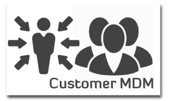

## Tutorial Contents 
(Note: This prototype lab is hands on and should take an estimated time of less than 120 minutes)
1. [Overview](#-overview)
2. [Create the Atlas Cluster](#-create-the-atlas-cluster)
3. [Create the Stitch Application](#-create-the-stitch-application)
4. [Adding customer source data through a REST based API](#-adding-customer-source-data-through-a-rest-based-api)
5. [Testing the REST based API](#-testing-the-rest-based-api)
6. [Matching the proper Master document](#-matching-the-proper-master-document)
7. [Creating and updating the master document](#-creating-and-updating-the-master-document)
8. [The trigger for change](#-the-trigger-for-change)
9. [Accessing customer Master data](#-accessing-customer-master-data)
10. [QueryAnywhere web application](#-QueryAnywhere)
11. [Host the web application](#-host-the-web-application) 
12. [GitHub and CI/CD Integration](#-github-and-cicd-integration)

##  Overview 
We've been hired by a fictitious auto manufacturing company called "Katana" to build a single view for a customer MDM application prototype.  Katana has a global market place consisting of automobile dealerships, online websites, and financial services for its customers of its two major brands. __"Katana"__ motors sells quality family vehicles, and its high end luxury brand __"Legacy"__ sells high performance extreemly high end luxury vehicles.  Each brand has its own set of dealerships and systems that repersent the customer in a variety of different ways.  Katana may have the same customer or the same customer household buying both brands and is unaware that these two apparently different customers may be the same individual buying cars for the same household.

  

You have been tasked to create a minimum viable product (MVP), a basic protype, of a single view for a customer MDM application across all dealerships and online sites for both Kanakata and Legacy brands. They wish to test both the functionality and performance of the application.  The functionality includes identifying a single customer from all systems and providing customer updates in real time to their third party dealerships and financing division.  

  

Additionally Katana motors has been given the task of removing sensitive customer data from all its related transactional systems. The California Consumer Privacy Act (CCPA) and the Nevada Consumer Privacy Law requires Katana to remove all customer data from its many transactional systems if a customer "opts out" and does not want their identifiable data inside Katana.  The intent of this new design is to change all the source systems to identify the customer through a unique token generated in the Customer MDM and use only the token in all the related transactions.  When a transactional source system needs to display customer information it will request that information via a rest based API to the Customer MDM application.  Should the customer opt out of Katana then only one system, the customer MDM, will need to remove the customer identifiable data.

The desire is to have a serverless REST based API layer to service the myriad of transactional systems that will not require any maintenance, and can scale automatically as demand increases with out human intervention.

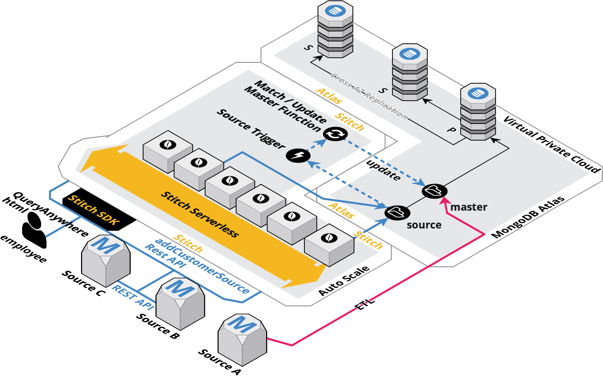

Customer data will be loaded into the Customer MDM as new customers come into the website and sign up for promotional offerings.  Customer data will also come into the Customer MDM with nightly batch loads from Katana financial services for the previous days loan applications.  The two different dealerships also load prospective customers and customer purchase data when a vehicle is taken for a test drive or purchased.  All of these websites and dealerships have a variety of data formats.

Our job is to ingest data from all these sources and both preserve a record of the data as it exists in each of these systems as well as a master copy that reconciles the customer into a single view and golden source of truth across all of the systems.

## Data Flow
A basic data flow diagram was put together to solve the MDM problem.  The dealerships used a legacy system (source system A) which requires a nightly batch process and an ETL program to load data into MongoDB.  The Katana and Legacy online services (source systems B and C) have the ability to use a REST API and send JSON documents in real time.

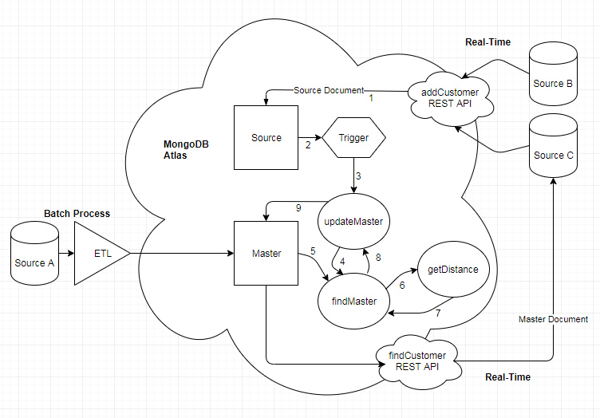  

MongoDB has three colections to manage the customer data.  As data comes in from the various sources they are loaded into a __"source"__ collection.  A matching function is used to find a matching master customer document based on specified rules and criteria found in the source document. If a match is found the source record is added to the array of source records in the master document and the master data fields are updated based on the latest changes reflected in the source document. If no matching master record is found the source record becomes the master data and a new master record is inserted into the __"master"__ collection.

## Sample Customer Document
Lets take a look at one of the documents produced from this process. The master document has all the information relevant to the customer.  The master object has the fields that were selected from all the source systems.  Each of the source systems are listed in an array with the data as it currently is in each of the source systems.  We notice a few descrepancies between each of the systems. The email and physical addresses are different in some cases, for example her first name was misspelled at the dealership.

```js
{
  "master": {
    "first_name": "CRYSTAL",
    "middle_name": "RACHAEL",
    "last_name": "POSEY",
    "gender": "FEMALE",
    "dob": "1977-04-02",
    "address": [
      {
        "street": "5438 LINCOLN DRIVE",
        "city": "PASADENA",
        "state": "CA",
        "zip": "91106"
      }
    ],
    "phone": "+13976946512",
    "email": "kezzo@myant.com"
  },
  "sources": [
    {
      "_id": "A-00150411",
      "first_name": "KRYSTAL",
      "middle_name": "RACHAEL",
      "last_name": "POSEY",
      "gender": "FEMALE",
      "dob": "1977-04-22",
      "address": {
        "street": "1432 PALOMA DRIVE, APT. 421",
        "city": "PASADENA",
        "state": "CA",
        "zip": "91106"
      },
      "phone": "+13976946512",
      "email": "kezzom@gmail.com"
    },
    {
      "_id": "B-03166091",
      "first_name": "CRYSTAL",
      "middle_name": "RACHAEL",
      "last_name": "POSEY",
      "gender": "FEMALE",
      "dob": "1977-04-22",
      "address": {
        "street": "5438 LINCOLN DRIVE",
        "city": "PASADENA",
        "state": "CA",
        "zip": "91106"
      },
      "phone": "+13976946512",
      "email": "kezzo@myant.com"
    },
    {
      "_id": "C-07164051",
      "first_name": "CRISTAL",
      "middle_name": "RACHAEL",
      "last_name": "POSEY",
      "gender": "FEMALE",
      "dob": "1977-04-22",
      "address": {
      "street": "5348 LINCOLN DRIVE",
      "city": "PASADENA",
      "state": "CA",
      "zip": "91106"
      },
      "phone": "+13976946512",
      "email": "kezzo@yahoo.com"
    }
  ]
}
```

The above document can be translated into rows and columns with ease using html, javascript sna stitch QueryAnyWhere functionality.  Below we see this same document represented with rows and columns for the source data.

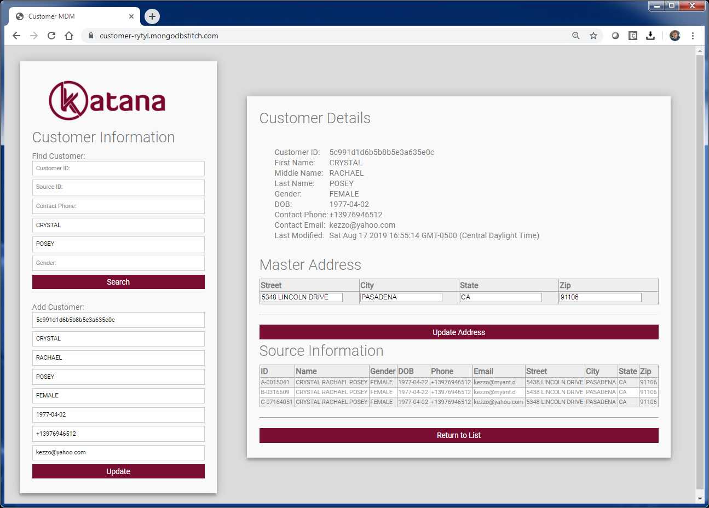   
The live prototype with 2,000,000 sample records is hosted in Stitch and can be accessed here:   
https://customer-rytyl.mongodbstitch.com/

This hands on lab will cover the entire process (except the ETL process) in the data flow diagram. We will create the REST API that allows the source data to be inserted from the micro services. We will create the basics of the grouping and mastering functions. 

We will create some additional components as well.  We will create a REST API service that will allow the master document to be queried and updated, with new source data merged and split as needed.  We will create a web based browser that uses the stitch SDK to create a broswer client with the full capabilities of stitch QueryAnywhere to access and manage the customer master data.

The entire project will be created and hosted in the cloud.  All of the functions, triggers and procedures will run in Stitch as serverless compute.  The data will reside in Atlas and be accessed via database as a service.  The power behind this solution offers an auto scalable maintenace free implementation of a Customer MDM.

Where do we begin?

Lets assume System B is Katana's online service.  When a user designs the car they wish to purchase on Katana's online website, by selecting the model number, color, engine size etc... they are given the opportunity of registering their customer information and saving the selection in their profile.  When they save their customer profile the Katana online service sends a json document through a REST API represnting the customer profile information to MongoDB stitch.

Below is an example of this customer profile json document.

```js
    {
      "_id": "B-04227551",
      "first_name": "MARION",
      "middle_name": "ANITA",
      "last_name": "COLE",
      "gender": "FEMALE",
      "dob": "1980-02-08",
      "address": {
        "street": "4620 FRANKLIN STREET",
        "city": "SANTA ROSA",
        "state": "CA",
        "zip": "95409"
      },
      "phone": "+14823008921",
      "email": "ox@tjwq.com"
    }
```

Due to the CCPA laws, Katana wishes to store this document in their MongoDB Customer MDM and only the customer id value and car selections in System B. All personal data relating to the customer will be stored only in the customer MDM. Anytime system B needs customer information it will make a REST API call to the MDM. When a new customer signs up he or she will enter personal information online and the personal information will be sent to the customer MDM via a REST based API. Upon insert into the MDM database a unique customer token will be generated and sent back to system B.  This token will be used for all customer transactions in system B, and system B will never store the customer's personal information.

Our first step is to create a stitch HTTP service to recieve the customer source data and store it in MongoDB. MongoDB has a servless compute capability to provide a REST based API called stitch. To create the Stitch service, we must begin by creating a Stitch application.  Before creating a stitch application we need to have an Atlas cluster set up to recieve the document.  Lets begin by creating an Atlas cluster.

[Tutorial Contents](#tutorial-contents)


##  Create the Atlas cluster

Open a modern browser (like google chrome) and go to https://cloud.mongodb.com.  Register for an atlas account by clicking the __"get started free"__ button.

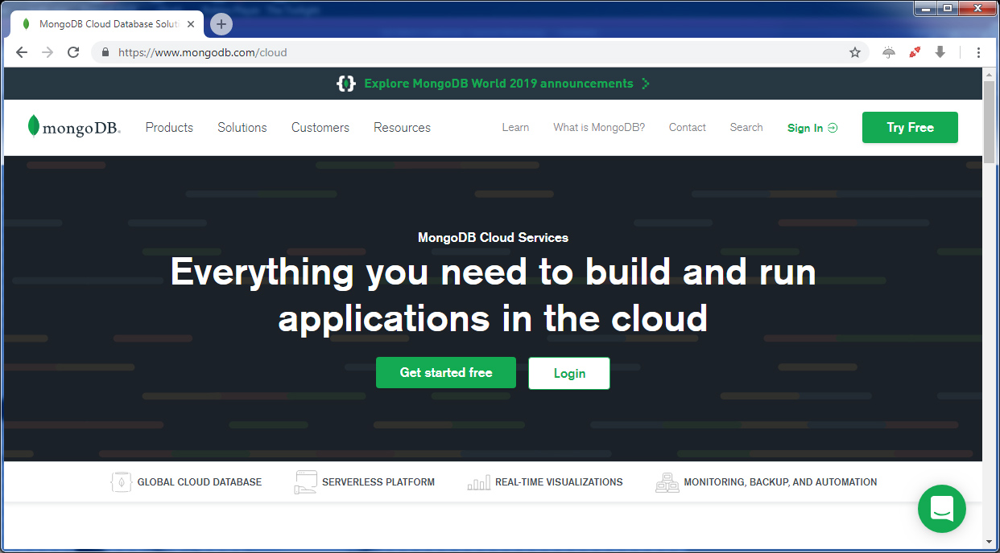

Click the __"get started free"__ button.  This will bring up a screen for you to enter your personal information.

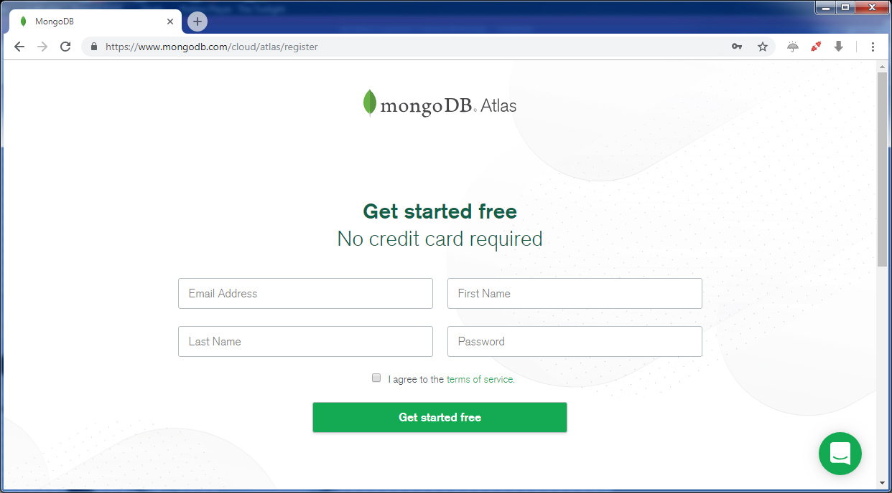   

Fill in your personal information.  Feel free to use your work or personal email address, either is fine as this is your personal "free for life" development environment.  Agree to the terms of service and click the __"get started free"__ button.  

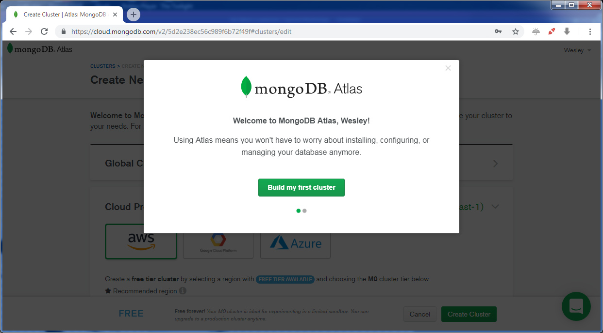   

This will bring up a window prompting you to build your first cluster.  Click the __"build your first cluster"__ button.  When prompted select "Learning MongoDB" as to the reason you are interested in Atlas. After clicking the Click the __"build your first cluster"__ button, you will be prompted to name your cluster.  "

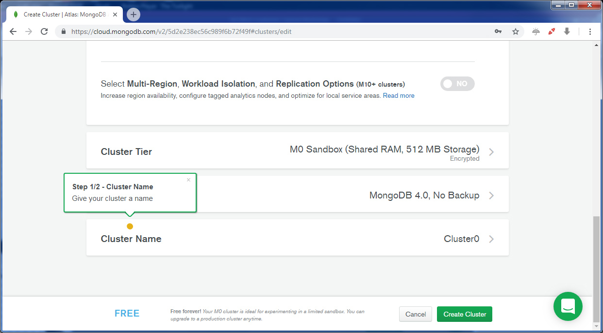   

__"Cluster0"__ is the default name and works well for importing data and projects later. Click the __"Create Cluster"__ button at the bottom and your cluster will be ready in the next 7 to 10 minutes.   

[Tutorial Contents](#tutorial-contents)
   

##  Create the Stitch Application

Next we will create our fist Stitch application. This task is accomplished by selecting __"Stitch"__ from the left hand navigation menu of the cluster we just created.

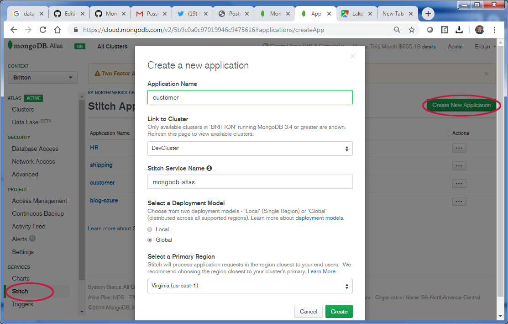

We click the large green button labeled __"Create new Application"__ and give the application a name.  In this case we will name our application __"customer"__   

Click the little green __"Create"__ button in the lower right hand of the popup window.  The stitch application console will appear as soon as the application has been created and linked with the cluster. 


[Tutorial Contents](#tutorial-contents)
   

##  Adding customer source data through a REST based API

When the customer saves their profile the Katana online service sends a json document through a REST API representing the customer profile information to MongoDB stitch.  We need to create a service that will receive the customer profile as a json document.  

Select the __"Services"__ menu item from the left naviagtion pane of the stitch console.  Click the __"Create New Service"__ button.  Select __"HTTP"__ service and give the service a name of __addCustomerSource__

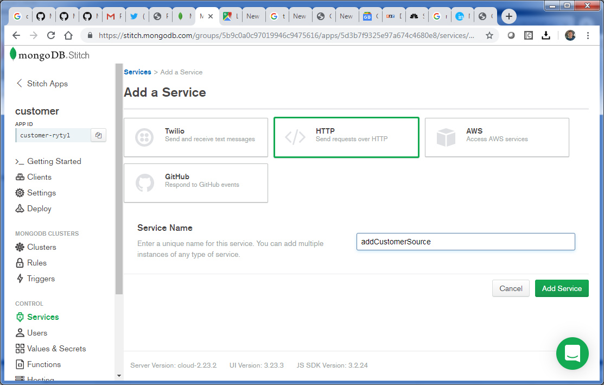

Click the add service button.  This will present the webhook editor.

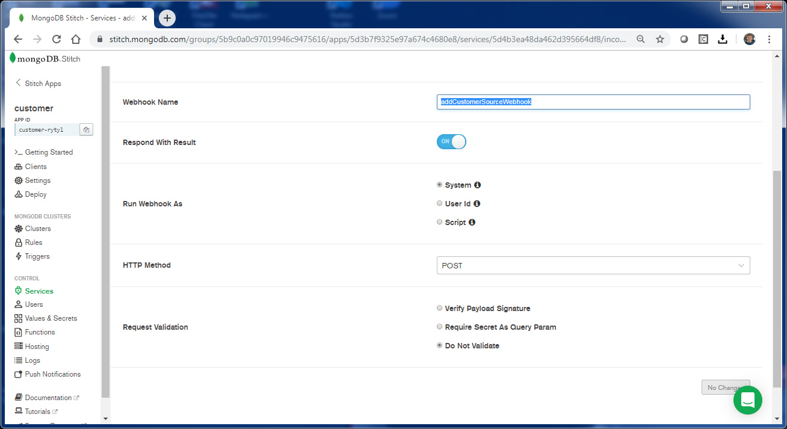

Fill in the appropriate fields.  Name the webhook __addCustomerSourceWebhook__ and make sure respond with result is set to __"ON"__. We will need the result of the operation returned to the calling program to make sure that the REST base API call was successful.  We will be sending a json document in the body of the request so we want this to be an HTTP Method of __POST__.  

We have not set up a validation method yet so lets start with __"Do Not Validate"__ for the request valdiation.  There are a number of ways to validate the request using java web tokens, API keys etc... and this should be done before putting any application or service like this into production.  For now we are building a simple prototype so we will procede with a quick soltion.

Name: __addCustomerSource__  
Respond with Result: __ON__   
HTTP Method: __POST__   
Request Validation:  __Do not validate__  

Click the save button and the function editor for the webhook will appear.  Cut and paste the code below and save the webhook function.

```js
exports = async function(payload) {
  var source = context.services.get("mongodb-atlas").db("single").collection("source");
  console.log("Executing addCustomerSourceWebhook");
  var queryArg = payload.query.arg || '';
  var body = {};
  var voptout = "";
  var result = { "status": "Unknown: Payload body may be empty"};
  
  if (payload.body) {
    body = EJSON.parse(payload.body.text());
    console.log(JSON.stringify(body));
    var nDate = new Date();
    if (body.optout) {
      voptout = body.optout;
    }
    //check the source_id
    if ( body._id ) {
        console.log("updating customer source document");
        result = await source.updateOne(
          {_id: body._id},
          {$set: {
              first_name: body.first_name,
              middle_name: body.middle_name,
              last_name: body.last_name,
              gender: body.gender,
              dob: body.dob,
              address: [{
                street: body.address.street,
                city: body.address.city,
                state: body.address.state,
                zip: body.address.zip
              }],
              phone: body.phone,
              email: body.email,
              optout: voptout,
              last_modified: nDate
              }
          },
          {upsert: true}
        );
        console.log("after update");
        
    } else {
      result = { "status": "Error: source _id is not present"};
      return result;
    }
  }
  return  result;
};
```
Notice two key words: __"await"__ and __"async"__. These key words are important as they tell stitch to wait for a response from the database before sending the results back to the calling application. The function is declared as async and the await is used when accessing the database.

Lets review the code above. We define the database and collection we are using with the following statment.  We connect to the database named __"single"__ and to the collection named __"source"__

```js
var source = context.services.get("mongodb-atlas").db("single").collection("source");
```

Next we parse the payload body,   

```js
body = EJSON.parse(payload.body.text());
```

We check for required fields and store then store all the specific fields into the database using an upsert defined in the MongoDB query language (MQL).  

```js
 result = await source.updateOne(
  {_id: body._id},
  {$set: {
      first_name: body.first_name,
      middle_name: body.middle_name,
      last_name: body.last_name,
      gender: body.gender,
      dob: body.dob,
      address: {
	street: body.address.street,
	city: body.address.city,
	state: body.address.state,
	zip: body.address.zip
      },
      phone: body.phone,
      email: body.email,
      optout: voptout,
      last_modified: nDate
      }
  },
  {upsert: true}
);
```

Notice two key words: __await__ and __async__.  These key words are important as they tell stitch to wait for a response from the database before sending the results back to the calling application.  The function is declared as __async__ and the __await__ is used when accessing the database.

Now that we have created our webhook and function we are ready to test it.   

[Tutorial Contents](#tutorial-contents)
   

##  Testing the Rest based API
We can simulate a REST based API call from the source system B into our newly created webhook.  We can use [postman](https://www.getpostman.com/downloads/) or we can use our own postrapper.html file.  If you do not have postman or if your ports have been blocked internally from using it, we have found that our simple [postrapper.html](html/postrapper.html) file works quite well. 

Right mouse click the link [postrapper.html](html/postrapper.html) and open in a new tab you can copy and paste the text into a text editor of your choice and save the file as postrapper.html on your local drive.  Open the file in your browser by double clicking and you are ready to begin your test.  

Atlernatively you can use a hosted version of postrapper here:   
https://customer-rytyl.mongodbstitch.com/postrapper.html

Our first step is to go to the __"Settings"__ tab in the __addCustomerSourceWebhook__ editor.    If the __addCustomerSourceWebhook__ you can open it by selecting __"Services"__ from the left hand navigation menu on the stitch console pane.  It will bring up a list of services.  Select the __addCustomerSource__ service and then the __addCustomerSourceWebhook__ webhook, this will open the function editor. When the function editor is open click the __"Settings"__ tab in the upper left and the webhook settings will be displayed as below.   

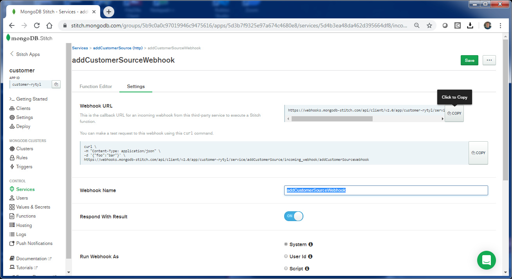

We look for the __"Webhook URL"__ and click the copy button.  We paste this value into the __"URL"__ input field of the postrapper.html file.  

Below is an example of this customer profile json document that will be sent to us from a source system.

```js
    {
      "_id": "B-04227551",
      "first_name": "MARION",
      "middle_name": "ANITA",
      "last_name": "COLE",
      "gender": "FEMALE",
      "dob": "1980-02-08",
      "address": {
        "street": "4620 FRANKLIN STREET",
        "city": "SANTA ROSA",
        "state": "CA",
        "zip": "95409"
      },
      "phone": "+14823008921",
      "email": "ox@tjwq.com"
    }
```
Copy the customer source json document above and paste it into the postrapper __"Input Document"__ text area of postrapper and hit send.  You should see something like the following:

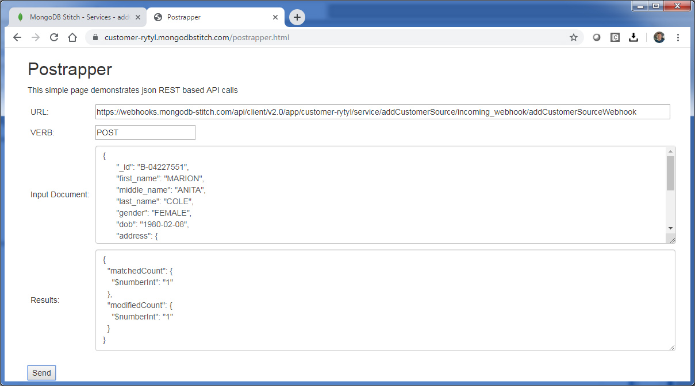

Notice the results information shows the matched count for an update or the infomation on an insert.  Our REST based API call worked!  Lets see the document in the database.  Open another tab and access your cluster through https://cloud.mongodb.com on the cluster information window select "Collections"   

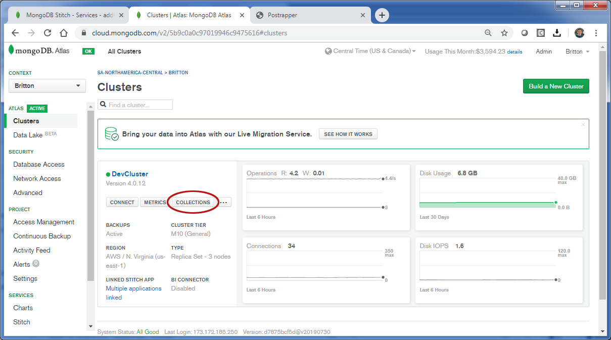

Navigate to the __"single"__ database and select the __"source"__ collection to view the document.

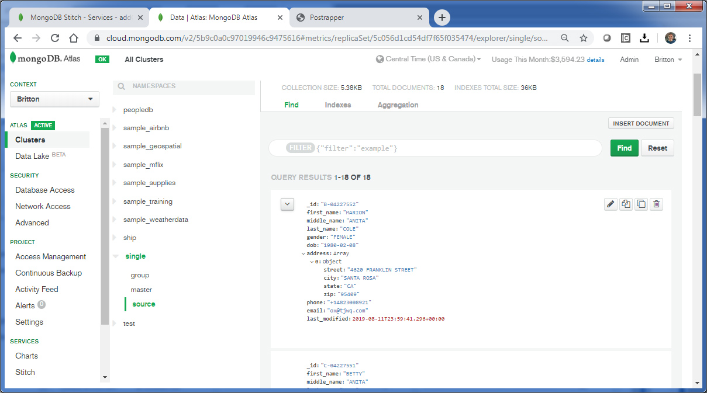

Later we can test the "opt out" functionality by setting a field __"optout"__ to true.  This will remove data from the master document and the source system that the user chose to opt out of.  Later we can enhance the function to opt out of all source systems.  

```
    {
      "_id": "B-04227551",
      "optout": "true",
      "first_name": "MARION",
      "middle_name": "ANITA",
      "last_name": "COLE",
      "gender": "FEMALE",
      "dob": "1980-02-08",
      "address": {
        "street": "4620 FRANKLIN STREET",
        "city": "SANTA ROSA",
        "state": "CA",
        "zip": "95409"
      },
      "phone": "+14823008921",
      "email": "ox@tjwq.com"
    }
```   

[Tutorial Contents](#tutorial-contents)
   

##  Matching the proper Master Document
Our next step is to master all the source documents together based on a series of rules about customer attributes.  For this prototype we will consider the values of 4 fields: source id, date of birth, first name and last name.

To compare these field values between documents we will use the Levenshtein distance.  In information theory, linguistics and computer science, the Levenshtein distance is a string metric for measuring the difference between two sequences. Informally, the Levenshtein distance between two words is the minimum number of single-character edits (insertions, deletions or substitutions) required to change one word into the other. It is named after the Soviet mathematician Vladimir Levenshtein, who considered this distance in 1965.

We will use this implementation of the Levenshtein distance by Andrei Mackenzie written in javascript in 2011.
https://gist.github.com/andrei-m/982927

Lets begin by creating our own getDistance function in stitch.  From the left hand navigation pane in the Stitch console select __"Functions"__.  When the function editor appears give the function the name __"getDistance"__ and click save.

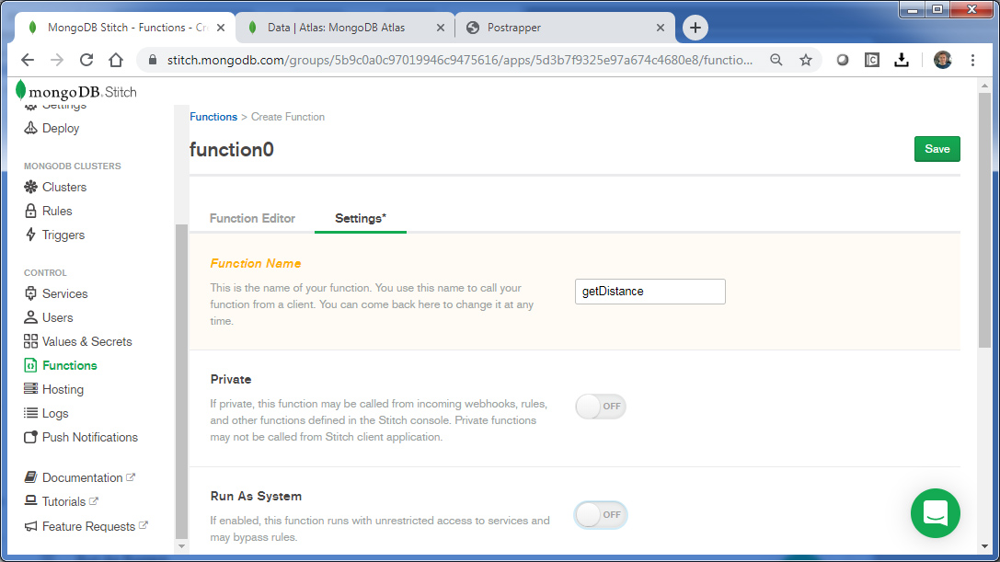

The function editor appears next, copy and paste the code below and click save.

__getDistance__
```js
exports = function(a,b){

  /*
Copyright (c) 2011 Andrei Mackenzie
Permission is hereby granted, free of charge, to any person obtaining a copy of this software and associated documentation files (the "Software"), to deal in the Software without restriction, including without limitation the rights to use, copy, modify, merge, publish, distribute, sublicense, and/or sell copies of the Software, and to permit persons to whom the Software is furnished to do so, subject to the following conditions:
The above copyright notice and this permission notice shall be included in all copies or substantial portions of the Software.
THE SOFTWARE IS PROVIDED "AS IS", WITHOUT WARRANTY OF ANY KIND, EXPRESS OR IMPLIED, INCLUDING BUT NOT LIMITED TO THE WARRANTIES OF MERCHANTABILITY, FITNESS FOR A PARTICULAR PURPOSE AND NONINFRINGEMENT. IN NO EVENT SHALL THE AUTHORS OR COPYRIGHT HOLDERS BE LIABLE FOR ANY CLAIM, DAMAGES OR OTHER LIABILITY, WHETHER IN AN ACTION OF CONTRACT, TORT OR OTHERWISE, ARISING FROM, OUT OF OR IN CONNECTION WITH THE SOFTWARE OR THE USE OR OTHER DEALINGS IN THE SOFTWARE.
*/

// Compute the edit distance between the two given strings

  if(a.length == 0) return b.length; 
  if(b.length == 0) return a.length; 

  var matrix = [];

  // increment along the first column of each row
  var i;
  for(i = 0; i <= b.length; i++){
    matrix[i] = [i];
  }

  // increment each column in the first row
  var j;
  for(j = 0; j <= a.length; j++){
    matrix[0][j] = j;
  }

  // Fill in the rest of the matrix
  for(i = 1; i <= b.length; i++){
    for(j = 1; j <= a.length; j++){
      if(b.charAt(i-1) == a.charAt(j-1)){
        matrix[i][j] = matrix[i-1][j-1];
      } else {
        matrix[i][j] = Math.min(matrix[i-1][j-1] + 1, // substitution
                                Math.min(matrix[i][j-1] + 1, // insertion
                                         matrix[i-1][j] + 1)); // deletion
      }
    }
  }

  return matrix[b.length][a.length];
};
```

The function above will compare two strings and calculate the number of changes needed between them to make them equal.  For example calling getDistance('BOB', 'BIB') would return 1 as we need to change one letter "O" to "I" to go from "BOB" to "BIB".  Calling getDistance('BOB', 'TIM')  would return 3, as all 3 letters are different.  What we need is a ratio of the number of changes to make compared to the total number of letters.

Lets repeat the steps above and create a new function that takes the result from get distance and divides it by the maximum number of letters for both strings.

__getNormalizedDistance__
```js
exports = function(a,b){
  var result = context.functions.execute("getDistance", a,b);
  var maxLength = Math.max (a.length, b.length);
	return result / maxLength;
};
```

Notice how we call the getDistance function from inside the getNoramlizedDistance function.

Now we will test the functions.  Click the __"Console"__ tab on the bottom left of the function editor for getNormalizedDistance. Lets say we have a customer named Robert who goes by both "ROB" and "BOB".  Lest give this real world example a test.  We will change the sample __"exports('Hello World')"__ to __"exports('BOB', 'ROB')"__

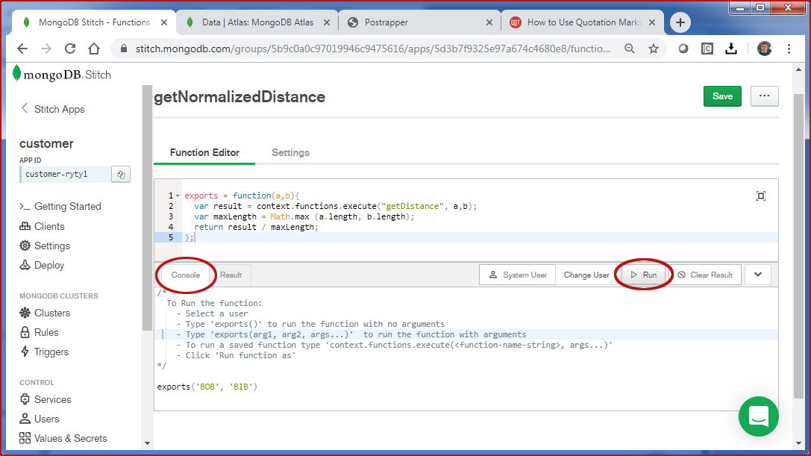

The results should be as follows:   

```
> ran on Sat Aug 17 2019 16:01:27 GMT-0500 (Central Daylight Time)
> took 520.675421ms
> result: 
{
  "$numberDouble": "0.3333333333333333"
}
> result (JavaScript): 
EJSON.parse('{"$numberDouble":"0.3333333333333333"}')

```
It appears that 0.33 is a good cutt off point for a match on three letter names.  Perhaps we can set an upper threshold of 0.4 to identify a name as possibly being the same.

Lets use this test to determine if we have a matching master document.  The easiest test is to query the master collection for an existing source_id field.  Since this field is expected to be unique its an easy test.

```js
  masterDoc = await master.findOne({"sources._id": argSource._id});
  if (masterDoc){
    if (masterDoc.master){
      return masterDoc;
    } 
  }
```

The code above queies the master collection for a document with an array of source documents that has a matching source_id value to the argument document's source_id passed in to the function.  If we get a matching document and it has a master object, great we found a match.  We return the document.

If we don't get a match we need to query the master collection for all the documents that match a specific date of birth.  Once we get the array of matching documents back we loop through each document and see if we can find a mathcing first and last name.  The date of birth and name comparison is the second find master query in the function below:

__findMaster__
```js
exports = async function(argSource){
  var masterDoc = {};
  var masterDoc2 = {};
  var lowestDistance = 1;
  var closestMaster = {};
  var searchString = "";
  var vfound = 0;
  var sourceCount = 0;
  var fdist = 1;
  var ldist = 1;
  var cdist = 1;

  var master = context.services.get("mongodb-atlas").db("single").collection("master");
  
  console.log("findMaster 1");
  masterDoc = await master.findOne({"sources._id": argSource._id});
  if (masterDoc){
    if (masterDoc.master){
      return masterDoc;
    } 
  }
  console.log("findMaster 2");
  // Try to find an existing master document. 
  // Search by the date of birth and compare first and last names
  var masterDocList = await master.find({"master.dob": argSource.dob}).toArray()
  .then( docs => {
      docs.map(c => {
        if(c.sources){
          c.sources.forEach( function(testSource){
            if (testSource.first_name &&  testSource.last_name) {
                fdist = context.functions.execute("getNormalizedDistance", argSource.first_name,testSource.first_name);
                ldist = context.functions.execute("getNormalizedDistance", argSource.last_name,testSource.last_name);
                cdist = (0.5 * fdist) + (0.5 * ldist);
            } else {
              //cant match on empty value
              cdist = 1;
            }
            //console.log("testSource._id: " + testSource._id + ", ts first_name: " + testSource.first_name + ", ts last_name: " + testSource.last_name + ", cdist: " + cdist);
            if (cdist < 0.4) {
              console.log("Found Group Matching Names and DOB: " + JSON.stringify(c));
              masterDoc2 = c;
            } 
          });
        }
      });
  });
  
  //console.log("Final sourceList: " + JSON.stringify(sourceList));
  return masterDoc2;

};
```

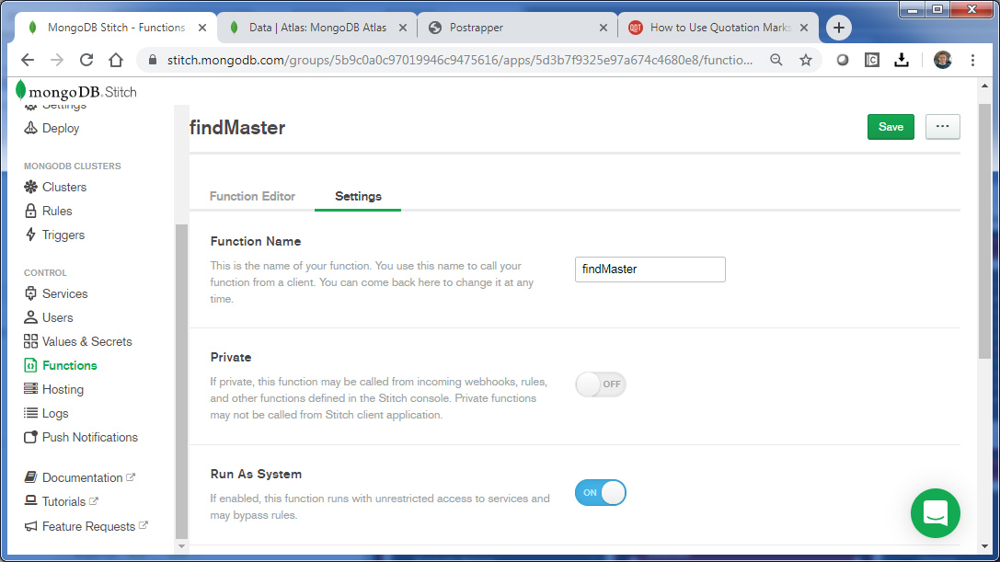

Create the __"findMaster"__ function by selecting the __"Functions"__ menu item form the left navigation pane.  Click the __"Create New Function"__ button and name the function __"findMaster"__.  Make certain to run on the __"Run as System"__ toggle so we can access the master collection.  Save the function and copy and paste the code above into the function editor and then save the changes.
[Tutorial Contents](#tutorial-contents)
   

##  Creating and updating the master document

The master document has one object called master that contains all the information.  It has an array adresses for the customer information.  The array allows the master object to reflect multiple addresses in the source system if desired.  The source object imbeded in the master documents sources array on the other hand has a single object for the address.  This is a design decision made for ease of use.  We can create a function to convert from an array of adresses to a single object.  We simply pick the last address in the array.  Our philosophy is the last update contains the most up to date information.

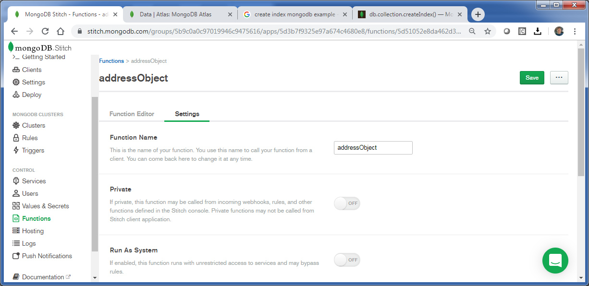  

Create a new function called __addressObject__ in the stitch console and copy past the code below and save it.

__addressObject__
```js
exports = function(source){
  //Master has an array of adresses
  //Source has an adress object
  var copy = {};
  var addressCopy = {};
  if (source) {
      copy._id = source._id;
      copy.first_name = source.first_name;
      copy.middle_name = source.middle_name;
      copy.last_name = source.last_name;
      copy.gender = source.gender;
      copy.dob = source.dob;
      copy.phone = source.phone;
      copy.email = source.email;
      if (source.address) {
        if (Array.isArray(source.address)) {
          source.address.forEach(function(myAddress) {
            //copy the address for each element
            //overwrite with the value from the last element
            addressCopy =  myAddress;
          });
        } else {
            //We have an object just copy it
            addressCopy = source.address;
        }
      }
      copy.address = addressCopy;
  }
  return copy;
};
```

Create a new function called __optOut__ in the stitch console and copy past the code below and save it.

__optOut__
```js
exports = async function(argSource){
  var result = {};
  var masterDoc = {};
  var newMasterDoc = {};
  var sourceAdressObject = context.functions.execute("addressObject", argSource);
  var master = context.services.get("mongodb-atlas").db("single").collection("master");
  var copyMaster = {"optout": "true"};
  var copySource = {};
  var nDate = new Date();
  console.log("optOut source doc: " + JSON.stringify(argSource));

  masterDoc = await context.functions.execute("findMaster", argSource);
  console.log("optOut find master doc: " + JSON.stringify(masterDoc))
  if(masterDoc.master){
    /*
    * we update the existing master doc with the source information
    * the most recent information is considered to be correct
    * this keeps data from getting stale
    */
    console.log("updating master document");
    await master.updateOne(
        { _id: masterDoc._id},
        { $set: {
          owner_id: argSource.owner_id,
          master: copyMaster,
          last_modified: nDate
          }
        }
    );
    //Loop through all additional sources
    if (masterDoc.sources && Array.isArray(masterDoc.sources) ){
      masterDoc.sources.forEach( function(mySource) {
        context.functions.execute("pullSource", masterDoc, mySource._id);
      });
    }
  } 
  result = await context.functions.execute("findMaster", argSource);
  return result;
};
```

Create a new function called __pullSource__ in the stitch console and copy past the code below and save it.  The pull source function is repsonible for deleting all the customer personal data from the master document as well as each individual source document.

__pullSource__
```js
exports = async function(argMaster, argSourceId){
  var master = context.services.get("mongodb-atlas").db("single").collection("master");
  var source = context.services.get("mongodb-atlas").db("single").collection("source");
  var copySource = {"optout":"true"};
  var nDate = new Date();
  console.log("pullSource source id: " + JSON.stringify(argSourceId));
  console.log("pullSource master doc: " + JSON.stringify(argMaster));
  
  if(argMaster.master){
    /*
    * Remove all customer master data from the source array
    */
    if (argMaster.sources){
      console.log("master ... $pull..." );
      await master.updateOne(
        	{ _id: argMaster._id },
        	{ $pull: { "sources": { _id: argSourceId } }	}
        );
    }
    console.log("master ... $addToSet..." );
    copySource._id = argSourceId;
    await master.updateOne(
    	{ _id: argMaster._id },
    	{ $addToSet: { "sources": copySource  } } 
    );
    /*
    * Remove all customer source data as well
    */
    console.log("source ... delete..." );
    await source.deleteOne(
    	{ _id: argSourceId }
    );
  } 
  
  return "complete";
};
```

We are now ready to design the function to create new master document or update our existing master document based on real time updates from the source systems.  The code below takes the source json document in as an argument processes the document into an object to store in an array.  Next it attempts to find an existing master document.  It makes use of all the functions we created earlier.

If the function finds the master document it updates the master object information to the new data contained in the source document.  Then it updates the array of sources with the source object created from the function above. 

If it does not find a master document the function creates a new document.

__updateMaster__
```js
exports = async function(argSource){
  var result = {};
  var masterDoc = {};
  var newMasterDoc = {};
  var sourceAdressObject = context.functions.execute("addressObject", argSource);
  var master = context.services.get("mongodb-atlas").db("single").collection("master");
  var nDate = new Date();
  console.log("updateMaster source doc: " + JSON.stringify(argSource));

  masterDoc = await context.functions.execute("findMaster", argSource);
  console.log("updateMaster find master doc: " + JSON.stringify(masterDoc))
  if(masterDoc.master){
    /*
    * we update the existing master doc with the source information
    * the most recent information is considered to be correct
    * this keeps data from getting stale
    */
    console.log("updating master document");
    await master.updateOne(
        { _id: masterDoc._id},
        { $set: {
          owner_id: argSource.owner_id,
          master: argSource,
          last_modified: nDate
          }
        }
    );
    if (masterDoc.sources){
      console.log("master ... $pull..." );
      await master.updateOne(
        	{ _id: masterDoc._id },
        	{ $pull: { "sources": { _id: argSource._id } }	}
        );
    }
    console.log("master ... $addToSet..." );
    await master.updateOne(
    	{ _id: masterDoc._id },
    	{ $addToSet: { "sources": sourceAdressObject  } } 
    );
  } else {
    //we create a new master document
    newMasterDoc.master = argSource;
    newMasterDoc["sources"] = [sourceAdressObject];
    newMasterDoc.last_modified = nDate;
    console.log("updateMaster newMasterDoc: " + JSON.stringify(newMasterDoc));
    master.insertOne(newMasterDoc);
  }
  //OptOut by source system
  if (argSource){
    console.log("checking optout argSource: " + JSON.stringify(argSource));
    if (argSource.optout){
      var wantsOut = argSource.optout;
      console.log("wantsOut: " + wantsOut);
      if (wantsOut == "true"){
        console.log("opting out" );
        await context.functions.execute("optOut", argSource);
      }
    }
  }
  result = await context.functions.execute("findMaster", argSource);
  return result;
};
```

Create the __"updateMasterFunction"__ be sure to select __"Run as System"__ save the function and copy / paste the code above into the function editor.

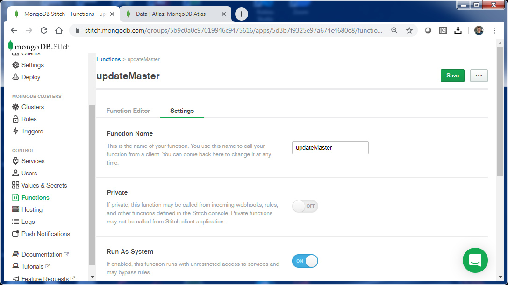

After saving the code we can test the function and create our new master document.  Open the __"Console"__ tab in the lower left and export the function with the source document like so:

```js
exports({
      "_id": "B-04227551",
      "first_name": "MARION",
      "middle_name": "ANITA",
      "last_name": "COLE",
      "gender": "FEMALE",
      "dob": "1980-02-08",
      "address": {
        "street": "4620 FRANKLIN STREET",
        "city": "SANTA ROSA",
        "state": "CA",
        "zip": "95409"
      },
      "phone": "+14823008921",
      "email": "ox@tjwq.com"
    })
```

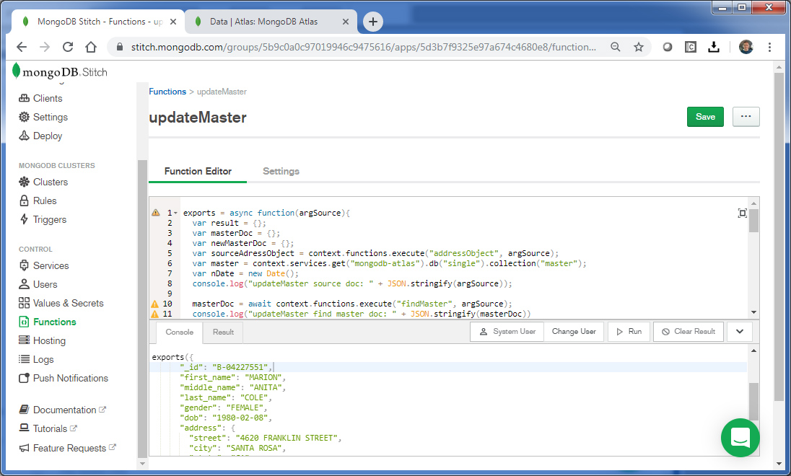

Click the __"Run"__ button and view the results. Browse for the new master document in the collection explorer of your atlas cluster.

Now that we have master documents we need to make certain that our findMaster function stays efficient when we reach tens to hundreds of millions of documents.  Lets add an index.  In the collections browser, select the __"Indexes"__ tab in the top portion of the interface next to the find and aggregation tabs.  Select it and then click the create index button. 

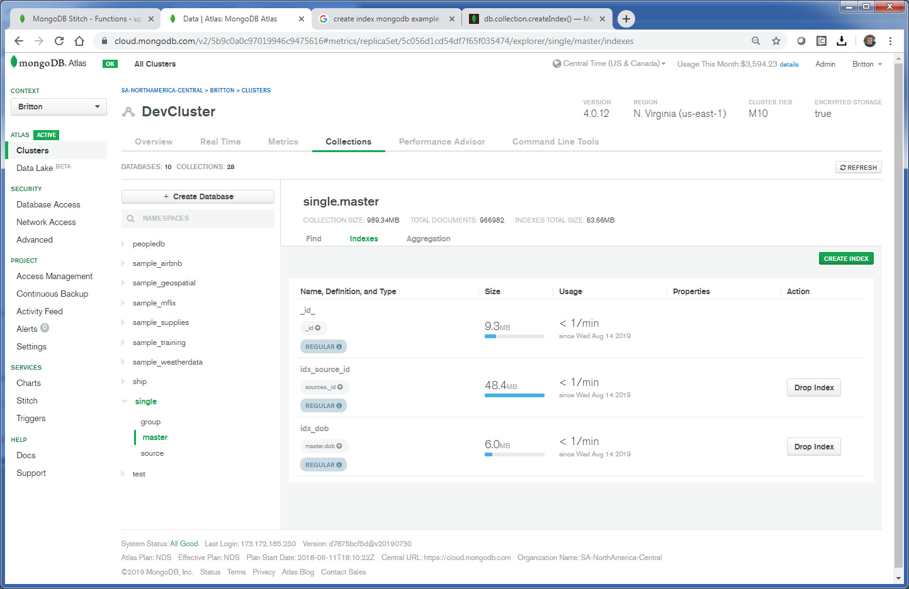

Create the indexes with the following information:

__sources.\_id__
```js
{
  "sources._id: 1
}
{ background : true }
```

__master.dob__
```js
{
  "master.dob: 1
}
{ background : true }
```

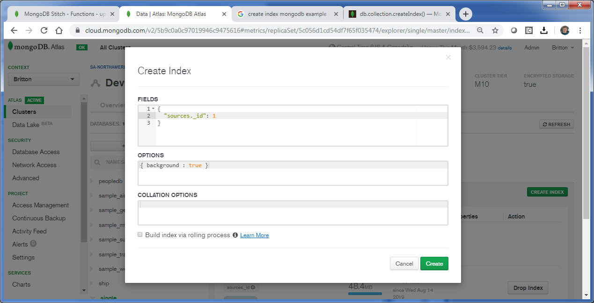   

[Tutorial Contents](#tutorial-contents)
   

##  The trigger for change
As changes occur to the source collection we want a trigger to capture the full document and send it as an argument to the update master function. Lets create the database trigger in stitch.  Select __"Triggers"__ from the left hand stitch navigation console.  Click the __"Create New Trigger"__ button.  Name the trigger __trgCustomerSource__.  Make sure the trigger is enabled and has event ordering turned on.  Select the linked cluster, __"Single"__ database and __"Source"__ collection.  Be sure the toggle for __"Full Document"__ is set to __"ON"__.  In the function drop list select __"New Function"__ and name it __fncCustomerSource__.

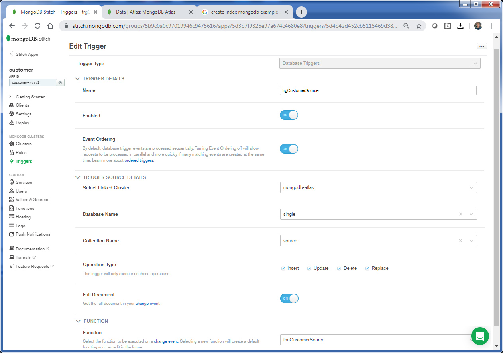

In the triggers fucntion editor for __fncCustomerSource__ copy and paste the following code and save the function.  

__fncCustomerSource__
```js
exports = async function(changeEvent) {
  //We have a new source document
  console.log("fncCustomerSource");
  const fullDocument = changeEvent.fullDocument;
  await context.functions.execute("updateMaster", fullDocument);
};
```

The created trigger is ready and watching for changes. When the REST based API __addCustomerSource__ is called from the source system, the trigger will fire and update the master record with the latest change.  

Additional functions can be developed to inspect the source data and apply rules, before the master record is updated.  This trigger is the hook to call multiple functions for real time updates and processing of data as changes occur in the source systems.

The next step is to create the REST API for the source system to find the customer master record.   

[Tutorial Contents](#tutorial-contents)
   

##  Accessing customer master data
We need the ability to find a master record based on any number of criteria.  We begin by writing a sitch function that takes a search document as an argument. For example if we were looking for a customer named "MARION COLE" we could pass in the following search document:

```
{"master.first_name":"MARION", "master.last_name":"COLE"}
```

Select __"Functions"__ from the left hand navigation pane of the stitch console. Click the __"Add a New Function"__ button. Give the function a name of __findCustomer__ and make sure it can __"Run as System"__.  


Save the function.  Copy and paste the code below into the function editor and press save.


__findCustomer__
```js
exports = async function( aSearchDoc ){

  console.log(JSON.stringify("Function findCustomer called ... executing..." ));
  var shipment = context.services.get("mongodb-atlas").db("single").collection("master");
  var doc = shipment.findOne(aSearchDoc);
  console.log(JSON.stringify("return document" ));
  console.log(JSON.stringify(doc));
  return doc;
};
```
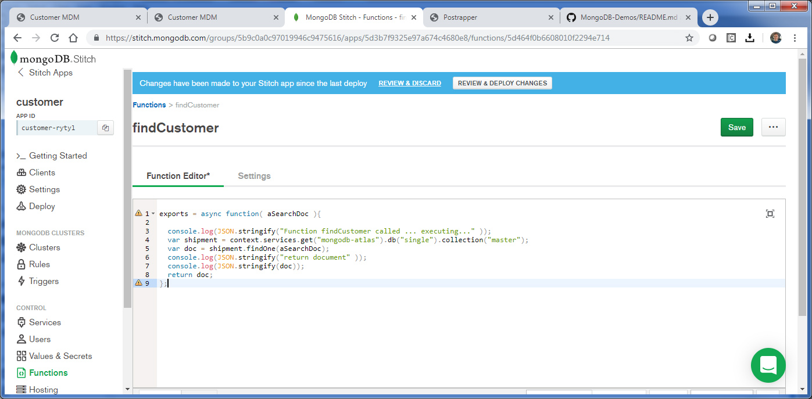

Once the function is saved, deploy the changes.  You can set the function by clicking the __"Console"__ tab in the lower left and clicking the __"Run"__ button with the following export using our search document.

```js
exports({"master.first_name":"MARION", "master.last_name":"COLE"})
```

### Creating a find customer service

We want to expose the new find customer function we created as a service.  This will allow our source systems and related micro servcies to query customer master data through a REST based API.

Select the __"Services"__ menu item from the left hand navigation pane of the stitch console.  Make the service an __"HTTP"__ service and name it __"findCustomerService"__

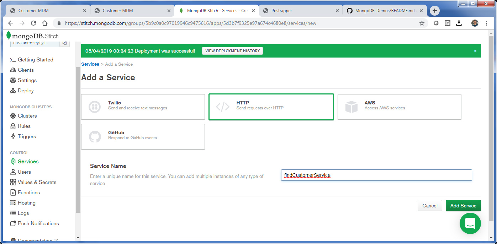

Save the service, and the webhook editor will be presented.  Name the webhook __"findCustomerWebhook"__ make sure we move the slider to __"ON"__ for __"Respond With Result"__ so we can return the master customer document to the calling application. Run the webhook as __"System"__.  The calling program will pass us a search document in the body of the hTTP request, make sure the HTTP Method is __"POST"__ to recieve the document in the body.  As we have not yet set up users, and API keys we will temporaily set the __"Request Validation"__ to do not Validate.  Save the webhook.

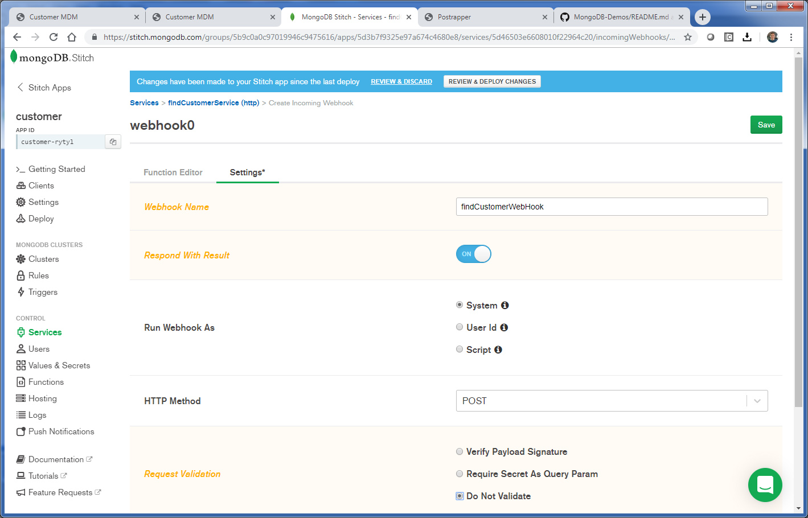

The webhook function editor is present.  Cust and paste the code below and press save.  Deploy the changes. 

__findCustomerWebhook__
```js
// This function is the webhook's request handler.
exports = async function(payload) {
    // Data can be extracted from the request as follows:

    var body = {};
    var result = {};
    if (payload.body) {
      console.log(JSON.stringify(payload.body));
      body = EJSON.parse(payload.body.text());
      console.log(JSON.stringify(body));
      result = await context.functions.execute("findCustomer", body);
    }
    
    return  result;
};
```
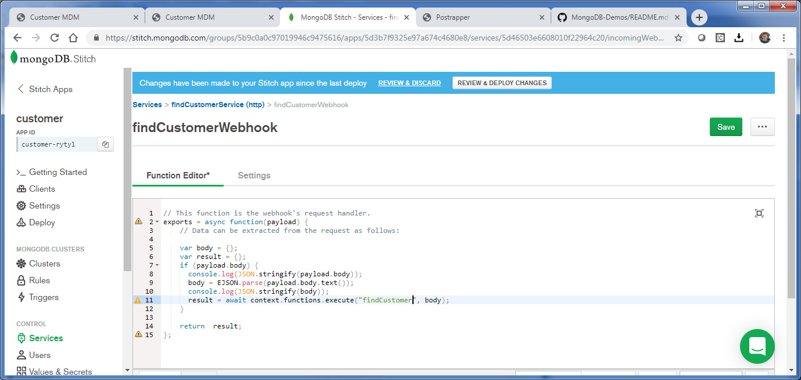

Notice that the webhook parses the payload body and then passes in the body (which contains the search document) as an argument to the find customer function we created earlier.

```js
      result = await context.functions.execute("findCustomer", body);
```
After waiting for the resulting master document from the database the function returns the document to the calling application.  The process is complete and we are ready to test.

We are now ready to test our REST based API through postrapper.html. Click on the __"Settings"__ tab of the webhook function editor and copy the webhook url.

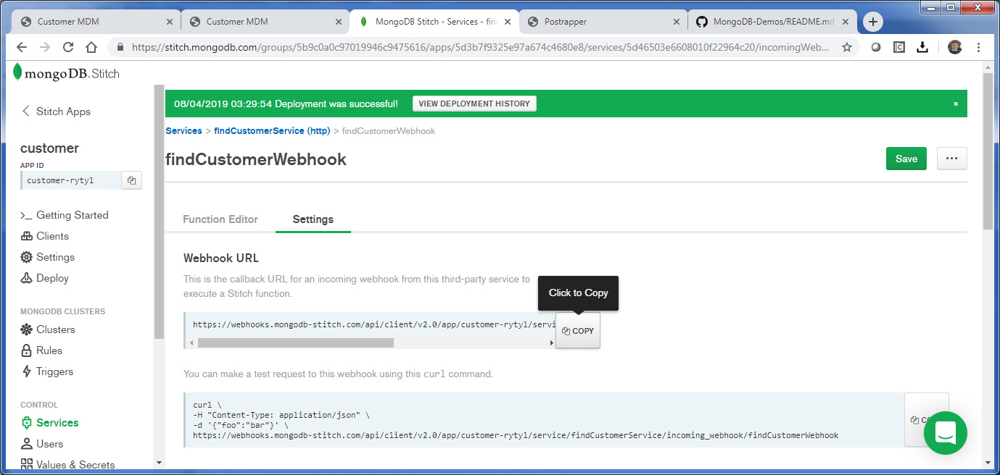

We can simulate a REST based API call from the source system B into our newly created webhook.  We can use [postman](https://www.getpostman.com/downloads/) or we can use our own postrapper.html file.  If you do not have postman or if your ports have been blocked internally from using it, we have found that our simple [postrapper.html](html/postrapper.html) file works quite well. 

Right mouse click the link [postrapper.html](html/postrapper.html) and open in a new tab you can copy and paste the text into a text editor of your choice and save the file as postrapper.html on your local drive.  Open the file in your browser by double clicking and you are ready to begin your test.  

Atlernatively you can use a hosted version of postrapper here:   
https://customer-rytyl.mongodbstitch.com/postrapper.html

Once the webhook url has been copied we can open postrapper.html and paste in the value in the __"URL"__ input field.  We can use the following search document or modify it to suit our needs.

```
{"master.first_name":"MARION", "master.last_name":"COLE"}
```

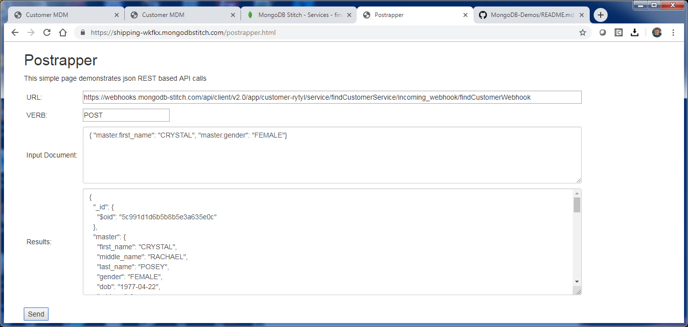

We have completed our prototype single view application.  We can submit source data through a REST based API, match and merge the source data in a master document, and return the master document to a calling program through a REST based API.  All that is missing is a beatiful web interface.

Next we will develop our web interface utilizing the power of Stitch QueryAnywhere.   

[Tutorial Contents](#tutorial-contents)
   

##  QueryAnywhere
In this section we will cover QueryAnywhere through the Stitch browser SDK.  We will use Mongo Query Language (MQL) directly against the database.  

### 1. Applying Rules
Before a client application can access a collection via the stitch browser SDK access to the underlying collections must be granted to the stitch application through the rules interface. 

We need to grant access to the __master__ collection in the __single__ database.   

   

Select the __"Rules"__ menu item from the left hand navigation pane in the stitch console window.  Click the __mongodb-atlas__ icon button __...__ and select "Add Database Collection" 

Enter __single__ for the database name and __master__ for the collection.  Select __"No template"__ and click save.  

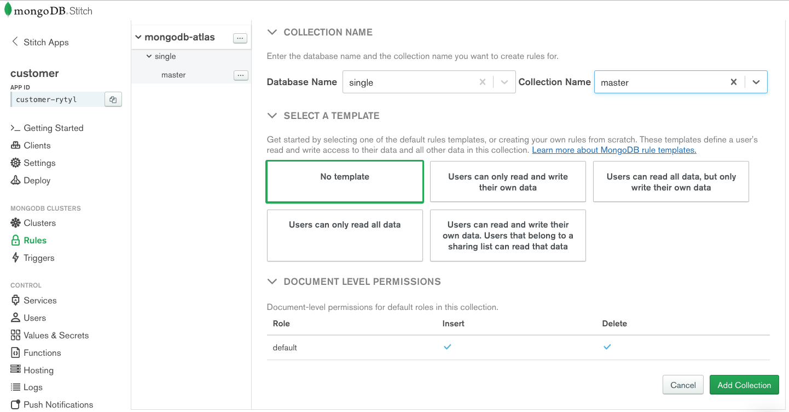

We can edit the rules generated at a future point in time to limit what data we will have access to through and API Key.  Generating an API Key creates a default user to go with the key.

### 2. Create an API key
We begin by adding a bit of security and creating an API Key and assoicated user permissions.  This is not necessary as we could create an anonymous user, use a third party athentication method (facebook, google, AWS Cognito, JWT etc..)  Let us quickly explore our options.  Click on the __"Users"__ menu item in the left hand navigation pane in the stitch console.  The users window will display a list of users (we have not created any). Lets click the providers tab at the top of the users window.  We are presented with a list of options as seen below.

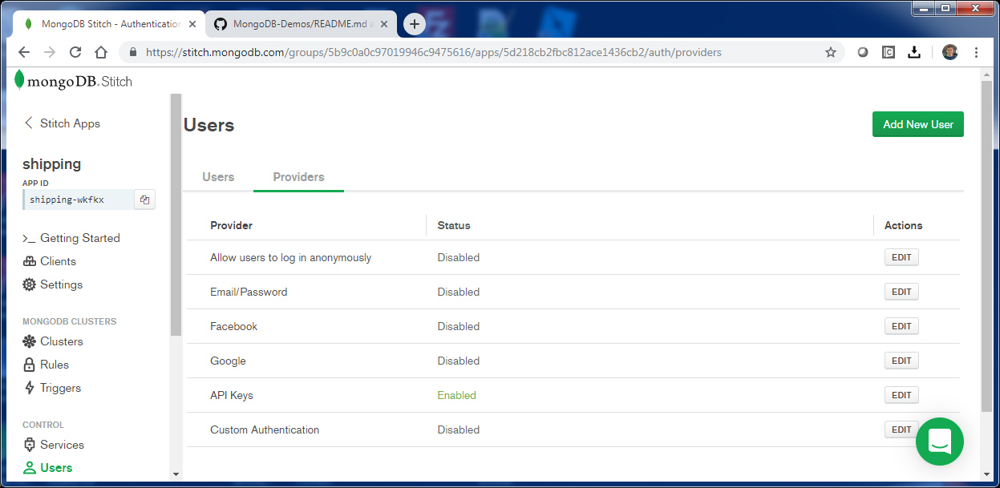

Third party providers such as facebook and google provide an excellent way for customers to access data and will be covered at a point in the future.  For now explore the custom option as you can see how to integrate with a Single Sign On (SSO) provider like AWS cognito, or something you are using in house through Java Web Tokens (JWT) as this eliminates the headache of user management for your application.

For now we will generate an API Key.  Select the __"API Keys"__ option and click the edit button.

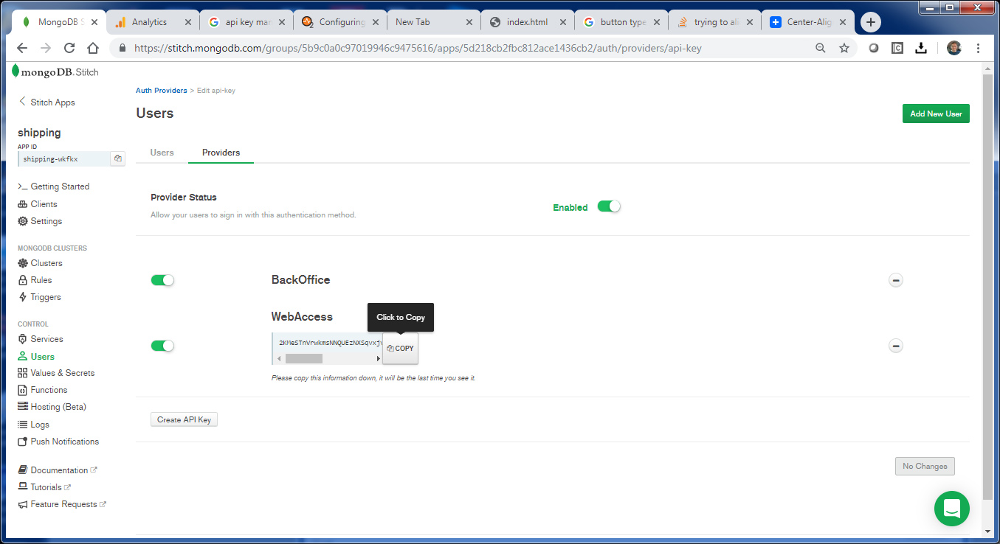

Type in a name for the API Key, something like "BackOffice" or "WebAccess" and click save.  A private key will be displayed.  Copy that key and paste it into a text editor of your choice.  Then create the api key.  We will use that key to access the database through the stitch browser SDK.

### 3. Create the browser client application
You will need a text editor for this section. If you do not have a text editor we recommend downloading a free text editor from one of the following sites (VS Code is best for Developers):

[Notepad ++](https://notepad-plus-plus.org/download)   
[Brackets](http://brackets.io/)   
[VS Code](https://code.visualstudio.com/)   

The MongoDB stitch browser client sdk documentation is in this link here [MongoDB Stitch Browser SDK](https://docs.mongodb.com/stitch-sdks/js/4/index.html)  At the time of the writing of this tutorial we are on sdk version 4.4.0 

Navigate to the top section ofthis git hub or (right click "open in new tab") the link [MongoDB-Demos](https://github.com/brittonlaroche/MongoDB-Demos).  

Press the green box "Clone or Download" and select "Donwload Zip File" if you have not already.  Extract the zip file and navigate to the (unzip path)MongoDB-Demos/Applications/Customer/html directory.  Here you will find the html file CSS file and images for our sample customer single view application.  Alternatively you can view and copy the html and css files from (right click "open in new tab") [here](https://github.com/brittonlaroche/MongoDB-Demos/tree/master/Applications/Customer-MDM/html).

Open the index.html file in the editor and replace 'your-app-id' with the application id of your customer single view application and the 'your-api-Key' with the api key we just generated.  The APP-ID is located in the upper left of the stitch console as seen below, click the copy button to load it in your clip board for a quick paste.


```js
      const credential = new stitch.UserApiKeyCredential('your-api-key');
      const client = stitch.Stitch.initializeDefaultAppClient('your-app-id');
```

should look like 

```js
      const credential = new stitch.UserApiKeyCredential("y2yhO49BDf4zvQVnt5GEC0Ge90VJVsByuSGVVJAvUr4Z9tZjWvJ2iZiL8OhKKY9M");
      const client = stitch.Stitch.initializeDefaultAppClient('customer-rytyl');
```

__Important Note:__ Pasting the API key directly into the html source code is a bad idea.  There are a number of ways to properly manage an API Key, and this is not one of them.  We highly recommend hidding and accessing this key according to best practices.  Unfortunately we dont have access to any of these best practice methods in this tutorial.  Just make a mental note that long term the API Key needs to be managed outside of the html source code and according to your organization's best practices.

Save the index.html and double click it.  You should see something like this:   

   
The live prototype with 2,000,000 sample records is hosted in Stitch and can be accessed here:   
https://customer-rytyl.mongodbstitch.com/

The magic happens in this line below.  Here we include the stitch SDK that turns the browser into a Sticth client.  All of the Stitch functions that allow us to connect to the database, query and manipulate data is made available by the source link in the index.html file below.
```js
 <script src="https://s3.amazonaws.com/stitch-sdks/js/bundles/4/stitch.js"></script>
```
Now that w ehave includedthe stitch SDK we can establish a connection to the database and authenticate.  Our example is provided below:

```js
        const credential = new stitch.UserApiKeyCredential("pC4Zh114GuVouc9DDBGO0UeZlIpo7UppPuzQJwBfThapugCViKBs0I4xFdUIBwbc");
        const client = stitch.Stitch.initializeDefaultAppClient('customer-rytyl');
        const db = client.getServiceClient(stitch.RemoteMongoClient.factory,"mongodb-atlas").db('single');
        function displayCustomersOnLoad() {
          client.auth
            .loginWithCredential(credential)
            .then(displayCustomers)
            .catch(console.error);
        }
	
```
Once connected to the datababse we can build our own search document based on user input. We pass that search document to a database find() function.  Then we loop through the results to build a dycnamic html table as seen below:

```js
        function displayCustomers() {
          var searchDoc = {};
          var sCust = document.getElementById('s_customer_id'); 
          var sSource = document.getElementById('s_source_id'); 
          var sPhone = document.getElementById('s_contact_phone');
          var sFname = document.getElementById('s_fname');
          var sLname = document.getElementById('s_lname'); 
          var sGender = document.getElementById('s_gender'); 
          if ( sGender.value != "") {
            searchDoc["master.gender"] =  sGender.value; 
          }
          if ( sPhone.value != "") {
            searchDoc["master.phone"] = { $regex: new RegExp(sPhone.value) }; 
          }
          if ( sFname.value != "") {
            searchDoc["master.first_name"] = { $regex: new RegExp(sFname.value)}; 
          }
          if ( sLname.value != "") {
            searchDoc["master.last_name"] = { $regex: new RegExp(sLname.value)}; 
          }
          if ( sCust.value != "") {
            searchDoc._id = new stitch.BSON.ObjectId(sCust.value); 
          }
          if ( sSource.value != "") {
            searchDoc["sources._id"] = sSource.value; 
          }
          //alert(JSON.stringify(searchDoc));
          const tStrt = "<div><table class=\"blueTable\"><tr><th>ID</th><th>Name</th><th>Gender</th><th>DOB</th>" +
            "<th>Conact Phone</th><th>Email</th><th>Last Modified</th><th>Edit</th></tr>";
            db.collection('master').find(searchDoc, {limit: 42}).asArray()
              .then(docs => {
                const html = docs.map(c => "<tr>" +
                  "<td>" + c._id +  "</td>" +
                  "<td>" + c.master.first_name + " " + c.master.last_name + "</td>" +
                  "<td>" + c.master.gender + "</td>" + 
                  "<td>" + c.master.dob + "</td>" +
                  "<td>" + c.master.phone + "</td>" + 
                  "<td>" + c.master.email + "</td>" +
                  "<td>" + formatDate(c.last_modified) + "</td>" +
                  "<td>" +
                  "<button type=\"checkbox\" class=\"blueTable\"" +
                  "onClick=\"editCustomer(\'" + c._id +"\')\">" +
                  "<i class=\"material-icons\" style=\"font-size:18px\">" +
                  "mode_edit</i></button>" + 
                  "</td>" +
                  "</tr>").join("");
                document.getElementById("customers").innerHTML = tStrt + html + "</table></div>";
            });
          }
```

The rest of the html file manipulates the results from the database and transforming the various document arrays into rows and columns.  Its allows the user to update the matser document data as well.   

[Tutorial Contents](#tutorial-contents)
   

##  Host the web application

### Hosting Overview
Stitch Hosting allows you to host, manage, and serve your application’s static media and document files. You can use Hosting to store individual pieces of content or to upload and serve your entire client application. Stitch hosts your application’s content behind a unique domain name. By default, Stitch uses domains of the following form: ```<Your App ID>.mongodbstitch.com```. You can configure Stitch to host content at a custom domain name that you own in addition to the default hosting domain.

For further infromation read the [hosting documentaion](https://docs.mongodb.com/stitch/hosting/) for an overview. Its a two step process to [enable hosting](https://docs.mongodb.com/stitch/hosting/enable-hosting/) and then [upload content](https://docs.mongodb.com/stitch/hosting/upload-content-to-stitch/). 

### 1. Enable hosting
Navigate to the Hosting Configuration Page:   
To open the hosting configuration page, click "Hosting" in the left-hand navigation of the Stitch UI.


On the Hosting configuration page, click Enable Hosting. Stitch will begin provisioning hosting for your application.  You can now access your default index page by typing inthe following url into your browser:

 ```<your-app-id>.mongodbstitch.com```
 

### 2. Upload your files


Press the button labeled __"upload your files"__ and select all the html files you have been working on.   

We will upload the files in this [html directory](../../html/)

__drop-down-arrow.png__   
__index.html__   
__loading.gif__   
__logo.png__   
__postrapper.html__   
__customer.css__   

Click the image files and right click save as.  Edit the text files (html and css) and cut paste the contents then save the file with the correct name.  Alternatively you can download the project as a zip file and navigate to (extract path)/MongoDB-Demos/Applications/Customer-MDM/html/

You can now access them at <your-app-id>..mongodbstitch.com!  For example try   
  
 ```<your-app-id>.mongodbstitch.com/blog.html```
 


Lets see your new employee app in action! Type in the default address 

 ```<your-app-id>.mongodbstitch.com```

Notice how you can access the database directly from the web.  __***Note:***__  you may need to select the  __"Actions"__ drop list in the hosting console and "Flush CDN Cache" and deploy the changges to view the updates.

We will upload the files in this [html directory](html/)   

[Tutorial Contents](#tutorial-contents)
   

##  GitHub and CI/CD Integration
A common queston we are asked by developers while going through the workshop is "Do we have to use the stitch console?" The answer is no.  You can write your own code in the editor of your choice and check that code into GitHub or whatever your source code control repository is. 

The next question we are asked is "How do we build a test environment?" A variation of this question is "Is there a local version of Stitch we can download for testing purposes?" The basic question is "if we need to deploy our changes into a testing environment how does all of this stuff fit together?"

The answer is a combination of source code control (we do have services built in for GitHub) and integration into your existing CICD infrastructure whether that is Jenkins or Maven Build Scripts or whatever your CICD platform is the whole process including stitch can be scripted and woven into your standard process.

The stitch command line tool provides the ability to integrate your CICD with Stitch.  Atlas has a Rest Based API that you can use to build a new test environment.  Stitch has a stitch-cli interface that allows you to access your changes from GitHub and deploy them into your new test environment.   

There are many ways to deploy with stitch and to integrate Atlas with Devops Please see the following links for detailed instructions
__Stitch command line overview (blog)__   
https://www.mongodb.com/blog/post/mongodb-stitch-command-line-interface

__Atlas Devops__   
https://www.mongodb.com/what-is-devops   
https://www.mongodb.com/presentations/devops-with-mongodb   

__Stitch Deployment Options__   
https://docs.mongodb.com/stitch/deploy/   

The following section shows how to import the application via this GitHub and the stitch command line tool __"stitch-cli"__. Knowledge of how the stitch command line works is important as you can integrate stitch-cli with your CICD (continuous integration and continuous delivery) tools.  This allows you to work in your native development enviroment, commit changes to GitHub and then deploy and test as you would normally through your CICD work flow.

The directions here are terse but complete as I refer you to documenation on setting up the stitch command line interface tool and importing the existing stitch customer application:

#### 1. Install the stitch-cli tool
Begin by [Installing the Stitch Command Line Interface tool](https://docs.mongodb.com/stitch/import-export/stitch-cli-reference/)

#### 2. Creat a project API key
Next [Create a Project API key](https://docs.atlas.mongodb.com/configure-api-access/#programmatic-api-keys).  When you createthe API key be sure to give yourself the __"Project Owner"__ role as you will need this to import the stitch application.   

Right click this link [Create a Project API key](https://docs.atlas.mongodb.com/configure-api-access/#programmatic-api-keys) open in new tab. Follow intrsuction under __Manage Programmatic Access to a Project__ perform each step listed in the section __Create an API Key for a Project__ be sure to copy the private API key somewhere safe for future refence.

#### 3. Download the GitHub code
Export the MongoDB Demos as a zip file from https://github.com/brittonlaroche/MongoDB-Demos. Press the green button in the upper right labled __"Clone Or Download"__ and press the download a zip file link.   

#### 4. Extract the zip file
Exctact the zip file to the directory you installed the stitch-cli tool.  The customer single view application stitch export is located under (stitch-cli path)/MongoDB-Demos-master/Applications/Customer-MDM/customer

#### 5. Log in via stitch-cli
log into your atlas cluster with your API key (public and pprivate keys) with the stich command line tool.

Sample login instructions:
```
stitch-cli login --api-key=my-api-key --private-api-key=my-private-api-key
```

Example login:
```
stitch-cli login --api-key=ytqictxq --private-api-key=8137b118-4a36-4197-a3c7-23b73ba49775
←[0;0myou have successfully logged in as ytqictxq←[0m
```

#### 6. Import the customer single view application
After logging in the command line maintains the connection until you execute the command __stitch-cli logout__.  We are now ready to import the application. The following command below should work.
```
stitch-cli import  --app-id=customer-rytyl --path=./MongoDB-Demos-master/Applications/Customer-MDM/customer --strategy=replace
```

Follow the prompts and respond __y__ when asked if you would like to create a new app. Press enter to accept the default values.  Change the values to match your configuration.  An example is provided below.

```
stitch-cli import  --app-id=customer-rytyl --path=./MongoDB-Demos-master/Applications/Customer-MDM/customer --strategy=replace
←[0;0mUnable to find app with ID: "customer-rytyl": would you like to create a new app? [y/n]:←[0m y
←[0;0mApp name [customer]:←[0m
←[0;0mAvailable Projects:←[0m
←[0;0mProject 0 - 5ce58a9fc56c98145d922e93←[0m
←[0;0mAtlas Project Name or ID [Project 0]:←[0m
←[0;0mLocation [US-VA]:←[0m
←[0;0mDeployment Model [GLOBAL]:←[0m
←[0;0mNew app created: customer-vibtf←[0m
←[0;0mImporting app...←[0m
←[0;0mDone.←[0m
←[0;0mSuccessfully imported 'customer-vibtf'←[0m

stitch-cli logout

```

If you named your cluster anything other than the default __"Cluster0"__ then you will need to modify a json document to reflect your cluster name. The document is located in your directory here: /MongoDB-Demos-master/Applications/Customer-MDM/customer/mongodb-atlas/config.json

If you named your cluster "DevCluster" for example you would change the __"clusterName":__ field from __"Cluster0"__ to __"DevCluster"__.  An example has been provided below.

```

{
    "id": "5d218cb4e0601bec3de065c7",
    "name": "mongodb-atlas",
    "type": "mongodb-atlas",
    "config": {
        "clusterName": "DevCluster",
        "readPreference": "primary",
        "wireProtocolEnabled": false
    },
    "version": 1
}
```
Once you save your changes you are ready to try the import again.

### Process overview
A basic outline of the process is as follows:

1. Develop or change software (Editor and environment of your choice)
2. Check in to GitHub or sourcecode control.
3. Integrate [Atlas rest API](https://docs.atlas.mongodb.com/api/) with build process to create or update new Atlas test database environment.
4. Obtain the latest changes from GitHub or source control and Import them via the stitch-cli into the new Atlas test database environment.
5. Commence testing against the new test database and stitch environment

Steps 3 and 4 are typically scripted with the CICD build process making calls to Atlas and the stitch-cli.   

[Tutorial Contents](#tutorial-contents)

