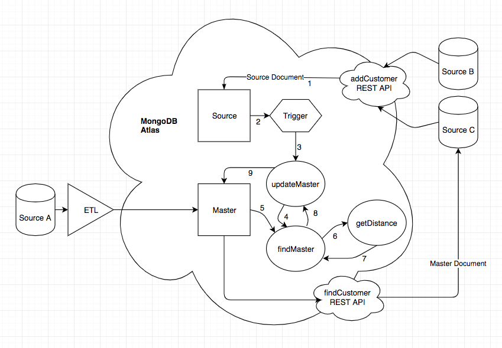

# Customer MDM Single View Application
_Solution Architect Author_: [Britton LaRoche](mailto:britton.laroche@mongodb.com)   
_Consulting Engineer Author_: [Andre Spiegel](mailto:andre.spiegel@mongodb.com)   


## Tutorial Contents 
(Note: This prototype lab is hands on and should take an estimated time of less than 120 minutes)
1. [Overview](#-overview)
2. [Create the Atlas Cluster](#-create-the-atlas-cluster)
3. [Create the Stitch Application](#-create-the-stitch-application)
4. [Adding customer source data through a REST based API](#-adding-customer-source-data-through-a-rest-based-api)
5. [Testing the REST based API](#-testing-the-rest-based-api)
6. [Matching the proper Master document](#-matching-the-proper-master-document)
7. [Creating and updating the master document](#-creating-and-updating-the-master-document)
8. [The trigger for change](#-the-trigger-for-change)
9. [Accessing customer Master data](#-accessing-customer-master-data)
10. [QueryAnywhere](#-QueryAnywhere)
11. [Importing from GitHub: Stitch Command Line tool](README.md)
12. [Host your application tutorial](README.md)  

##  Overview 
We've been hired by a fictitious auto manufacturing company called "Katana" to build a single view for a customer MDM application prototype.  Katana has a global market place consisting of automobile dealerships, online websites, and financial services for its customers of its two major brands. __"Katana"__ motors sells quality family vehicles, and its high end luxury brand __"Legacy"__ sells high performance extreemly high end luxury vehicles.  Each brand has its own set of dealerships and systems that repersent the customer in a variety of different ways.  Katana may have the same customer or the same customer household buying both brands and is unaware that these two apparently different customers may be the same individual buying cars for the same household.

  

You have been tasked to create a minimum viable product (MVP), a basic protype, of a single view for a customer MDM application across all dealerships and online sites for both Kanakata and Legacy brands. They wish to test both the functionality and performance of the application.  The functionality includes identifying a single customer from all systems and providing customer updates in real time to their third party dealerships and financing division.  

  

Additionally Katana motors has been given the task of removing sensitive customer data from all its related transactional systems. The California Consumer Privacy Act (CCPA) and the Nevada Consumer Privacy Law requires Katana to remove all customer data from its many transactional systems if a customer "opts out" and does not want their identifiable data inside Katana.  The intent of this new design is to change all the source systems to identify the customer through a unique token generated in the Customer MDM and use only the token in all the related transactions.  When a transactional source system needs to display customer information it will request that information via a rest based API to the Customer MDM application.  Should the customer opt out of Katana then only one system, the customer MDM, will need to remove the customer identifiable data.

The desire is to have a serverless REST based API layer to service the myriad of transactional systems that will not require any maintenance, and can scale automatically as demand increases with out human intervention.


Customer data will be loaded into the Customer MDM as new customers come into the website and sign up for promotional offerings.  Customer data will also come into the Customer MDM with nightly batch loads from Katana financial services for the previous days loan applications.  The two different dealerships also load prospective customers and customer purchase data when a vehicle is taken for a test drive or purchased.  All of these websites and dealerships have a variety of data formats.

Our job is to ingest data from all these sources and both preserve a record of the data as it exists in each of these systems as well as a master copy that reconciles the customer into a single view and golden source of truth across all of the systems.

## Data Flow
A basic data flow diagram was put together to solve the MDM problem.  The dealerships used a legacy system (source system A) which requires a nightly batch process and an ETL program to load data into MongoDB.  The Katana and Legacy online services (source systems B and C) have the ability to use a REST API and send JSON documents in real time.

  

MongoDB has three colections to manage the customer data.  As data comes in from the various sources they are loaded into a __"source"__ collection.  A matching function is used to find a matching master customer document based on specified rules and criteria found in the source document. If a match is found the source record is added to the array of source records in the master document and the master data fields are updated based on the latest changes reflected in the source document. If no matching master record is found the source record becomes the master data and a new master record is inserted into the __"master"__ collection.

## Sample Customer Document
Lets take a look at one of the documents produced from this process. The master document has all the information relevant to the customer.  The master object has the fields that were selected from all the source systems.  Each of the source systems are listed in an array with the data as it currently is in each of the source systems.  We notice a few descrepancies between each of the systems. The email and physical addresses are different in some cases, for example her first name was misspelled at the dealership.

```js
{
  "master": {
    "first_name": "CRYSTAL",
    "middle_name": "RACHAEL",
    "last_name": "POSEY",
    "gender": "FEMALE",
    "dob": "1977-04-02",
    "address": [
      {
        "street": "5438 LINCOLN DRIVE",
        "city": "PASADENA",
        "state": "CA",
        "zip": "91106"
      }
    ],
    "phone": "+13976946512",
    "email": "kezzo@myant.com"
  },
  "sources": [
    {
      "_id": "A-00150411",
      "first_name": "KRYSTAL",
      "middle_name": "RACHAEL",
      "last_name": "POSEY",
      "gender": "FEMALE",
      "dob": "1977-04-22",
      "address": {
        "street": "1432 PALOMA DRIVE, APT. 421",
        "city": "PASADENA",
        "state": "CA",
        "zip": "91106"
      },
      "phone": "+13976946512",
      "email": "kezzom@gmail.com"
    },
    {
      "_id": "B-03166091",
      "first_name": "CRYSTAL",
      "middle_name": "RACHAEL",
      "last_name": "POSEY",
      "gender": "FEMALE",
      "dob": "1977-04-22",
      "address": {
        "street": "5438 LINCOLN DRIVE",
        "city": "PASADENA",
        "state": "CA",
        "zip": "91106"
      },
      "phone": "+13976946512",
      "email": "kezzo@myant.com"
    },
    {
      "_id": "C-07164051",
      "first_name": "CRISTAL",
      "middle_name": "RACHAEL",
      "last_name": "POSEY",
      "gender": "FEMALE",
      "dob": "1977-04-22",
      "address": {
      "street": "5348 LINCOLN DRIVE",
      "city": "PASADENA",
      "state": "CA",
      "zip": "91106"
      },
      "phone": "+13976946512",
      "email": "kezzo@yahoo.com"
    }
  ]
}
```

The above document can be translated into rows and columns with ease using html, javascript sna stitch QueryAnyWhere functionality.  Below we see this same document represented with rows and columns for the source data.

   
The live prototype with 2,000,000 sample records is hosted in Stitch and can be accessed here:   
https://customer-rytyl.mongodbstitch.com/

This hands on lab will cover the entire process (except the ETL process) in the data flow diagram. We will create the REST API that allows the source data to be inserted from the micro services. We will create the basics of the grouping and mastering functions. 

We will create some additional components as well.  We will create a REST API service that will allow the master document to be queried and updated, with new source data merged and split as needed.  We will create a web based browser that uses the stitch SDK to create a broswer client with the full capabilities of stitch QueryAnywhere to access and manage the customer master data.

The entire project will be created and hosted in the cloud.  All of the functions, triggers and procedures will run in Stitch as serverless compute.  The data will reside in Atlas and be accessed via database as a service.  The power behind this solution offers an auto scalable maintenace free implementation of a Customer MDM.

Where do we begin?

Lets assume System B is Katana's online service.  When a user designs the car they wish to purchase on Katana's online website, by selecting the model number, color, engine size etc... they are given the opportunity of registering their customer information and saving the selection in their profile.  When they save their customer profile the Katana online service sends a json document through a REST API represnting the customer profile information to MongoDB stitch.

Below is an example of this customer profile json document.

```js
    {
      "_id": "B-04227551",
      "first_name": "MARION",
      "middle_name": "ANITA",
      "last_name": "COLE",
      "gender": "FEMALE",
      "dob": "1980-02-08",
      "address": {
        "street": "4620 FRANKLIN STREET",
        "city": "SANTA ROSA",
        "state": "CA",
        "zip": "95409"
      },
      "phone": "+14823008921",
      "email": "ox@tjwq.com"
    }
```

Due to the CCPA laws, Katana wishes to store this document in their MongoDB Customer MDM and only the customer id value and car selections in System B. All personal data relating to the customer will be stored only in the customer MDM. Anytime system B needs customer information it will make a REST API call to the MDM. When a new customer signs up he or she will enter personal information online and the personal information will be sent to the customer MDM via a REST based API. Upon insert into the MDM database a unique customer token will be generated and sent back to system B.  This token will be used for all customer transactions in system B, and system B will never store the customer's personal information.

Our first step is to create a stitch HTTP service to recieve the customer source data and store it in MongoDB. MongoDB has a servless compute capability to provide a REST based API called stitch. To create the Stitch service, we must begin by creating a Stitch application.  Before creating a stitch application we need to have an Atlas cluster set up to recieve the document.  Lets begin by creating an Atlas cluster.


##  Create the Atlas cluster

Open a modern browser (like google chrome) and go to https://cloud.mongodb.com.  Register for an atlas account by clicking the __"get started free"__ button.


Click the __"get started free"__ button.  This will bring up a screen for you to enter your personal information.

   

Fill in your personal information.  Feel free to use your work or personal email address, either is fine as this is your personal "free for life" development environment.  Agree to the terms of service and click the __"get started free"__ button.  

   

This will bring up window promptin you to build your first cluster.  Click the __"build your first cluster"__ button.  When prompted select "Learning MongoDB" as to the reason you are interested in Atlas. After clicking the Click the __"build your first cluster"__ button, you will be prompted to name your cluster.  "

   

__"Cluster0"__ is the default name and works well for importing data and projects later. Click the __"Create Cluster"__ button at the bottom and your cluster will be ready in the next 7 to 10 minutes.   

   

##  Create the Stitch Application

Next we will create our fist Stitch application. This task is accomplished by selecting __"Stitch"__ from the left hand navigation menu of the cluster we just created.


We click the large green button labeled __"Create new Application"__ and give the application a name.  In this case we will name our application __"customer"__   

Click the little green __"Create"__ button in the lower right hand of the popup window.  The stitch application console will appear as soon as the application has been created and linked with the cluster. 

   

##  Adding customer source data through a REST based API

When the customer saves their profile the Katana online service sends a json document through a REST API represnting the customer profile information to MongoDB stitch.  We need to create a service that will receive the customer profile as a json document.  

Select the __"Services"__ menu item from the left naviagtion pane of the stitch console.  Click the __"Create New Service"__ button.  Select __"HTTP"__ service and give the service a name of __addCustomerSource__


Click the add service button.  This will present the webhook editor.


Fill in the appropriate fields.  Name the webhook __addCustomerSource__ and make sure respond with result is set to __"ON"__. We will need the result of the operation returned to the calling program to make sure that the REST base API call was successful.  We will be sending a json document in the body of the request so we want this to be an HTTP Method of __POST__.  

We have not set up a validation method yet so lets start with __"Do Not Validate"__ for the request valdiation.  There are a number of ways to validate the request using java web tokens, API keys etc... and this should be done before putting any application or service like this into production.  For now we are building a simple prototype so we will procede with a quick soltion.

Name: __addCustomerSource__  
Respond with Result: __ON__   
HTTP Method: __POST__   
Request Validation:  __Do not validate__  

Click the save button and the function editor for the webhook will appear.  Cut and paste the code below and save the webhook function.

```js
exports = async function(payload) {
  var source = context.services.get("mongodb-atlas").db("single").collection("source");
  console.log("Executing addCustomerSourceWebhook");
  var queryArg = payload.query.arg || '';
  var body = {};
  var result = { "status": "Unknown: Payload body may be empty"};
  
  if (payload.body) {
    body = EJSON.parse(payload.body.text());
    console.log(JSON.stringify(body));
    var nDate = new Date();
    //check the source_id
    if ( body._id ) {
        console.log("updating customer source document");
        result = await source.updateOne(
          {_id: body._id},
          {$set: {
              first_name: body.first_name,
              middle_name: body.middle_name,
              last_name: body.last_name,
              gender: body.gender,
              dob: body.dob,
              address: [{
                street: body.address.street,
                city: body.address.city,
                state: body.address.state,
                zip: body.address.zip
              }],
              phone: body.phone,
              email: body.email,
              last_modified: nDate
              }
          },
          {upsert: true}
        );
        console.log("after update");
        
    } else {
      result = { "status": "Error: source _id is not present"};
      return result;
    }
  }
  return  result;
};
```

Lets review the code above. We define the database and collection we are using with the following statment.  We connect to the database named __"single"__ and to the collection named __"source"__

```js
var source = context.services.get("mongodb-atlas").db("single").collection("source");
```

Next we parse the payload body,   

```js
body = EJSON.parse(payload.body.text());
```

We check for required fields and store then store all the specific fields into the database using an upsert defined in the MongoDB query language (MQL).  

```js
 result = await source.updateOne(
  {_id: body._id},
  {$set: {
      first_name: body.first_name,
      middle_name: body.middle_name,
      last_name: body.last_name,
      gender: body.gender,
      dob: body.dob,
      address: [{
	street: body.address.street,
	city: body.address.city,
	state: body.address.state,
	zip: body.address.zip
      }],
      phone: body.phone,
      email: body.email,
      last_modified: nDate
      }
  },
  {upsert: true}
);
```

Notice two key words: __await__ and __async__.  These key words are important as they tell stitch to wait for a response from the database before sending the results back to the calling application.  The function is declared as __async__ and the __await__ is used when accessing the database.

Now that we have created our webhook and function we are ready to test it.

   

##  Testing the Rest based API
We can simulate a REST based API call from the source system B into our newly created webhook.  We can use [postman](https://www.getpostman.com/downloads/) or we can use our own postrapper.html file.  If you do not have postman or if your ports have been blocked internally from using it, we have found that our simple [postrapper.html](html/postrapper.html) file works quite well. 

Right mouse click the link [postrapper.html](html/postrapper.html) and open in a new tab you can copy and paste the text into a text editor of your choice and save the file as postrapper.html on your local drive.  Open the file in your browser by double clicking and you are ready to begin your test.  

Atlernatively you can use a hosted version of postrapper here:   
https://customer-rytyl.mongodbstitch.com/postrapper.html

Our first step is to go to the __"Settings"__ tab in the __addCustomerSourceWebhook__ editor.    If the __addCustomerSourceWebhook__ you can open it by selecting __"Services"__ from the left hand navigation menu on the stitch console pane.  It will bring up a list of services.  Select the __addCustomerSource__ service and then the __addCustomerSourceWebhook__ webhook, this will open the function editor. When the function editor is open click the __"Settings"__ tab in the upper left and the webhook settings will be displayed as below.   


We look for the __"Webhook URL"__ and click the copy button.  We paste this value into the __"URL"__ input field of the postrapper.html file.  

Below is an example of this customer profile json document that will be sent to us from a source system.

```js
    {
      "_id": "B-04227551",
      "first_name": "MARION",
      "middle_name": "ANITA",
      "last_name": "COLE",
      "gender": "FEMALE",
      "dob": "1980-02-08",
      "address": {
        "street": "4620 FRANKLIN STREET",
        "city": "SANTA ROSA",
        "state": "CA",
        "zip": "95409"
      },
      "phone": "+14823008921",
      "email": "ox@tjwq.com"
    }
```
Copy the customer source json document above and paste it into the postrapper __"Input Document"__ text area of postrapper and hit send.  You should see something like the following:


Notice the results information shows the matched count for an update or the infomation on an insert.  Our REST based API call worked!  Lets see the document in the database.  Open another tab and access your cluster through https://cloud.mongodb.com on the cluster information window select "Collections"   


Navigate to the __"single"__ database and select the __"source"__ collection to view the document.


   

##  Matching the proper Master Document
Our next step is to master all the source documents together based on a series of rules about customer attributes.  For this prototype we will consider the values of 4 fields: source id, date of birth, first name and last name.

To compare these field values between documents we will use the Levenshtein distance.  In information theory, linguistics and computer science, the Levenshtein distance is a string metric for measuring the difference between two sequences. Informally, the Levenshtein distance between two words is the minimum number of single-character edits (insertions, deletions or substitutions) required to change one word into the other. It is named after the Soviet mathematician Vladimir Levenshtein, who considered this distance in 1965.

We will use this implementation of the Levenshtein distance by Andrei Mackenzie written in javascript in 2011.
https://gist.github.com/andrei-m/982927

Lets begin by creating our own getDistance function in stitch.  From the left hand navigation pane in the Stitch console select __"Functions"__.  When the function editor appears give the function the name __"getDistance"__ and click save.


The function editor appears next, copy and paste the code below and click save.

__getDistance__
```js
exports = function(a,b){

  /*
Copyright (c) 2011 Andrei Mackenzie
Permission is hereby granted, free of charge, to any person obtaining a copy of this software and associated documentation files (the "Software"), to deal in the Software without restriction, including without limitation the rights to use, copy, modify, merge, publish, distribute, sublicense, and/or sell copies of the Software, and to permit persons to whom the Software is furnished to do so, subject to the following conditions:
The above copyright notice and this permission notice shall be included in all copies or substantial portions of the Software.
THE SOFTWARE IS PROVIDED "AS IS", WITHOUT WARRANTY OF ANY KIND, EXPRESS OR IMPLIED, INCLUDING BUT NOT LIMITED TO THE WARRANTIES OF MERCHANTABILITY, FITNESS FOR A PARTICULAR PURPOSE AND NONINFRINGEMENT. IN NO EVENT SHALL THE AUTHORS OR COPYRIGHT HOLDERS BE LIABLE FOR ANY CLAIM, DAMAGES OR OTHER LIABILITY, WHETHER IN AN ACTION OF CONTRACT, TORT OR OTHERWISE, ARISING FROM, OUT OF OR IN CONNECTION WITH THE SOFTWARE OR THE USE OR OTHER DEALINGS IN THE SOFTWARE.
*/

// Compute the edit distance between the two given strings

  if(a.length == 0) return b.length; 
  if(b.length == 0) return a.length; 

  var matrix = [];

  // increment along the first column of each row
  var i;
  for(i = 0; i <= b.length; i++){
    matrix[i] = [i];
  }

  // increment each column in the first row
  var j;
  for(j = 0; j <= a.length; j++){
    matrix[0][j] = j;
  }

  // Fill in the rest of the matrix
  for(i = 1; i <= b.length; i++){
    for(j = 1; j <= a.length; j++){
      if(b.charAt(i-1) == a.charAt(j-1)){
        matrix[i][j] = matrix[i-1][j-1];
      } else {
        matrix[i][j] = Math.min(matrix[i-1][j-1] + 1, // substitution
                                Math.min(matrix[i][j-1] + 1, // insertion
                                         matrix[i-1][j] + 1)); // deletion
      }
    }
  }

  return matrix[b.length][a.length];
};
```

The function above will compare two strings and calculate the number of changes needed between them to make them equal.  For example calling getDistance('BOB', 'BIB') would return 1 as we need to change one letter "O" to "I" to go from "BOB" to "BIB".  Calling getDistance('BOB', 'CAT')  would return 3, as all 3 letters are different.  What we need is a ratio of the number of changes to make compared to the total number of letters.

Lets repeat the steps above and create a new function that takes the result from get distance and divides it by the maximum number of letters for both strings.

__getNormalizedDistance__
```js
exports = function(a,b){
  var result = context.functions.execute("getDistance", a,b);
  var maxLength = Math.max (a.length, b.length);
	return result / maxLength;
};
```

Notice how we call the getDistance function from inside the getNoramlizedDistance function.

Now we will test the functions.  Click the __"Console"__ tab on the bottom left of the function editor for getNormalizedDistance.  We will change the sample __"exports('Hello World')"__ to __"exports('BOB', 'BIB')"__


The results should be as follows:   

```
> ran on Sat Aug 17 2019 16:01:27 GMT-0500 (Central Daylight Time)
> took 520.675421ms
> result: 
{
  "$numberDouble": "0.3333333333333333"
}
> result (JavaScript): 
EJSON.parse('{"$numberDouble":"0.3333333333333333"}')

```

Lets use this test to determine if we have a matching master document.  The easiest test is to query the master collection for an existing source_id field.  Since this field is expected to be unique its an easy test.

```js
  masterDoc = await master.findOne({"sources._id": argSource._id});
  if (masterDoc){
    if (masterDoc.master){
      return masterDoc;
    } 
  }
```

The code above queies the master collection for a document with an array of source documents that has a matching source_id value to the argument document's source_id passed in to the function.  If we get a matching document and it has a master object, great we found a match.  We return the document.

If we don't get a match we need to query the master collection for all the documents that match a specific date of birth.  Once we get the array of matching documents back we loop through each document and see if we can find a mathcing first and last name.  The date of birth and name comparison is the second find master query in the function below:

__findMaster__
```js
exports = async function(argSource){
  var masterDoc = {};
  var masterDoc2 = {};
  var fdist = 1;
  var ldist = 1;
  var cdist = 1;
  var master = context.services.get("mongodb-atlas").db("single").collection("master");
  console.log("findMaster 1");
  masterDoc = await master.findOne({"sources._id": argSource._id});
  if (masterDoc){
    if (masterDoc.master){
      return masterDoc;
    } 
  }
  console.log("findMaster 2");
  // Try to find an existing master document. 
  // Search by the date of birth and compare first and last names
  var masterDocList = await master.find({"master.dob": argSource.dob}).toArray()
  .then( docs => {
      docs.map(c => {
        if(c.sources){
          c.sources.forEach( function(testSource){
            fdist = context.functions.execute("getNormalizedDistance", argSource.first_name,testSource.first_name);
            ldist = context.functions.execute("getNormalizedDistance", argSource.last_name,testSource.last_name);
            cdist = (0.5 * fdist) + (0.5 * ldist);
            //console.log("testSource._id: " + testSource._id + ", ts first_name: " + testSource.first_name + ", ts last_name: " + testSource.last_name + ", cdist: " + cdist);
            if (cdist < 0.4) {
              console.log("Found Group Matching Names and DOB: " + JSON.stringify(c));
              masterDoc2 = c;
            } 
          });
        }
      });
  });
  return masterDoc2;
};
```


Create the __"findMaster"__ function by selecting the __"Functions"__ menu item form the left navigation pane.  Click the __"Create New Function"__ button and name the function __"findMaster"__.  Make certain to run on the __"Run as System"__ toggle so we can access the master collection.  Save the function and copy and paste the code above into the function editor and then save the changes.

   

##  Creating and updating the master document

The master document has one object called master that contains all the information.  It has an array adresses for the customer information.  The array allows the master object to reflect multiple addresses in the source system if desired.  The source object imbeded in the master documents sources array on the other hand has a single object for the address.  This is a design decision made for ease of use.  We can create a function to convert from an array of adresses to a single object.  We simply pick the last address in the array.  Our philosophy is the last update contains the most up to date information.

Create a new function called __addressObject__ in the stitch console and copy past the code below and save it.

__addressObject__
```js

exports = function(source){
  //Master has an array of adresses
  //Source has an adress object
  var copy = {};
  var addressCopy = {};
  if (source) {
      copy._id = source._id;
      copy.first_name = source.first_name;
      copy.middle_name = source.middle_name;
      copy.last_name = source.last_name;
      copy.gender = source.gender;
      copy.dob = source.dob;
      copy.phone = source.phone;
      copy.email = source.email;
      if (source.address) {
       source.address.forEach(function(myAddress) {
          addressCopy =  myAddress;
        });
      }
      copy.address = addressCopy;
  }
  return copy;
};
```

We are now ready to design the function to create new master document or update our existing master document based on real time updates from the source systems.  The code below takes the source json document in as an argument processes the document into an object to store in an array.  Next it attempts to find an existing master document.  It makes use of all the functions we created earlier.

If the function finds the master document it updates the master object information to the new data contained in the source document.  Then it updates the array of sources with the source object created from the function above. 

If it does not find a master document the function creates a new document.

__updateMaster__
```js
exports = async function(argSource){
  var result = {};
  var masterDoc = {};
  var newMasterDoc = {};
  var sourceAdressObject = context.functions.execute("addressObject", argSource);
  var master = context.services.get("mongodb-atlas").db("single").collection("master");
  var nDate = new Date();
  console.log("updateMaster source doc: " + JSON.stringify(argSource));

  masterDoc = await context.functions.execute("findMaster", argSource);
  console.log("updateMaster find master doc: " + JSON.stringify(masterDoc))
  if(masterDoc.master){
    /*
    * we update the existing master doc with the source information
    * the most recent information is considered to be correct
    * this keeps data from getting stale
    */
    console.log("updating master document");
    await master.updateOne(
        { _id: masterDoc._id},
        { $set: {
          owner_id: argSource.owner_id,
          master: argSource,
          last_modified: nDate
          }
        }
    );
    if (masterDoc.sources){
      console.log("master ... $pull..." );
      await master.updateOne(
        	{ _id: masterDoc._id },
        	{ $pull: { "sources": { _id: argSource._id } }	}
        );
    }
    console.log("master ... $addToSet..." );
    await master.updateOne(
    	{ _id: masterDoc._id },
    	{ $addToSet: { "sources": sourceAdressObject  } } 
    );
  } else {
    //we create a new master document
    newMasterDoc.master = argSource;
    newMasterDoc["sources"] = [sourceAdressObject];
    newMasterDoc.last_modified = nDate;
    console.log("updateMaster newMasterDoc: " + JSON.stringify(newMasterDoc));
    master.insertOne(newMasterDoc);
  }
  result = await context.functions.execute("findMaster", argSource);
  return result;
};
```

Create the __"updateMasterFunction"__ be sure to select __"Run as System"__ save the function and copy / paste the code above into the function editor.


After saving the code we can test the function and create our new master document.  Open the __"Console"__ tab in the lower left and export the function with the source document like so:

```js
exports({
      "_id": "B-04227551",
      "first_name": "MARION",
      "middle_name": "ANITA",
      "last_name": "COLE",
      "gender": "FEMALE",
      "dob": "1980-02-08",
      "address": {
        "street": "4620 FRANKLIN STREET",
        "city": "SANTA ROSA",
        "state": "CA",
        "zip": "95409"
      },
      "phone": "+14823008921",
      "email": "ox@tjwq.com"
    })
```


Click the __"Run"__ button and view the results. Browse for the new master document in the collection explorer of your atlas cluster.

Now that we have master documents we need to make certain that our findMaster function stays efficient when we reach tens to hundreds of millions of documents.  Lets add an index.  In the collections browser, select the __"Indexes"__ tab in the top portion of the interface next to the find and aggregation tabs.  Select it and then click the create index button. 


Create the indexes with the following information:

__sources._id__
```js
{
  "sources._id: 1
}
{ background : true }
```

__master.dob__
```js
{
  "master.dob: 1
}
{ background : true }
```


   

##  The trigger for change


__fncCustomerSource__
```js
exports = async function(changeEvent) {
  //We have a new source document
  console.log("fncCustomerSource");
  const fullDocument = changeEvent.fullDocument;
  await context.functions.execute("updateMaster", fullDocument);
};
```

   

##  Accessing customer master data

__findCustomer__
```js
exports = async function( aSearchDoc ){

  console.log(JSON.stringify("Function findCustomer called ... executing..." ));
  var shipment = context.services.get("mongodb-atlas").db("single").collection("master");
  var doc = shipment.findOne(aSearchDoc);
  console.log(JSON.stringify("return document" ));
  console.log(JSON.stringify(doc));
  return doc;
};
```

__findCustomerWebhook__
```js
// This function is the webhook's request handler.
exports = async function(payload) {
    // Data can be extracted from the request as follows:

    var body = {};
    var result = {};
    if (payload.body) {
      console.log(JSON.stringify(payload.body));
      body = EJSON.parse(payload.body.text());
      console.log(JSON.stringify(body));
      result = await context.functions.execute("findCustomer", body);
    }
    
    return  result;
};
```

   

##  QueryAnywhere
