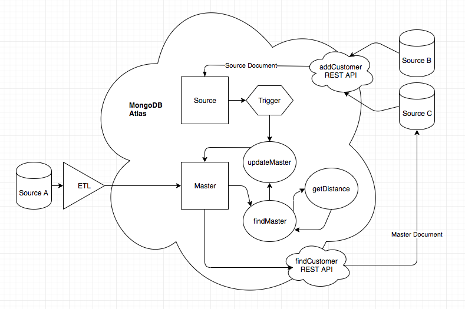

# Customer MDM Application
_Solution Architect Author_: [Britton LaRoche](mailto:britton.laroche@mongodb.com)   
_Consulting Engineer Author_: [Andre Spiegel](mailto:andre.spiegel@mongodb.com)   


## Tutorial Contents 
(Note: This prototype lab is hands on and should take an estimated time of less than 120 minutes)
1. [Overview](#-overview)
2. [Create the Atlas Cluster](#-create-the-atlas-cluster)
3. [Create the Stitch Application](#-create-the-stitch-application)
3. [Accessing customer data through a REST based API](#-accessing-customer-data-through-a-rest-based-api)
4. [QueryAnywhere](README.md)
5. [Tiggers and Functions](README.md)
6. [Importing from GitHub: Stitch Command Line tool](README.md)
7. [Host your application tutorial](README.md)  

##  Overview 
We've been hired by a fictitious auto manufacturing company called "Katana" to build a customer MDM application prototype.  Katana has a global market place consisting of automobile dealerships, online websites, and financial services for its customers of its two major brands. __"Katana"__ motors sells quality family vehicles, and its high end luxury brand __"Legacy"__ sells high performance extreemly high end luxury vehicles.  Each brand has its own set of dealerships and systems that repersent the customer in a variety of different ways.  Katana may have the same customer or the same customer household buying both brands and is unaware that these two apparently different customers may be the same individual buying cars for the same household.

  

You have been tasked to create a minimum viable product (MVP), a basic protype, of a customer MDM application across all dealerships and online sites for both Kanakata and Legacy brands. They wish to test both the functionality and performance of the application.  The functionality includes identifying a single customer from all systems and providing customer updates in real time to their third party dealerships and financing division.

  

Additionally Katana motors has been given the task of removing sensitive customer data from all its related transactional systems. The California Consumer Privacy Act (CCPA) and the Nevada Consumer Privacy Law requires Katana to remove all customer data from its many transactional systems if a customer "opts out" and does not want their identifiable data inside Katana.  The intent to change all the systems to identify the customer through a unique token generated in the Customer MDM and use only the token in all the related transactional systems.  When a transactional system needs to display customer information it will request that information via a rest based API to the Customer MDM application.  Should the customer opt out of Katana then only one system, the customer MDM, will need to remove the customer identifiable data.

The desire is to have a serverless REST based API layer to service the myriad of transactional systems that will not require any maintenance, and can scale automatically as demand increases with out human intervention.

  

Customer data will be loaded into the Customer MDM as new customers come into the website and sign up for promotional offerings.  Customer data will also come into the Customer MDM with nightly batch loads from Katana financial services for the previous days loan applications.  The two different dealerships also load prospective customers and customer purchase data when a vehicle is taken for a test drive or purchased.  All of these websites and dealerships have a variety of data formats.

Our job is to ingest data from all these sources and both preserve a record of the data as it exists in each of these systems as well as a master copy that reconciles the customer into a single view and golden source of truth across all of the systems.

## Data Flow
A basic data flow diagram was put together to solve the MDM problem.  The dealerships used a legacy system (source system A) which requires a nightly batch process and an ETL program to load data into MongoDB.  The Katana and Legacy online services (source systems B and C) have the ability to use a REST API and send JSON documents in real time.

  

MongoDB has three colections to manage the customer data.  As data comes in from the various sources they are loaded into a __"source"__ collection.  A matching function is used to find a matching master customer document based on specified rules and criteria found in the source document. If a match is found the source record is added to the array of source records in the master document and the master data fields are updated based on the latest changes reflected in the source document. If no matching master record is found the source record becomes tehmaster data and a new master record is inserted into the __"master"__ collection.

## Sample Customer Document
Lets take a look at one of the documents produced from this process. The master document has all the information relevant to the customer.  The master object has the fields that were selected from all the source systems.  Each of the source systems are listed in an array with the data as it currently is in each of the source systems.  We notice a few descrepancies between each of the systems. The email and physical addresses are different in some cases, for example her first name was misspelled at the dealership.

```js
{
  "master": {
    "first_name": "CRYSTAL",
    "middle_name": "RACHAEL",
    "last_name": "POSEY",
    "gender": "FEMALE",
    "dob": "1977-04-02",
    "address": [
      {
        "street": "5438 LINCOLN DRIVE",
        "city": "PASADENA",
        "state": "CA",
        "zip": "91106"
      }
    ],
    "phone": "+13976946512",
    "email": "kezzo@myant.com"
  },
  "sources": [
    {
      "_id": "A-00150411",
      "first_name": "KRYSTAL",
      "middle_name": "RACHAEL",
      "last_name": "POSEY",
      "gender": "FEMALE",
      "dob": "1977-04-02",
      "address": {
        "street": "1432 PALOMA DRIVE, APT. 421",
        "city": "PASADENA",
        "state": "CA",
        "zip": "91106"
      },
      "phone": "+13976946512",
      "email": "kezzom@gmail.com"
    },
    {
      "_id": "B-03166091",
      "first_name": "CRYSTAL",
      "middle_name": "RACHAEL",
      "last_name": "POSEY",
      "gender": "FEMALE",
      "dob": "1977-04-02",
      "address": {
        "street": "5438 LINCOLN DRIVE",
        "city": "PASADENA",
        "state": "CA",
        "zip": "91106"
      },
      "phone": "+13976946512",
      "email": "kezzo@myant.com"
    },
    {
      "_id": "C-07164051",
      "first_name": "CRYSTAL",
      "middle_name": "RACHAEL",
      "last_name": "POSEY",
      "gender": "FEMALE",
      "dob": "1977-04-02",
      "address": {
      "street": "5348 LINCOLN DRIVE",
      "city": "PASADENA",
      "state": "CA",
      "zip": "91106"
      },
      "phone": "+13976946512",
      "email": "kezzo@yahoo.com"
    }
  ]
}
```

This hands on lab will cover the entire process (except the ETL process) in the data flow diagram. We will create the REST API that allows the source data to be inserted from the micro services. We will create the basics of the grouping and mastering functions. 

We will create some additional components as well.  We will create a REST API service that will allow the master document to be queried and updated, with new source data merged and split as needed.  We will create a web based browser that uses the stitch SDK to create a broswer client with the full capabilities of stitch QueryAnywhere to access and manage the customer master data.

The entire project will be created and hosted in the cloud.  All of the functions, triggers and procedures will run in Stitch as serverless compute.  The data will reside in Atlas and be accessed via database as a service.  The power behind this solution offers an auto scalable maintenace free implementation of a Customer MDM.

Where do we begin?

Lets assume System B is Katana's online service.  When a user designs the car they wish to purchase on Katana's online website, by selecting the model number, color, engine size etc... they are given the opportunity of registering their customer information and saving the selection in their profile.  When they save their customer profile the Katana online service sends a json document through a REST API represnting the customer profile information to MongoDB stitch.

Below is an example of this customer profile json document.

```js
    {
      "_id": "B-04227551",
      "first_name": "MARION",
      "middle_name": "ANITA",
      "last_name": "COLE",
      "gender": "FEMALE",
      "dob": "1980-02-08",
      "address": {
        "street": "4620 FRANKLIN STREET",
        "city": "SANTA ROSA",
        "state": "CA",
        "zip": "95409"
      },
      "phone": "+14823008921",
      "email": "ox@tjwq.com"
    }
```

Due to the CCPA laws, Katana wishes to store this document in their MongoDB Customer MDM and only the id value and car selections in System B.  Our first step is to create a stitch HTTP service to recieve this data and store it in MongoDB.  To do create the Stitch service we must begin by creating a Stitch application.  To create a stitch application we need to have an Atlas cluster.  Lets begin by creating an atlas cluster.


##  Create the Atlas cluster

Open a modern browser (like google chrome) and go to https://cloud.mongodb.com.  Register for an atlas account by clicking the __"get started free"__ button.


Click the __"get started free"__ button.  This will bring up a screen for you to enter your personal information.

   

Fill in your personal information.  Feel free to use your work or personal email address, either is fine as this is your personal "free for life" development environment.  Agree to the terms of service and click the __"get started free"__ button.  

   

This will bring up window promptin you to build your first cluster.  Click the __"build your first cluster"__ button.  When prompted select "Learning MongoDB" as to the reason you are interested in Atlas. After clicking the Click the __"build your first cluster"__ button, you will be prompted to name your cluster.  "

   

__"Cluster0"__ is the default name and works well for importing data and projects later. Click the __"Create Cluster"__ button at the bottom and your cluster will be ready in the next 7 to 10 minutes.   

   

##  Create the Stitch Application

Next we will create our fist Stitch application. This task is accomplished by selecting __"Stitch"__ from the left hand navigation menu of the cluster we just created.


We click the large green button labeled __"Create new Application"__ and give the application a name.  In this case we will name our application __"customer"__   

Click the little green __"Create"__ button in the lower right hand of the popup window.  The stitch application console will appear as soon as the application has been created and linked with the cluster. 

   

##  Adding customer source data through a REST based API

When the customer saves their profile the Katana online service sends a json document through a REST API represnting the customer profile information to MongoDB stitch.  We need to create a service that will receive the customer profile as a json document.  

Select the __"Services"__ menu item from the left naviagtion pane of the stitch console.  Click the __"Create New Service"__ button.  Select __"HTTP"__ service and give the service a name of __addCustomerSource__


Click the add service button.  This will present the webhook editor.

```js
exports = async function(payload) {
  var source = context.services.get("mongodb-atlas").db("single").collection("source");
  console.log("Executing addCustomerSourceWebhook");
  var queryArg = payload.query.arg || '';
  var body = {};
  var result = { "status": "Unknown: Payload body may be empty"};
  
  if (payload.body) {
    body = EJSON.parse(payload.body.text());
    console.log(JSON.stringify(body));
    var nDate = new Date();
    //check the source_id
    if ( body._id ) {
        console.log("updating customer source document");
        result = await source.updateOne(
          {_id: body._id},
          {$set: {
              first_name: body.first_name,
              middle_name: body.middle_name,
              last_name: body.last_name,
              gender: body.gender,
              dob: body.dob,
              address: [{
                street: body.address.street,
                city: body.address.city,
                state: body.address.state,
                zip: body.address.zip
              }],
              phone: body.phone,
              email: body.email,
              last_modified: nDate
              }
          },
          {upsert: true}
        );
        console.log("after update");
        
    } else {
      result = { "status": "Error: source _id is not present"};
      return result;
    }
  }
  return  result;
};
```


Below is an example of this customer profile json document.

```js
    {
      "_id": "B-04227551",
      "first_name": "MARION",
      "middle_name": "ANITA",
      "last_name": "COLE",
      "gender": "FEMALE",
      "dob": "1980-02-08",
      "address": {
        "street": "4620 FRANKLIN STREET",
        "city": "SANTA ROSA",
        "state": "CA",
        "zip": "95409"
      },
      "phone": "+14823008921",
      "email": "ox@tjwq.com"
    }
```
   

##  Matching the proper Master Document

__getDistance__
```js
exports = function(a,b){

  /*
Copyright (c) 2011 Andrei Mackenzie
Permission is hereby granted, free of charge, to any person obtaining a copy of this software and associated documentation files (the "Software"), to deal in the Software without restriction, including without limitation the rights to use, copy, modify, merge, publish, distribute, sublicense, and/or sell copies of the Software, and to permit persons to whom the Software is furnished to do so, subject to the following conditions:
The above copyright notice and this permission notice shall be included in all copies or substantial portions of the Software.
THE SOFTWARE IS PROVIDED "AS IS", WITHOUT WARRANTY OF ANY KIND, EXPRESS OR IMPLIED, INCLUDING BUT NOT LIMITED TO THE WARRANTIES OF MERCHANTABILITY, FITNESS FOR A PARTICULAR PURPOSE AND NONINFRINGEMENT. IN NO EVENT SHALL THE AUTHORS OR COPYRIGHT HOLDERS BE LIABLE FOR ANY CLAIM, DAMAGES OR OTHER LIABILITY, WHETHER IN AN ACTION OF CONTRACT, TORT OR OTHERWISE, ARISING FROM, OUT OF OR IN CONNECTION WITH THE SOFTWARE OR THE USE OR OTHER DEALINGS IN THE SOFTWARE.
*/

// Compute the edit distance between the two given strings

  if(a.length == 0) return b.length; 
  if(b.length == 0) return a.length; 

  var matrix = [];

  // increment along the first column of each row
  var i;
  for(i = 0; i <= b.length; i++){
    matrix[i] = [i];
  }

  // increment each column in the first row
  var j;
  for(j = 0; j <= a.length; j++){
    matrix[0][j] = j;
  }

  // Fill in the rest of the matrix
  for(i = 1; i <= b.length; i++){
    for(j = 1; j <= a.length; j++){
      if(b.charAt(i-1) == a.charAt(j-1)){
        matrix[i][j] = matrix[i-1][j-1];
      } else {
        matrix[i][j] = Math.min(matrix[i-1][j-1] + 1, // substitution
                                Math.min(matrix[i][j-1] + 1, // insertion
                                         matrix[i-1][j] + 1)); // deletion
      }
    }
  }

  return matrix[b.length][a.length];
};
```

__getNormalizedDistance__
```js
exports = function(a,b){
  var result = context.functions.execute("getDistance", a,b);
  var maxLength = Math.max (a.length, b.length);
	return result / maxLength;
};
```

__findMaster__
```js
exports = async function(argSource){
  var masterDoc = {};
  var masterDoc2 = {};
  var fdist = 1;
  var ldist = 1;
  var cdist = 1;
  var master = context.services.get("mongodb-atlas").db("single").collection("master");
  console.log("findMaster 1");
  masterDoc = await master.findOne({"sources._id": argSource._id});
  if (masterDoc){
    if (masterDoc.master){
      return masterDoc;
    } 
  }
  console.log("findMaster 2");
  // Try to find an existing master document. 
  // Search by the date of birth and compare first and last names
  var masterDocList = await master.find({"master.dob": argSource.dob}).toArray()
  .then( docs => {
      docs.map(c => {
        if(c.sources){
          c.sources.forEach( function(testSource){
            fdist = context.functions.execute("getNormalizedDistance", argSource.first_name,testSource.first_name);
            ldist = context.functions.execute("getNormalizedDistance", argSource.last_name,testSource.last_name);
            cdist = (0.5 * fdist) + (0.5 * ldist);
            //console.log("testSource._id: " + testSource._id + ", ts first_name: " + testSource.first_name + ", ts last_name: " + testSource.last_name + ", cdist: " + cdist);
            if (cdist < 0.4) {
              console.log("Found Group Matching Names and DOB: " + JSON.stringify(c));
              masterDoc2 = c;
            } 
          });
        }
      });
  });
  return masterDoc2;
};
```

   

##  Creating and updating the master document

__updateMaster__
```js
exports = async function(argSource){
  var result = {};
  var masterDoc = {};
  var newMasterDoc = {};
  var sourceAdressObject = context.functions.execute("addressObject", argSource);
  var master = context.services.get("mongodb-atlas").db("single").collection("master");
  var nDate = new Date();
  console.log("updateMaster source doc: " + JSON.stringify(argSource));

  masterDoc = await context.functions.execute("findMaster", argSource);
  console.log("updateMaster find master doc: " + JSON.stringify(masterDoc))
  if(masterDoc.master){
    /*
    * we update the existing master doc with the source information
    * the most recent information is considered to be correct
    * this keeps data from getting stale
    */
    console.log("updating master document");
    await master.updateOne(
        { _id: masterDoc._id},
        { $set: {
          owner_id: argSource.owner_id,
          master: argSource,
          last_modified: nDate
          }
        }
    );
    if (masterDoc.sources){
      console.log("master ... $pull..." );
      await master.updateOne(
        	{ _id: masterDoc._id },
        	{ $pull: { "sources": { _id: argSource._id } }	}
        );
    }
    console.log("master ... $addToSet..." );
    await master.updateOne(
    	{ _id: masterDoc._id },
    	{ $addToSet: { "sources": sourceAdressObject  } } 
    );
  } else {
    //we create a new master document
    newMasterDoc.master = argSource;
    newMasterDoc["sources"] = [sourceAdressObject];
    newMasterDoc.last_modified = nDate;
    console.log("updateMaster newMasterDoc: " + JSON.stringify(newMasterDoc));
    master.insertOne(newMasterDoc);
  }
  result = await context.functions.execute("findMaster", argSource);
  return result;
};
```

   

##  Creating and updating the master document
