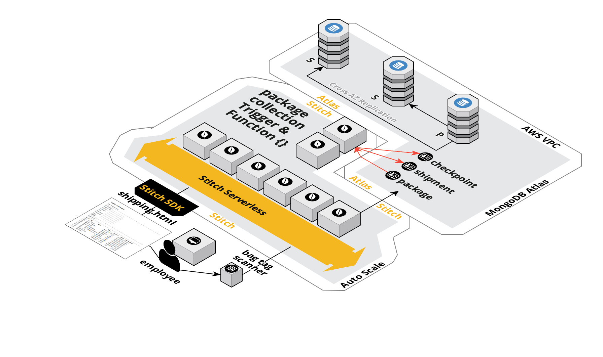

# Shipping Application

## Overview 

In this short tutorial we are going to create a Shipping application that tracks changes to packages as they are transported over time.  To accomplish this we will modify the results of our [MongoDB blog tutorial](https://docs.mongodb.com/stitch/tutorials/blog-overview/) by adding additional fields and using an "upsert" (update / insert) into a new __"Ship"__ database with a __shipment, package and checkpoint__ collection. We will add a trigger to update the shipment bill of lading 

   

It is important to note the various componets we will be using in the tutorial, listed in the diagram above.  You will be both the developer and user on an HR application insterteding employee data into the employees collection.  The Stitch serverless framework will monitor the employee collection through an Stitch trigger.  As soon as it detects a change a trigger function will execute inside the Stitch serverless framework and outside of the database.  This affords a highly scalable solution with out impacting database processing, as the trigger function code always executes outside of the database server. Additonal information on triggers are available here [MongoDB Trigger Documenatation](https://docs.mongodb.com/stitch/triggers/).
