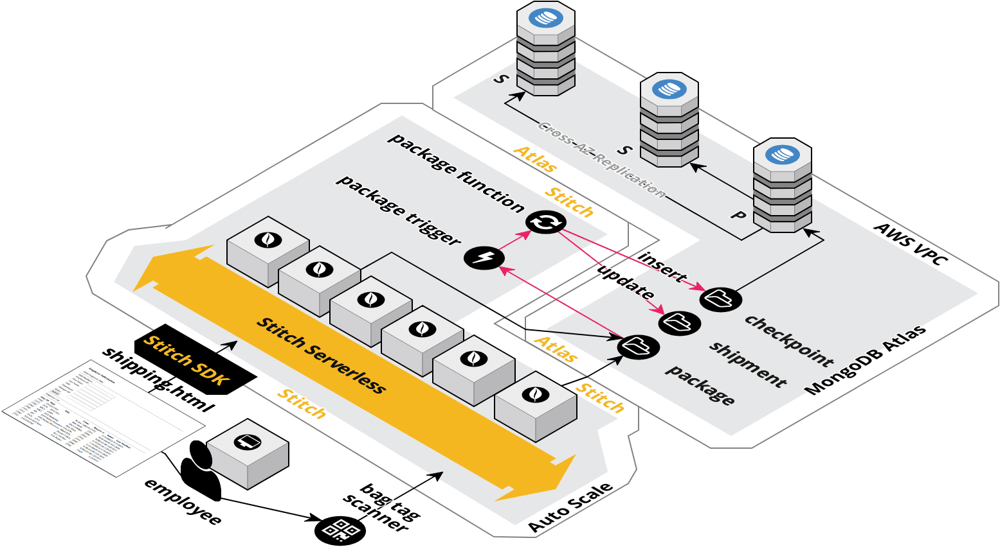
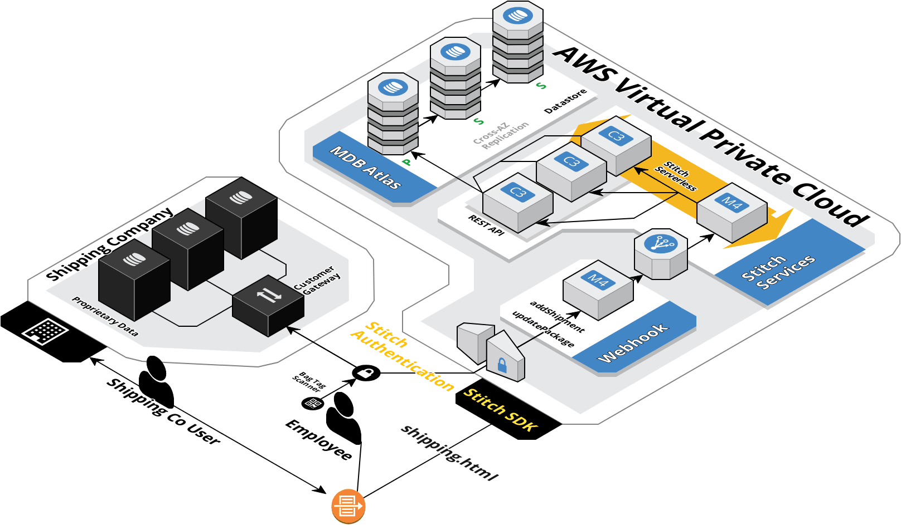

# Shipping Application

## Overview 

In this short 60 minute tutorial we are going to create a shipping application that tracks changes to packages as they are transported over time.  To accomplish this we will modify the results of our [MongoDB blog tutorial](https://docs.mongodb.com/stitch/tutorials/blog-overview/) to create a new shipping html file by adding additional fields and using an "upsert" (update / insert) into a new __"Ship"__ database with a __shipment, package and checkpoint__ collection. We will add a trigger to update the shipment bill of lading and insert the full document to a checkpoint collection when changes are made to the package collection.  We will add some additional functions and enable a REST based API through a serverless framework to communicate with external shipping companies, cutomers and baggage and package handlers.

   

It is important to note the various componets we will be using in the tutorial, listed in the diagram above. The Stitch serverless framework will monitor the package collection through a Stitch trigger.  As soon as it detects a change, the trigger function will execute inside the Stitch serverless framework and outside of the database.  This affords a highly scalable solution with out impacting database processing, as the trigger function code always executes outside of the database server. Additonal information on triggers are available here [MongoDB Trigger Documenatation](https://docs.mongodb.com/stitch/triggers/).

The process begins with a user inserting a shipping document into the shipping collection.  The shipping document containins an array of packages to be shipped.  The original document can be inserted through a webhook using a REST based API or through a browser application.
As the packages are tagged and checked in, the package information is updated or inserted into the package collection.  The trigger fires and updates the shipping document with the new package location and event information.

  

The bag scanner or the application that is updated by the bag scanner can update the package information using the stitch serverless rest based API called Stitch.  The REST based API opens the door for shipping companies to send shipping documents before the packages arrive.  The shipping document is updated as the packages are checked in and loaded and acts as a bill of lading, acknowledging receipt of each package as cargo for shipment.

  

All of the major components of the shipping application have been captured in the diagrams above. In this tutorial we will create the following objects to develop the shipping application.

### Collections
__shipment__   
__package__   
__checkpoint__   

### Functions
__findShipment__   
__findPackage__   
__fncPackageUpdate__   

### Trigger
__trgPackageCheckpoint__   

### Services

### Webhooks

