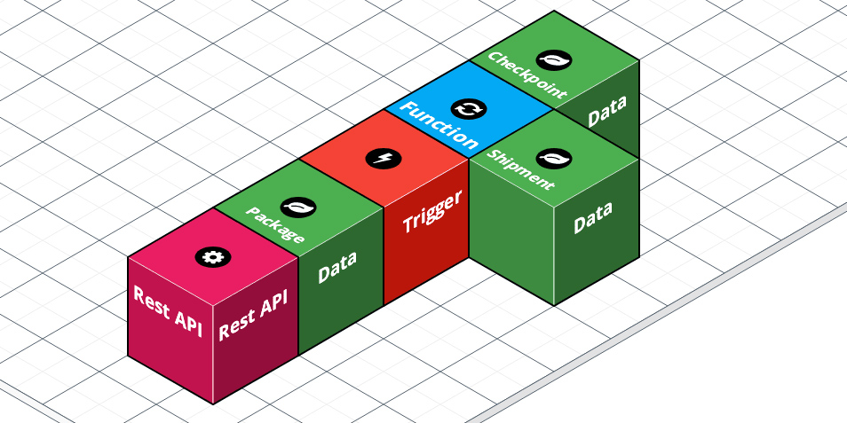

# Shipping: Triggers and Functions
_Solution Architect Author_: [Britton LaRoche](mailto:britton.laroche@mongodb.com)   

## Tutorial Contents 
(Note: All HR tutorials are hands on and should take an estimated time of less than 20 minutes)
1. [Overview](../../)
2. [Accesing shipment data through a REST based API](../rest/README.md)
3. [Triggers and Functions](../triggers/README.md)
4. [Query Anywhere](../queryAnywhere/README.md)
4. [Importing from GitHub: Stitch Command Line tool](../cli/README.md)
5. [Host your application tutorial](../hosting/README.md)  

## Overview
We need to keep changes made to the package collection in sync with the shipping collection.  Our analysis shows that Pronto's shipping application will be 80% reads and 20% writes.  In order to make the reads efficent we will make changes on the shipping document through an Atlas trigger when the package collection is updated.

We will also update a checkpoint collection to implement the versioning design pattern.  We will keep a version of each docuemnt as it passes through each checkpoint.  Notice that the diagram above shows the Atlas trigger and fucntion executing in the stitch serverless framework.  The execution of the code in the trigger takes place outside of Atlas and will not impact database performance. 

## 1. Create the 

Again, thinking of these objects as a set of building blocks the solution is easy to visualize.  We will insert data through the REST API into the database where the collection is being watched by a trigger in stitch.  The trigger will fire executing logic to update two other collections.  The whole design in building blocks looks like the following.

