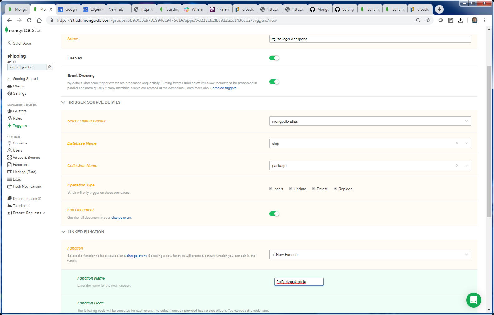
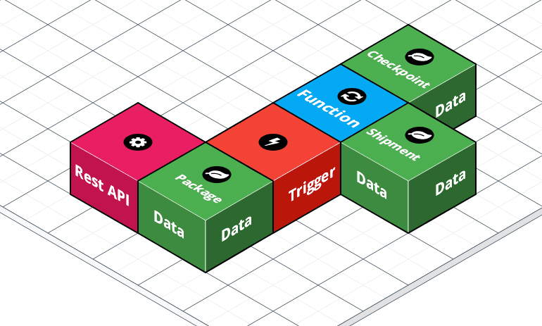

# Shipping: Triggers and Functions
_Solution Architect Author_: [Britton LaRoche](mailto:britton.laroche@mongodb.com)   

## Tutorial Contents 
(Note: All HR tutorials are hands on and should take an estimated time of less than 20 minutes)
1. [Overview](../../)
2. [Accesing shipment data through a REST based API](../rest/README.md)
3. [Triggers and Functions](../triggers/README.md)
4. [Query Anywhere](../queryAnywhere/README.md)
4. [Importing from GitHub: Stitch Command Line tool](../cli/README.md)
5. [Host your application tutorial](../hosting/README.md)  


## Overview
We need to keep changes made to the package collection in sync with the shipping collection.  Our analysis shows that Pronto's shipping application will be 80% reads and 20% writes.  In order to make the reads efficent we will make changes on the shipping document through an Atlas trigger when the package collection is updated.


We will also update a checkpoint collection to implement the versioning design pattern.  We will keep a version of each document as it passes through each checkpoint.  Notice that the diagram above shows the Atlas trigger and fucntion executing in the stitch serverless framework.  The execution of the code in the trigger takes place outside of Atlas and will not impact database performance. 

## 1. Create the package trigger
We will create and atlas trigger __trgPackageCheckpoint__  that will call a function __fncPackageUpdate__   to update the shipment and checkpoint collections everytime the package collection is updated.

trigger name: __trgPackageCheckpoint__   
function name: __fncPackageUpdate__   
datbase name: __ship__   
collection name: __package__ 

Start by clicking the "triggers" menu item on the left hand navigation pane and then press the "create new trigger" button.  The trigger creation windw appears.  We need to configure the trigger with the following features, the name is __trgPackageCheckpoint__. Next we insure that the trigger is enabled and event ordering is turned on, these are the defaults.  We select mongodb-atlas as our linked cluster, datbase name is __ship__, collection name we are watching is __package__.  We want to capture the __Full Document__ make sure that slider is moved to the right and green.  We also want to capture information for any insert, update, delete or replace so make sure all those boxes are checked.

Next we want to link a new function so click the "+ New Function" in the select list and give the function name __fncPackageUpdate__.  A default function template is generated.  Click save. All that remains is writing the code for that function to update the checkpoint and shipment collections.



## 2. Write the package update function 
We just created the fucntion in the previous step.  Select the __"Functions"__ menu item in the left navigation pane of the stitch console.  A screen appears listing the functions for the stitch application


```js
exports = function(changeEvent) {
  /*
    A Database Trigger will always call a function with a changeEvent.
    Documentation on ChangeEvents: https://docs.mongodb.com/manual/reference/change-events/

    Access the _id of the changed document:
    var docId = changeEvent.documentKey._id;

    Access the latest version of the changed document
    (with Full Document enabled for Insert, Update, and Replace operations):
    var fullDocument = changeEvent.fullDocument;

    var updateDescription = changeEvent.updateDescription;

    See which fields were changed (if any):
    if (updateDescription) {
      var updatedFields = updateDescription.updatedFields; // A document containing updated fields
    }

    See which fields were removed (if any):
    if (updateDescription) {
      var removedFields = updateDescription.removedFields; // An array of removed fields
    }

    Functions run by Triggers are run as System users and have full access to Services, Functions, and MongoDB Data.

    Accessing a mongodb service:
    var collection = context.services.get("mongodb-atlas").db("db_name").collection("coll_name");
    var doc = collection.findOne({ name: "mongodb" });

    To call other named functions:
    var result = context.functions.execute("function_name", arg1, arg2);
  */


  console.log("Function fncPackageUpdate called ... executing..." );
  
  var shipment = context.services.get("mongodb-atlas").db("ship").collection("shipment");
  var checkpoint = context.services.get("mongodb-atlas").db("ship").collection("checkpoint");
  var fullDocument = changeEvent.fullDocument;
  var fullCopy = fullDocument;
  
  //update the shipping document with the new package information
  console.log("Shipment updateOne ... executing..." );
  console.log("fullDocument");
  console.log(JSON.stringify(fullDocument));
  shipment.updateOne(
  	{ shipment_id: parseInt(fullDocument.shipment_id) },
  	{ $pull: { "packages": { package_id: fullDocument.package_id } }	}
  );
  
  console.log("Shipment ... $addToSet..." );
  shipment.updateOne(
  	{ shipment_id: parseInt(fullDocument.shipment_id) },
  	{ $addToSet: { "packages": { 
  	  package_id: fullDocument.package_id, 
  	  tag_id: fullDocument.tag_id, 
  	  type: fullDocument.type, 
  	  tracking: fullDocument.tracking, 
  	  description: fullDocument.description, 
  	  last_event: fullDocument.last_event, 
  	  location: fullDocument.location, 
  	  last_modified: fullDocument.last_modified, 
  	  fullDocument } } }
  );
  
  //track all changes to the package in the checkpoint collection
  fullCopy.parent_id = fullDocument._id;
  delete fullCopy._id;
  checkpoint.insertOne(fullCopy);

};
```

Again, thinking of these objects as a set of building blocks, the solution is easy to visualize.  We will insert data through the REST API into the database where the collection is being watched by a trigger in stitch.  The trigger will fire a function with logic to update two other collections the shipment collectoion and the checkpoint collection.  The whole design in building blocks looks like the following.



