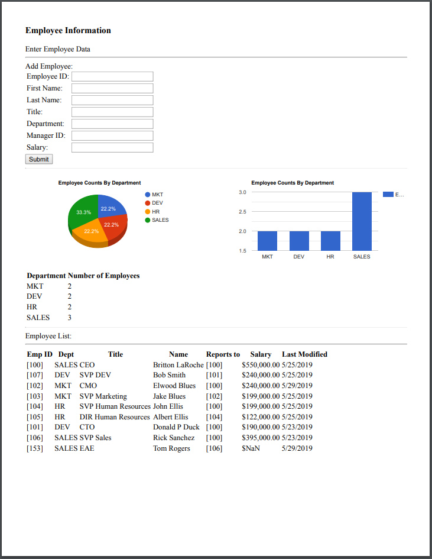

## Embedding Google Charts
_SA Author_: [Britton LaRoche](mailto:britton.laroche@mongodb.com)   
(Note this tutorial build's on the [Employee Tutorial](../employee))

## Full Tutorial Contents 
1. [MongoDB blog tutorial](https://docs.mongodb.com/stitch/tutorials/blog-overview/)
2. [Atlas Triggers and Functions: Employee tutorial](https://github.com/brittonlaroche/MongoDB-Demos/edit/master/Stitch/employee/)
3. [Stitch Query Anywhere tutorial](https://github.com/brittonlaroche/MongoDB-Demos/edit/master/Stitch/rest)
4. [Embed Atlas Charts in your app tutorial](https://github.com/brittonlaroche/MongoDB-Demos/edit/master/Stitch/charts)
5. [Embed Google Charts tutorial](https://github.com/brittonlaroche/MongoDB-Demos/edit/master/Stitch/charts-google) 
6. [Embed an Org Chart tutorial](https://github.com/brittonlaroche/MongoDB-Demos/edit/master/Stitch/charts-google) 
7. [Host your application tutorial](https://github.com/brittonlaroche/MongoDB-Demos/edit/master/Stitch/hosting) 

## Google charts overview 

Google has a number of easily imported charting functions that you can imbed in your stitch application with minimal coding effort.  In this tutorial we show how to embed a google pie and column chart into your basic employee application.  The data is loaded directly from stitch into a data object that is passed into the draw chart function.

The result is shown below:


No effort was put into the html page, no css or framework was added to the html, to keep it in its most simple and pure form. The image above was generated by selecting "file/print" from the browser menu.  Its simple, elegant and powerful.  Lets get started.  

## Source file
[Employee Google Charts](employeeGoogleChart.html) you can click the link and copy the html into a text editor.  Change 'your-app-id' to the application displayed in your stitch console.  Save the file as employeeChartsGoogle.html and double click to see the reports generated for your employee application.  The rest of this tutorial explains how to create this file from the original employee.html covered in the [Atlas Triggers and Functions: Employee tutorial](https://github.com/brittonlaroche/MongoDB-Demos/edit/master/Stitch/employee/)

## Aggregation of employees by department
The first step is to gather the data required by the charts.  The charts will display a count of employees by department.  Lets begin by creating a new function to count the employees by department and display the results as a table.

```
	function displayEmployeeCounts() {
		//We will aggregate the employee data by department and create a table with totals
		const tStrt = "<div><table><tr><th>Department</th><th>Number of Employees</th></tr>";
		const cEmployees = db.collection("employees");
		cEmployees.aggregate([{"$group":{"_id":"$department","num_employees":{"$sum":1}}}]).asArray()
		    .then(docs => {
		      const html = docs.map(c => "<tr><td>" +
		      c._id +  "</td><td>" +
		      c.num_employees + "</td><td>" +
		      "</tr>").join("");
		      document.getElementById("employee_counts").innerHTML = tStrt + html + "</table></div>";
		    });
	}
```

Next we add a div tag ```<div id="employee_counts"></div>``` to contain the "employee_counts" table.

```
     <input type="submit" onClick="addEmployee()">
      <hr>
	  <table><tr><td><div id="employee_piechart"></div><td><td><div id="employee_columnchart"></div></tr>
	  </table>
	  <div id="employee_counts"></div>
      <hr>
	  Employee List:
      <hr>
	  <div id="employees"></div>
  </body>
```


