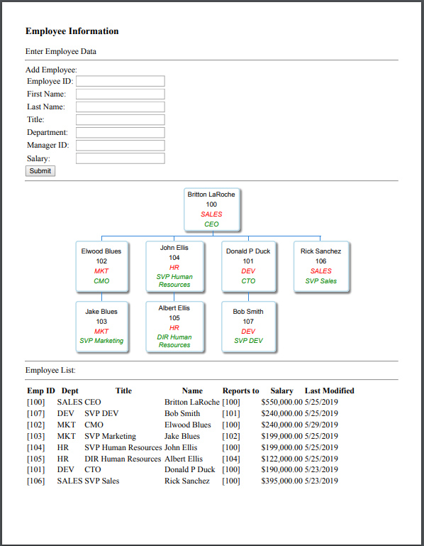

## Embedding Org Charts
_SA Author_: [Britton LaRoche](mailto:britton.laroche@mongodb.com)   
(Note this tutorial build's on the [Employee Tutorial](../employee))

### Tutorial Contents 
1. [MongoDB blog tutorial](https://docs.mongodb.com/stitch/tutorials/blog-overview/)
2. [Atlas Triggers and Functions: Employee tutorial](https://github.com/brittonlaroche/MongoDB-Demos/edit/master/Stitch/employee/)
3. [Stitch Query Anywhere tutorial](https://github.com/brittonlaroche/MongoDB-Demos/edit/master/Stitch/rest)
4. [Embed Atlas Charts in your app tutorial](https://github.com/brittonlaroche/MongoDB-Demos/edit/master/Stitch/charts)
5. [Embed Google Charts tutorial](https://github.com/brittonlaroche/MongoDB-Demos/edit/master/Stitch/charts-google) 
6. [Embed an Org Chart tutorial](https://github.com/brittonlaroche/MongoDB-Demos/edit/master/Stitch/charts-org) 
7. [Host your application tutorial](https://github.com/brittonlaroche/MongoDB-Demos/edit/master/Stitch/hosting) 

## Google Org chart overview
Google has a number of easily imported charting functions that you can imbed in your stitch application with minimal coding effort. In this tutorial we show how to embed a google org chart into your basic employee application. The data is loaded directly from stitch into a data object that is passed into the draw chart function.

The result is shown below:      

   

Google charts are a good alternative to Atlas charts, but they do require coding and additional effort to set up.  Atlas charts require no code. The charts are easily created in the intuitive interface provided by Atlas Charts, and quickly are embeded as an iframe.  This tutorial is merely to show another method of adding another set of charts to your application. In this case a google Org chart was chosen as this type of chart does not yet exist in Atlas charts.

No effort was put into beautifying the html page, no css or framework was added to the html, to keep it in its most simple and pure form. The image above was generated by selecting "file/print" from the browser menu. It may not be pretty, but its simple, elegant and powerful.  Lets get started.  

### Source file
The completed source file is in the link here [Employee Org Chart](employeeOrgChart.html), you can click the link and copy the html into a text editor.  Change 'your-app-id' to the application displayed in your stitch console.  

```
const client = stitch.Stitch.initializeDefaultAppClient('your-app-id');
```

Save the file as employeeOrgChart.html and double click to see the reports generated for your employee application in the browser.  The rest of this tutorial explains how to create this file from the original [employee.html](../employee/employee.html) covered in the [Atlas Triggers and Functions: Employee tutorial](https://github.com/brittonlaroche/MongoDB-Demos/edit/master/Stitch/employee/)

### 1. Importing Google Charts
Google charts are created in three steps.  The first step requires importing the javascript library form google.  Next we specify the chart type.  We then load the chart data into a data table object and pass that data object into the charts draw function. Lets begin by importing the chart's java script library from gooogle.  We add the import in the header section of the html right after we import the stitch sdk.

```
<html>
  <head>
    <script src="https://s3.amazonaws.com/stitch-sdks/js/bundles/4.4.0/stitch.js"></script>
    <script type="text/javascript" src="https://www.gstatic.com/charts/loader.js"></script>
    ...
```

Next we load the orgchart package ```google.charts.load('current', {'packages':['orgchart']});``` as we initialize the variables for our functions.

```
<html>
  <head>
    <script src="https://s3.amazonaws.com/stitch-sdks/js/bundles/4.4.0/stitch.js"></script>
    <script type="text/javascript" src="https://www.gstatic.com/charts/loader.js"></script>
    <script>
        const client = stitch.Stitch.initializeDefaultAppClient('your-app-id');
        const db = client.getServiceClient(stitch.RemoteMongoClient.factory,
        "mongodb-atlas").db('HR');
	google.charts.load('current', {'packages':['orgchart']});
	...
```

We also need to add a new div tag as a place for the rendered chart in our application.   Lets call it "chart_div" and place it after the submit button, but above the employee list.

```
      <input type="submit" onClick="addEmployee()">
      <hr>
	  <div id="chart_div"></div>
      <hr>
      Employee List:
      <hr>
	  <div id="employees"></div>
  </body>
</html>

```

### 2. Drawing the google org chart
To draw the org chart we begin by initializing variables for the data table and the chart object.

```
            var data = new google.visualization.DataTable();
            var chart = new google.visualization.OrgChart(document.getElementById('chart_div'));
```

Notice we pass in the "chart_div" created earlier when we initailize the chart variable to indicate where to render the chart.  Now we need to add columns for the org chart.  The org chart will map the employee id to the manager id.

```
            data.addColumn('string', 'Employee');
            data.addColumn('string', 'Manager');
```

Now we need to query the database and add in the relevant information to the chart.  Everything we need to display has to be crammed in as a set of div tags in the employee column, right after the employee id.  If we want to simply display a bunch of numbers in an org chart we can do the following:

```
data.addRow([ myDoc.employee_id.toString(), myDoc.manager_id.toString()] );
```
But thats not very interesting.  We can pass in the title department and name along with the id as a json document with the following code. The "v" is for the value of the employee_id, and "f" is for the additional fields seperated by div tags.  We put those tags in a variable called mydiv.

```
data.addRow([{v: myDoc.employee_id.toString() , f: mydiv },myDoc.manager_id.toString()] );
```

We need to loop through each employee record and gather the data in a "forEach" loop to build the mydiv varable.  Below is a sample that just adds the employee first name and last name to the mydiv variable.

```
db.collection('employees').find(searchDoc, {limit: 1000}).asArray()
            .then(docs => {
                docs.forEach( function(myDoc) {
                        var mydiv = "<div>" +
                            myDoc.first_name +
                            " " + myDoc.last_name +
                            "</div>"
                        ;
			data.addRow([{v: myDoc.employee_id.toString() , f: mydiv },myDoc.manager_id.toString()] );
		});
```
We want to add the fisrt and last name, title and department and give the title and department fancy colors on our org chart.  We accomplish that with the following function.

```
	function displayOrgChart( aSearchDoc ) {
            var data = new google.visualization.DataTable();
            var chart = new google.visualization.OrgChart(document.getElementById('chart_div'));
            data.addColumn('string', 'Employee');
            data.addColumn('string', 'Manager');
            var searchDoc = {};
            db.collection('employees').find(searchDoc, {limit: 1000}).asArray()
            .then(docs => {
                docs.forEach( function(myDoc) {
                        var mydiv = "<div>" +
                            myDoc.first_name +
                            " " + myDoc.last_name +
                            "</div>" +
                            "<div>" +
                            myDoc.employee_id +
                            "</div>" +
                            "<div style='color:red; font-style:italic'>" +
                            myDoc.department +
                            "</div>" +
                            "<div style='color:green; font-style:italic'>" +
                            myDoc.title +
                            "</div>"
                        ;
			data.addRow([{v: myDoc.employee_id.toString() , f: mydiv },myDoc.manager_id.toString()] );
		});
                // Create the chart.
                chart.draw(data, {allowHtml:true});
            });
        }
```
### 3. Calling the draw chart function
