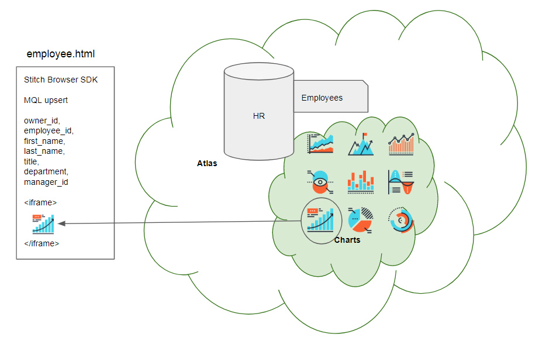

Note this tutorial build's on the [Employee Tutorial](../employee)

## Tutorial Contents 
1. [MongoDB blog tutorial](https://docs.mongodb.com/stitch/tutorials/blog-overview/)
2. [Atlas Triggers and Functions: Employee tutorial](https://github.com/brittonlaroche/MongoDB-Demos/edit/master/Stitch/employee/)
3. [Stitch Query Anywhere tutorial](https://github.com/brittonlaroche/MongoDB-Demos/edit/master/Stitch/rest)
4. [Atlas Charts tutorial](https://github.com/brittonlaroche/MongoDB-Demos/edit/master/Stitch/charts)

## Atlas Charts Overview
In this short tutorial we are going to build some atlas charts on our employee data created in our HR application.  Once the charts are created we will embed them in our employee application.  Creating charts is very easy, it does not require any code, you can drag and drop fields and apply functions such as sum and count to create stunning charts in a matter of minutes.

### 1. Create a new Atlas Dashboard
Log in to atlas from https://cloud.mongodb.com. Create a new stitch Atlas Dashboard by selecting "Charts" from the left menu pain.   

After selecting the chart menu item a new charts window will open in your browser, press the "New Dashboard" button. Give the new dashboard a name and description, such as "Employees" and "HR Data."   

### 2. Create a new Atlas Chart
After the dashboard is created, click the "Add Chart" button. Next you have to select a datasource for the chart. Press the green slector button "Choose a Data Source"  Select the HR.employees collection we created earlier in the [Atlas Triggers and Functions: Employee tutorial](https://github.com/brittonlaroche/MongoDB-Demos/edit/master/Stitch/employee/). Then select a chart type from the "chart type" drop list, and choose "circular."  Drag and drop the dpartment field into the section named "Label" and the employee_id field into the section named "Arc."  Choose the "count" function from the aggregate drop list in the Arc section.  We now have our first chart which counts employees by department.

### 3. Embed the new Atlas Chart in the employee applictaion
The saved chart has a set of menu items along the top right ofthe chart border, they become visisble as you mouse over them inside the dashboard editor. Press the item labeled "..." for a drop list of menu items and select "Embed Chart"

