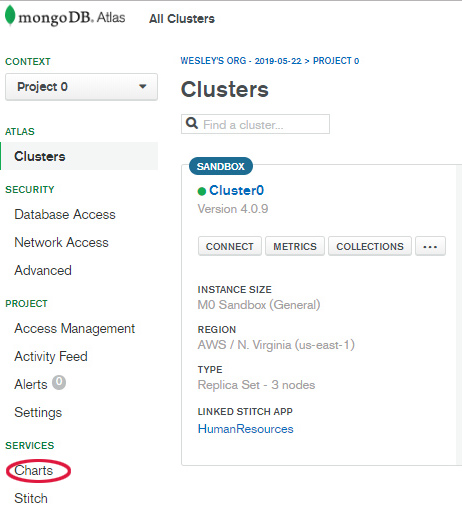
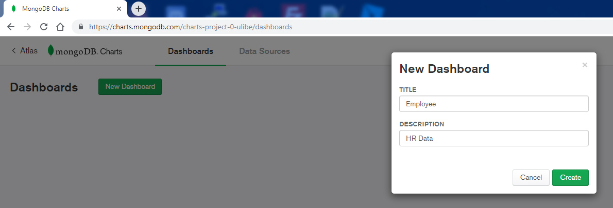
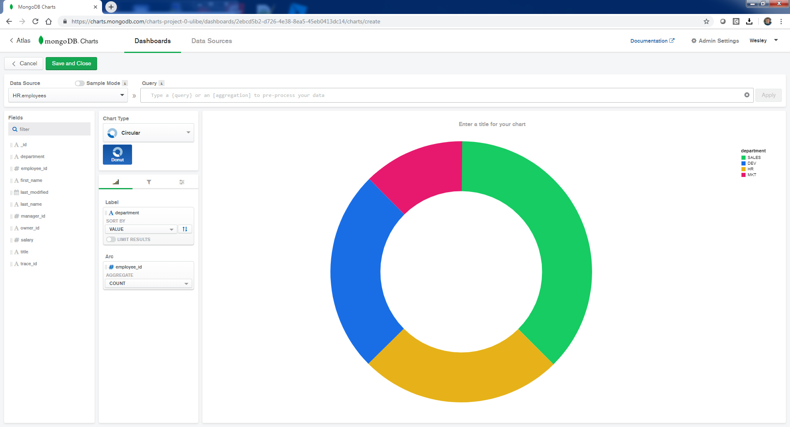
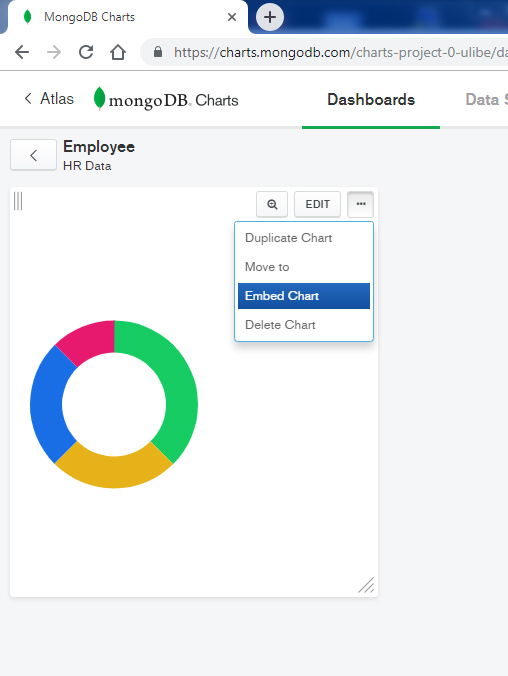
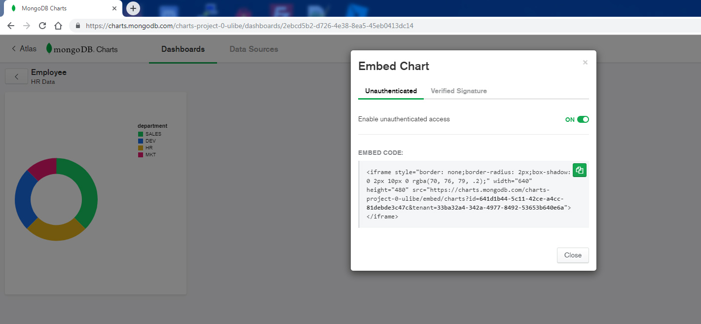
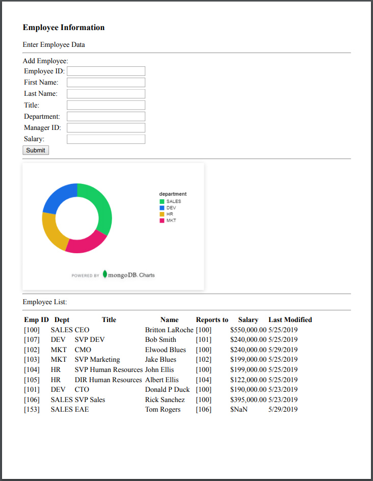

## Embedding Atlas Charts
_SA Author_: [Britton LaRoche](mailto:britton.laroche@mongodb.com)   
(Note this tutorial build's on the [Employee Tutorial](../employee))

## Tutorial Contents 
(Note: All HR tutorials are hands on and should take an estimated time of less than 20 minutes)
1. [MongoDB blog tutorial](../blog)
2. [Atlas Triggers, Functions & Stitch Query Anywhere: HR Employee tutorial](../employee/)
3. [Stitch Rest API: HR Employee Tutorial](../rest)
4. [Embed Atlas Charts in your app tutorial](../charts)
5. [Embed Google Charts tutorial](../charts-google) 
6. [Embed an Org Chart tutorial](../charts-org) 
7. [Host your application tutorial](../hosting) 

## Atlas Charts Overview
In this short tutorial we are going to build some atlas charts on our employee data created in our HR application.  Once the charts are created we will embed them in our employee application.  Creating charts is very easy, it does not require any code, you can drag and drop fields and apply functions such as sum and count to create stunning charts in a matter of minutes.  Charts is hosted as a service along with Atlas so you do not need to configure any servers.  If you do want to run charts on premises you can install your own container after downloading the image from the [MongoDB Charts](https://www.mongodb.com/products/charts) page.  Instruction for installing charts on premises can be found [here](https://docs.mongodb.com/charts/onprem/installation/).


### 1. Create a new Atlas Dashboard
Log in to atlas from https://cloud.mongodb.com. Create a new stitch Atlas Dashboard by selecting "Charts" from the left menu pain.   



After selecting the chart menu item a new charts window will open in your browser, press the "New Dashboard" button. Give the new dashboard a name and description, such as "Employees" and "HR Data."   



### 2. Create a new Atlas Chart
After the dashboard is created, click the "Add Chart" button. Next you have to select a datasource for the chart. Press the green slector button "Choose a Data Source"  Select the HR.employees collection we created earlier in the [Atlas Triggers and Functions: Employee tutorial](https://github.com/brittonlaroche/MongoDB-Demos/edit/master/Stitch/employee/). Then select a chart type from the "chart type" drop list, and choose "circular."  Drag and drop the dpartment field into the section named "Label" and the employee_id field into the section named "Arc."  Choose the "count" function from the aggregate drop list in the Arc section.  We now have our first chart which counts employees by department.



### 3. Embed the new Atlas Chart in the employee applictaion
The saved chart has a set of menu items along the top right ofthe chart border, they become visisble as you mouse over them inside the dashboard editor. Press the item labeled "..." for a drop list of menu items and select "Embed Chart."



The embed chart dialog window will open. It is important to note that the user must have privileges to view the chart.  This is accomplished by following the instructions in the section labeled "Verified Signature."  There are multiple ways to control access to the data visualized in the chart.  See the bonus section for how to do this with stitch.  For the purpose of this tutorial we will provide "unauthenticated access" move the slider to the right and follow the instructions to allow unauthenticated access to your chart.



Click the copy button icon.  This copies an iframe that can be embeded in your [employee.html](https://github.com/brittonlaroche/MongoDB-Demos/blob/master/Stitch/employee/employee.html) file.  Lets put it in below the submit button, but above the employee list:

```html
<iframe style="border: none;border-radius: 2px;box-shadow: 0 2px 10px 0 rgba(70, 76, 79, .2);" width="640" height="480" src="https://charts.mongodb.com/charts-project-0-ulibe/embed/charts?id=<your-chart-data>"></iframe>
```

An example is provided here

```html
      <input type="submit" onClick="addEmployee()">
      <hr>
      <iframe style="border: none;border-radius: 2px;box-shadow: 0 2px 10px 0 rgba(70, 76, 79, .2);" width="640" height="480" src="https://charts.mongodb.com/charts-project-0-ulibe/embed/charts?id=<your-chart-data>"></iframe>
      <hr>
      Employee List:
      <hr>
      <div id="employees"></div>
```

And the final result... is beatiful...   


## Next Steps
5. [Embed Google Charts](https://github.com/brittonlaroche/MongoDB-Demos/edit/master/Stitch/charts-google) in your application.
6. [Embed an Org Chart](https://github.com/brittonlaroche/MongoDB-Demos/edit/master/Stitch/charts-google) in your application.
7. [Host your application](https://github.com/brittonlaroche/MongoDB-Demos/edit/master/Stitch/hosting) upload your application to stitch hosting services and host it on the web at mongodbstitch.com for everyone to see.

