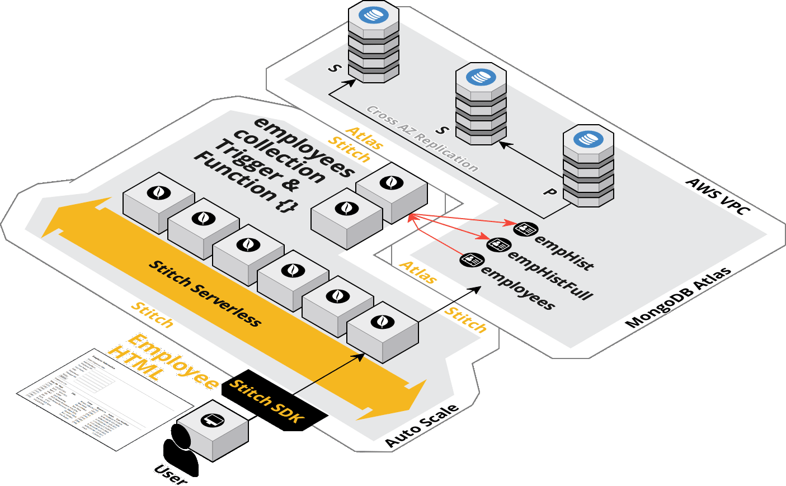
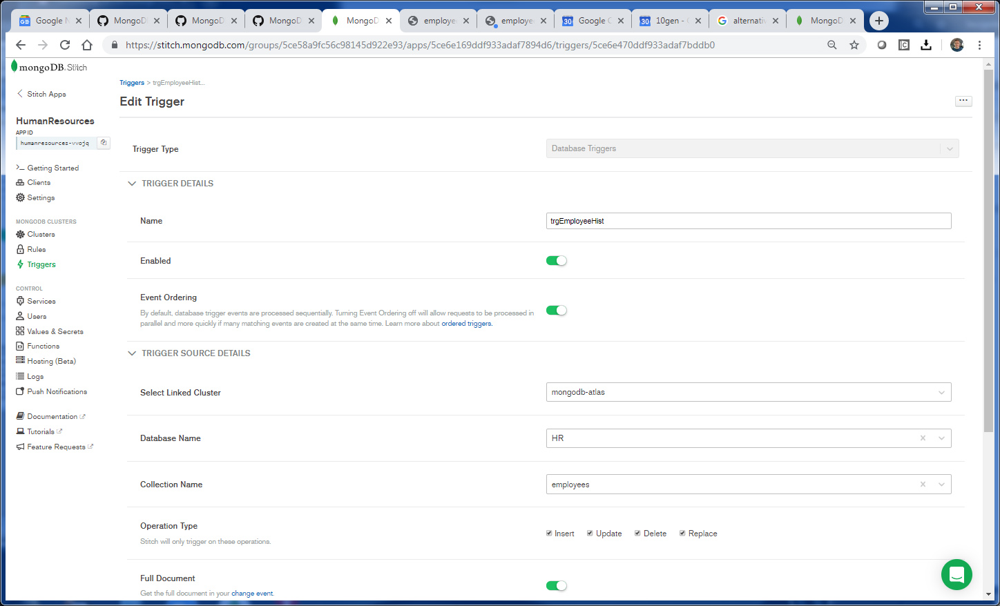

## Atlas Triggers and Functions: Employee Application
_SA Author_: [Britton LaRoche](mailto:britton.laroche@mongodb.com)   
(Note: This tutorial builds upon concepts learned in the official [MongoDB blog](https://docs.mongodb.com/stitch/tutorials/blog-overview/) tutorial.)

## Tutorial Contents 
(Note: All HR tutorials are hands on and should take an estimated time of less than 20 minutes)
1. [MongoDB blog tutorial](../blog)
2. [Atlas Triggers, Functions & Stitch Query Anywhere: HR Employee tutorial](../employee/)
3. [Stitch Rest API: HR Employee Tutorial](../rest)
4. [Embed Atlas Charts in your app tutorial](../charts)
5. [Embed Google Charts tutorial](../charts-google) 
6. [Embed an Org Chart tutorial](../charts-org) 
7. [Host your application tutorial](../hosting) 

## Overview 

In this short tutorial we are going to create a Human Resources application that tracks changes to employees over time.  To accomplish this we will modify the results of our [MongoDB blog tutorial](https://docs.mongodb.com/stitch/tutorials/blog-overview/) by adding additional fields and using an "upsert" (update / insert) into a new HR database with an employees collection. We will add a trigger to take the new full employee document into one collection, and just the updated fields into a second collection.  

   

It is important to note the various componets we will be using in the tutorial, listed in the diagram above.  You will be both the developer and user on an HR application insterteding employee data into the employees collection.  The Stitch serverless framework will monitor the employee collection through an Stitch trigger.  As soon as it detects a change a trigger function will execute inside the Stitch serverless framework and outside of the database.  This affords a highly scalable solution with out impacting database processing, as the trigger function code always executes outside of the database server. Additonal information on triggers are available here [MongoDB Trigger Documenatation](https://docs.mongodb.com/stitch/triggers/).

If you have not created an Atlas account then you need to register at https://cloud.mongodb.com and create a free tier cluster before you can continue.  Instructions on creating a free tier accouunt can be found here: https://docs.atlas.mongodb.com/getting-started/

### 1. Create a new stitch app
Log in to atlas from https://cloud.mongodb.com. Create a new stitch app by selecting "Stitch" from the left menu pain. 
Click the button "Create New Stitch App. Type in __"HumanResources"__ (no spaces) for the application name and click the create button in the lower right.

### 2. Configure the stitch application
After the new application is created, click the "HumanResources" in the list of stitch applications to enter into the application's stitch console.  The console will display and look like the following screen.


Notice the Stitch application ID (APP ID) dsiplayed in the upper left with a copy button.  We will make use of the application id in a moment.  Also notice section (1) labeled "Turn on Authentication" at the bottom center of the screen.

#### Turn on anonymous authentication 
Enable anonymous authentication by moving the slider button to the right. In general this is a bad idea, as we should have a secure way of identifying our users, but for the brevity of this tutorial and for the purpose of demonstration, we will use Anonymous Authentication.  We will address user authentication in another tutorial.

#### Initialize a MongoDB Collection
After turning on to anonymous authentication we now move to section (2) where we initiatlize a mongo DB collection.  This allows secure rules to apply to data accessing the collection.  If we do not specify a collection stitch will not have access to the data.  Specify a new collection where the application will write data.  Use the uppercase database name __"HR"__ and the lower case collection name __"employees"__ (note the names are case sensitive)


The owner's template has been applied to this collection allowing only the owner of the data to see his or her data.  This rule and the permissions can be viewed by selecting the "Rules" menu item, and has been explained in the [blog tutorial](https://docs.mongodb.com/stitch/tutorials/guides/blog-backend/). 

### 3. Create the browser client application
You will need a text editor for this section. If you do not have a text editor we recommend downloading a free text editor from one of the following sites (VS Code is best for Developers):

[Notepad ++](https://notepad-plus-plus.org/download)   
[Brackets](http://brackets.io/)   
[VS Code](https://code.visualstudio.com/)   

The MongoDB stitch browser client sdk documentation is in this link here [MongoDB Stitch Browser SDK](https://docs.mongodb.com/stitch-sdks/js/4/index.html)  At the time of the writing of this tutorial we are on sdk version 4.4.0 

Cut and paste the raw code from the [employee.html](./employee.html) file into a text editor and save it as "employee.html" to a directory of your choosing.  For convience the file contents is also listed here for a quick copy paste:

```html
<html>
  <head>
    <script src="https://s3.amazonaws.com/stitch-sdks/js/bundles/4.4.0/stitch.js"></script>
    <script>
      const client = stitch.Stitch.initializeDefaultAppClient('your-app-id');
      const db = client.getServiceClient(stitch.RemoteMongoClient.factory,
      "mongodb-atlas").db('HR');
      function displayEmployeesOnLoad() {
        client.auth
          .loginWithCredential(new stitch.AnonymousCredential())
          .then(displayEmployees)
          .catch(console.error);
      }
      function displayEmployees() {
        const tStrt = "<div><table><tr><th>Emp ID</th><th>Dept</th><th>Title</th>" +
          "<th>Name</th><th>Reports to</th><th>Salary</th><th>Last Modified</th></tr>";
          db.collection('employees').find({}, {limit: 1000}).asArray()
            .then(docs => {
              const html = docs.map(c => "<tr><td>[" +
                c.employee_id +  "]</td><td>" +
                c.department +  "</td><td>" +
                c.title + "</td><td>" +
                c.first_name + " " +
                c.last_name + "</td><td>" +
                "[" + c.manager_id + "] </td><td>" +
                "$" + parseFloat(c.salary).toFixed(2).replace(/\d(?=(\d{3})+\.)/g, '$&,') + "</td><td>" +
                c.last_modified.toLocaleDateString() + "</td>" +
                "</tr>").join("");
              document.getElementById("employees").innerHTML = tStrt + html + "</table></div>";
          });
      }
      function addEmployee() {
        const eID = document.getElementById('employee_id');
        const eFname = document.getElementById('first_name');
        const eLname = document.getElementById('last_name');
        const eTitle = document.getElementById('title');
        const eDepartment = document.getElementById('department');
        const eManagerId = document.getElementById('manager_id');
        const eSalary = document.getElementById('salary');
        var nDate = new Date();
        db.collection('employees').updateOne(
          {employee_id: parseInt(eID.value)},
          {$set: {
            owner_id: client.auth.user.id,
            employee_id: parseInt(eID.value),
            first_name: eFname.value,
            last_name: eLname.value,
            title: eTitle.value,
            department: eDepartment.value,
            manager_id: parseInt(eManagerId.value),
            salary: parseFloat(eSalary.value),
            last_modified: nDate
            }
          },
          {upsert: true}
        )
        .then(displayEmployees);
      }
    </script>
  </head>
  <body onload="displayEmployeesOnLoad()">
    <h3>Employee Information</h3>
    <div id="content">
      Enter Employee Data
    </div>
    <hr>
      Add Employee:
      <table>
        <tr><td>Employee ID:</td><td><input id="employee_id"></td></tr>
        <tr><td>First Name:</td><td><input id="first_name"></td></tr>
        <tr><td>Last Name:</td><td><input id="last_name"></td></tr>
        <tr><td>Title:</td> <td><input id="title"></td></tr>
        <tr><td>Department:</td><td><input id="department"></td></tr>
        <tr><td>Manager ID:</td><td><input id="manager_id"></td></tr>
        <tr><td>Salary:</td><td><input id="salary"></td></tr>
     </table>
     <input type="submit" onClick="addEmployee()">
     <hr>
     Employee List:
     <hr>
     <div id="employees"></div>
  </body>
</html>

```


Open the file in the text editor of your choice and change the line:    
``` const client = stitch.Stitch.initializeDefaultAppClient('your-app-id'); ```    
by replacing your-app-id with the APP ID displayed in the upper left of your stitch console.  

Save the file as employee.html to a directory on your hard drive.  Navigate to that file in finder or windows explorer and double click the file to open it in your browser. Enter some data, be sure to fill in the employee_id field with a unique number.  For example, start with 100. Then add another employee with and id of 101, next 102 etc... You can have the second employee 101 report to the first employee by setting the manager id to 100.   

You should see something like the following:   


Note: the employee.html app is bare bones on purpose, if you wish to add some style after this tutorial you might want to check out the [Adding Style](../style) tutorial.

### 4. Create a trigger to track changes to employees over time
In the left hand navigation pannel of the stitch console select "Triggers" and then click the "Add a trigger" button.  

Name the new trigger __"trgEmployeeHist"__ Select your cluster from the "Select Linked Cluster" drop down.  Select __"HR"__ for the database and __"employees"__ for the collection. Check all the boxes for the opertaion type "Insert, Update, Delete and Replace." Finally be sure to move the slider to get the full document.   

In the linked function drop list select "+ New Function" and give the function a name of __"fncEmployeeHist"__ and then save the trigger.  Be sure to keep all the sample documentation generated by default inthe function editor, we will need it for a future step.   



### 5. Write the history function
Edit the fncEmployeeHist by selecting "Functions" in the left navigation pane of the stitch console. The list of functions appear, click the row with the __fncEmployeeHist__ created in step 4. The click will bring up the function editor for fncEmployeeHist.  You should be able to copy / paste the code below.  Once the code has been pasted press the save button.  The trigger is ready to be tested!

```js
exports = function(changeEvent) {
    var fullDocument = changeEvent.fullDocument;
    var fullCopy = fullDocument;
    var updateDescription = changeEvent.updateDescription;
    var cEmpHistFull = context.services.get("mongodb-atlas").db("HR").collection("empHistFull");
    var cEmpHist = context.services.get("mongodb-atlas").db("HR").collection("empHist");
    var nDate = new Date();
    
    if (updateDescription) {
      //--------------------------------------------------
      //we have an update.
      //--------------------------------------------------
      // we will update both collections
      // let's add the employee_id and date fields so we know when the change 
      // was made and to which employee_id
      // let's also track the document id as the parent_id of the change
      // we will start by recording only the updated fields in empHist
      var updatedFields = updateDescription.updatedFields; 
      updatedFields.employee_id = fullDocument.employee_id;
      updatedFields.date = nDate;
      updatedFields.parent_id = fullDocument._id;
      cEmpHist.insertOne(updatedFields);
     
      // lets track a full document change as well
      // lets set the _id field of the original document as parent_id
      // and delete the _id field as this original document will change 
      // multiple times and violate the unique key for _id 
      // in the history table
      // we will finish by recording the full document in empHistFull
      fullCopy.date = nDate;
      fullCopy.parent_id = fullDocument._id;
      delete fullCopy._id; 
      cEmpHistFull.insertOne(fullCopy);
    } else {
      //--------------------------------------------------
      //we have an insert
      //--------------------------------------------------
      // we will update the full history collection only
      // lets set the _id field of the original document as parent_id
      // and delete the _id field as this original document will change 
      // multiple times and violate the unique key for _id 
      // in the history table
      fullCopy.date = nDate;
      fullCopy.parent_id = fullDocument._id;
      delete fullCopy._id; 
      cEmpHistFull.insertOne(fullCopy);
    }
  
};
```
The first part of the trigger is a comment section which shows how to access document data through the change event.   We removed them from the code above to make a cut and paste easier, and to focus on the execution of our task at hand. The comments have  to shown below so we can see how to handle a delete or replace event.  

```
  /*
    A Database Trigger will always call a function with a changeEvent.
    Documentation on ChangeEvents: https://docs.mongodb.com/manual/reference/change-events/

    Access the _id of the changed document:
    var docId = changeEvent.documentKey._id;

    Access the latest version of the changed document
    (with Full Document enabled for Insert, Update, and Replace operations):
    var fullDocument = changeEvent.fullDocument;

    var updateDescription = changeEvent.updateDescription;

    See which fields were changed (if any):
    if (updateDescription) {
      var updatedFields = updateDescription.updatedFields; // A document containing updated fields
    }

    See which fields were removed (if any):
    if (updateDescription) {
      var removedFields = updateDescription.removedFields; // An array of removed fields
    }

    Functions run by Triggers are run as System users and have full access to Services, 
    Functions, and MongoDB Data.

    Accessing a mongodb service:
    var collection = context.services.get("mongodb-atlas").db("db_name").collection("coll_name");
    var doc = collection.findOne({ name: "mongodb" });

    To call other named functions:
    var result = context.functions.execute("function_name", arg1, arg2);
  */
```
The full change event documentation is available here: [MongoDB Change Event Documentation](https://docs.mongodb.com/manual/reference/change-events/)   

### 6. Test the trigger
Test the trigger with your employee.html application. Add new employees and change salary information, titles and managers.  View what is tracked in the history collections.  You can see this information by opening a new tab in your browser and going to https://cloud.mongodb.com

When the Atlas control panel opens, click on "clusters" in the left navigation menu panel. This will show the clusters in the main panel. Press the "collection" button for your cluster.  This will bring up the collection browsing tab in Atlas. An example is provided in the screen capture below.   


Alternatively you can download a client tool known as [MongoDB Compass](https://www.mongodb.com/download-center/compass?jmp=hero) and find connection information by clicking the "connect" button on the cluster panel (see above).    

Once the collection browsing tab is open, navigate to your database and look at the data in the employee collection. Next look at the employee history full docuement collection, and the employee history collection which contains only the updated fields.   


Add another employee and make him or her report in to a lower level manager.  Give that employee a raise and a promotion, reporting directly to the CEO.  Observe the changes recorded for that employee in the employee history collections.

## Next Steps
Check out the next stitch tutorial on extending your app though the use of a REST based API to get access to your employee data through [Stitch Query Anywhere](../rest)

### Bonus
Once you complete the Stitch Query anwhere tutorial, create a new HTTP Service __"myPayrollHttpService"__ and return here to add a call to the service.  Add a trigger or modify the existing employee trigger to insert the employee record into a payroll collection, and then send a message with the employee document from the trigger to a payroll processor.  This completes the loop from the hiring process to begin sending payments to the employee from an external payroll processor.

```js
...
    var collection = context.services.get("mongodb-atlas").db("HR").collection("payroll");
    var fullDocument = changeEvent.fullDocument;
    fullDocument.date = new Date();
    var doc = collection.insertOne({fullDocument});
    
    const http = context.services.get("myPayrollHttpService");
    http.post({
      "encodeBodyAsJSON": true,
      "url": "https://postman-echo.com/post",
      "headers": { "Content-Type": ["application/json"] },
      "body": fullDocument
    })
    .then((data) => {
      console.log("Successfully sent the post request!", JSON.stringify(data));
    });
...
```
