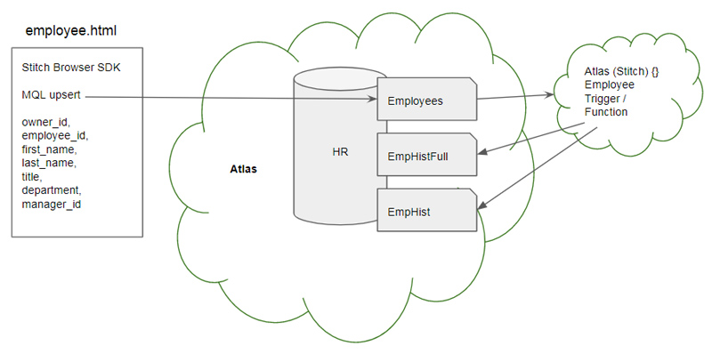
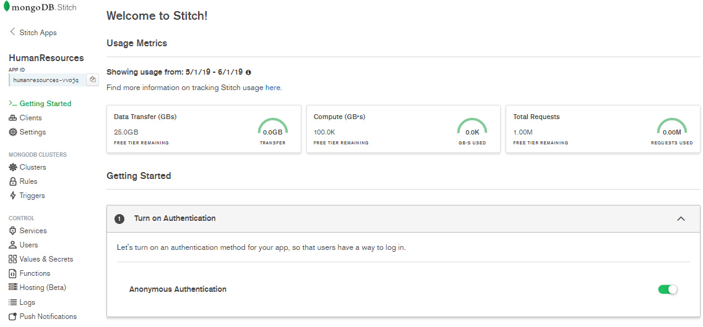
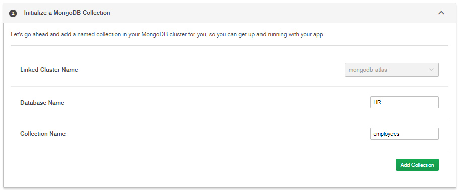
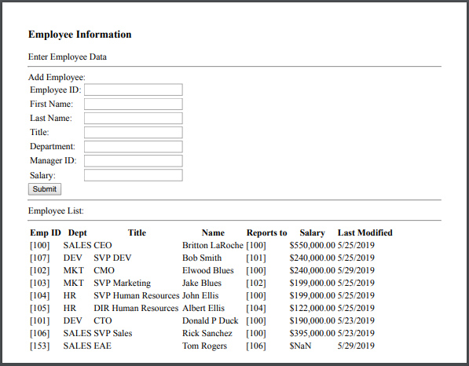
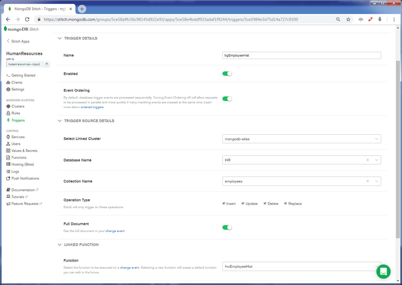
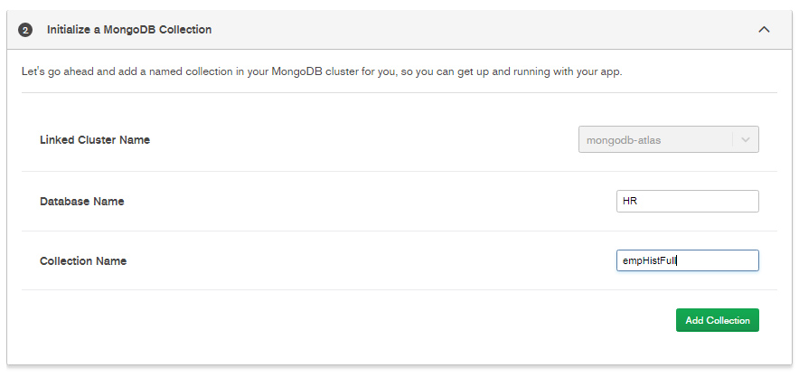
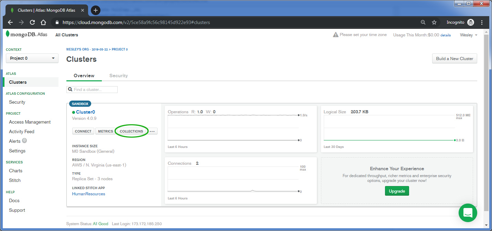
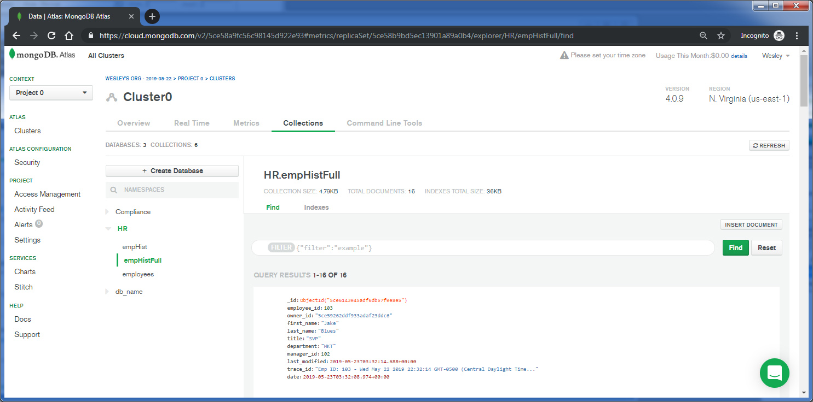

## Human Resources Employee Application
_SA Author_: [Britton LaRoche](mailto:britton.laroche@mongodb.com)   
(Note: This tutorial builds upon concepts learned in the official [MongoDB blog](https://docs.mongodb.com/stitch/tutorials/blog-overview/) tutorial.)

### Tutorial Contents 
1. [MongoDB blog tutorial](https://docs.mongodb.com/stitch/tutorials/blog-overview/)
2. [Atlas Triggers and Functions: Employee tutorial](https://github.com/brittonlaroche/MongoDB-Demos/edit/master/Stitch/employee/)
3. [Stitch Query Anywhere tutorial](https://github.com/brittonlaroche/MongoDB-Demos/edit/master/Stitch/rest)
4. [Embed Atlas Charts in your app tutorial](https://github.com/brittonlaroche/MongoDB-Demos/edit/master/Stitch/charts)
5. [Embed Google Charts tutorial](https://github.com/brittonlaroche/MongoDB-Demos/edit/master/Stitch/charts-google) 
6. [Embed an Org Chart tutorial](https://github.com/brittonlaroche/MongoDB-Demos/edit/master/Stitch/charts-google) 
7. [Host your application tutorial](https://github.com/brittonlaroche/MongoDB-Demos/edit/master/Stitch/hosting) 

## Overview 

In this short tutorial we are going to create a Human Resources application that tracks changes to employees over time.  To accomplish this we will modify our blog tutorial by adding fields and using an upsert into a new HR database with an employees collection. We will add a trigger to take the new full employee document into one collection, and just the updated fields into a second collection.



### 1. Create a new stitch app
Log in to atlas from https://cloud.mongodb.com. Create a new stitch app by selecting "Stitch" from the left menu pain. 
Click the button "Create New Stitch App. Type in __"HumanResources"__ (no spaces) for the application name and click the create button in the lower right.


### 2. Configure the stitch application
After the new application is created, click the "HumanResources" in the list of stitch applications to enter into the application's stitch console.  The console will display and look like the following screen.



#### Turn on anonymous authentication 
Enable aunonmous authentication by moving the slider button to the right. In general this is a bad idea, as we should have a secure way of identifying our users, but for the brevity of this tutorial and for the purpose of demonstration, we will use Anonymous Authentication.  We will address user authentication in another tutorial.

#### Initialize a MongoDB Collection
Specify a new collection where the application will write data.  Use the uppercase database name __"HR"__ and the lower case collection name __"employees"__ (note the names are case sensitive)


### 3. Create the browser client application
Cut and paste the raw code from the [employee.html](./employee.html) file into a text editor and save it as "employee.html" to a directory of your choosing. For convience the file contents is also listed here for a quick copy paste:

```
<html>
  <head>
    <script src="https://s3.amazonaws.com/stitch-sdks/js/bundles/4.3.1/stitch.js"></script>
    <script>
        const client = stitch.Stitch.initializeDefaultAppClient('your-app-id');
        const db = client.getServiceClient(stitch.RemoteMongoClient.factory,
        "mongodb-atlas").db('HR');

        function displayEmployeesOnLoad() {
          client.auth
            .loginWithCredential(new stitch.AnonymousCredential())
            .then(displayEmployees)
            .catch(console.error);
        }

        function displayEmployees() {
          const tStrt = "<div><table><tr><th>Emp ID</th><th>Dept</th><th>Title</th>" +
                "<th>Name</th><th>Reports to</th><th>Salary</th><th>Last Modified<th></tr>";
          db.collection('employees').find({}, {limit: 1000}).asArray()
            .then(docs => {
              const html = docs.map(c => "<tr><td>[" +
                  c.employee_id +  "]</td><td>" +
                  c.department +  "</td><td>" +
                  c.title + "</td><td>" +
                  c.first_name + " " +
                  c.last_name + "</td><td>" +
                  "[" + c.manager_id + "] </td><td>" +
                  "$" + parseFloat(c.salary).toFixed(2).replace(/\d(?=(\d{3})+\.)/g, '$&,') + "</td><td>" +
                  c.last_modified.toLocaleDateString() + "</td>" +
                  "</tr>").join("");
              document.getElementById("employees").innerHTML = tStrt + html + "</table></div>";
            });
        }
	    
        function addEmployee() {
            const eID = document.getElementById('employee_id');
            const eFname = document.getElementById('first_name');
            const eLname = document.getElementById('last_name');
            const eTitle = document.getElementById('title');
            const eDepartment = document.getElementById('department');
            const eManagerId = document.getElementById('manager_id');
            const eSalary = document.getElementById('salary');
            var nDate = new Date();
            db.collection('employees').updateOne(
                {employee_id: parseInt(eID.value)},
                {$set: {
                    owner_id: client.auth.user.id,
                    employee_id: parseInt(eID.value),
                    first_name: eFname.value,
                    last_name: eLname.value,
                    title: eTitle.value,
                    department: eDepartment.value,
                    manager_id: parseInt(eManagerId.value),
                    salary: parseFloat(eSalary.value),
                    last_modified: nDate
                    }
                },
                {upsert: true}
            )
            .then(displayEmployees);
            //eFname.value = '';
            //eLname.value = '';
            //eID.value = '';
        }
    </script>
  </head>
  <body onload="displayEmployeesOnLoad()">
    <h3>Employee Information</h3>
    <div id="content">
      Enter Employee Data
    </div>
    <hr>
      Add Employee:
      <table>
        <tr><td>Employee ID:</td><td><input id="employee_id"></td></tr>
        <tr><td>First Name:</td><td><input id="first_name"></td></tr>
        <tr><td>Last Name:</td><td><input id="last_name"></td></tr>
        <tr><td>Title:</td><td><input id="title"></td></tr>
        <tr><td>Department:</td><td> <input id="department"></td></tr>
        <tr><td>Manager ID:</td><td> <input id="manager_id"></td></tr>
        <tr><td>Salary:</td><td><input id="salary"></td></tr>
     </table>
      <input type="submit" onClick="addEmployee()">
      <hr>
      Employee List:
      <hr>
      <div id="employees"></div>
  </body>
</html>
```


Open the file in the text editor of your choice and change the line:    
``` const client = stitch.Stitch.initializeDefaultAppClient('your-app-id'); ```    
by replacing your-app-id with the APP ID displayed in the upper left of your stitch console.  

Save the file as employee.html to a directory on your hard drive.  Navigate to that file in finder or windows explorer and double click the file to open it in your browser. Enter some data, be sure to fill in the employee_id field with a unique number.  For example, start with 100. Then add another employee with and id of 101, next 102 etc... You can have the second employee 101 report to the first employee by setting the manager id to 100.   

You should see something like the following:   


### 4. Create a trigger to track changes to employees over time
In the left hand navigation pannel of the stitch console select "Triggers" and then click the "Add a trigger" button.  

Name the new trigger __"trgEmployeeHist"__ Select your cluster from the "Select Linked Cluster" drop down.  Select __"HR"__ for the database and __"employees"__ for the collection. Check all the boxes for the opertaion type "Insert, Update, Delete and Replace." Finally be sure to move the slider to get the full document.   

In the linked function drop list select "+ New Function" and give the function a name of __"fncEmployeeHist"__ and then save the trigger.  Be sure to keep all the sample documentation, we will need it for a future step.


### 5. Create two new history collections
Select the ">_Getting Started_" menu item in the left pannel or add a new rule for two new collections.  Specify the HR database and the collection names "empHistFull" and "empHist" these collections must be present in the stitch rules for the trigger to update these collections.


### 6. Write the history function
Edit the fncEmployeeHist by selecting "Functions" in the left navigation pane of the stitch console. The list of functions appear, click the row with the fncEmployeeHist. The click will bring up the function editor for fncEmployeeHist.  You should be able to copy / paste the code below.  Once the code has been pasted press the save button.  The trigger is ready to be tested!

```
exports = function(changeEvent) {
  /*
    A Database Trigger will always call a function with a changeEvent.
    Documentation on ChangeEvents: https://docs.mongodb.com/manual/reference/change-events/

    Access the _id of the changed document:
    var docId = changeEvent.documentKey._id;

    Access the latest version of the changed document
    (with Full Document enabled for Insert, Update, and Replace operations):
    var fullDocument = changeEvent.fullDocument;

    var updateDescription = changeEvent.updateDescription;

    See which fields were changed (if any):
    if (updateDescription) {
      var updatedFields = updateDescription.updatedFields; // A document containing updated fields
    }

    See which fields were removed (if any):
    if (updateDescription) {
      var removedFields = updateDescription.removedFields; // An array of removed fields
    }

    Functions run by Triggers are run as System users and have full access to Services, Functions, and MongoDB Data.

    Accessing a mongodb service:
    var collection = context.services.get("mongodb-atlas").db("db_name").collection("coll_name");
    var doc = collection.findOne({ name: "mongodb" });

    To call other named functions:
    var result = context.functions.execute("function_name", arg1, arg2);
  */
    var fullDocument = changeEvent.fullDocument;
    var fullCopy = fullDocument;
    var updateDescription = changeEvent.updateDescription;
    var cEmpHistFull = context.services.get("mongodb-atlas").db("HR").collection("empHistFull");
    var cEmpHist = context.services.get("mongodb-atlas").db("HR").collection("empHist");
    var nDate = new Date();
    
    if (updateDescription) {
      //--------------------------------------------------
      //we have an update.
      //--------------------------------------------------
      //we will update both collections
      var updatedFields = updateDescription.updatedFields; 
      //lets add the employee_id and date fields so we know when the change was made and to which employee_id
      //lets also track the document id as the parent_id of the change
      updatedFields.employee_id = fullDocument.employee_id;
      updatedFields.date = nDate;
      updatedFields.parent_id = fullDocument._id;
      cEmpHist.insertOne(updatedFields);
      
      //lets track a full document change as well
      // lets set the _id field of the original document as parent_id
      // and delete the _id field as this original document will change multiple times and violate the unique key for _id 
      // in the history table
      fullCopy.date = nDate;
      parent_id = fullDocument._id;
      delete fullCopy._id; 
      cEmpHistFull.insertOne(fullCopy);
    } else {
      //--------------------------------------------------
      //we have an insert
      //--------------------------------------------------
      // we will update the full history collection only
      // lets set the _id field of the original document as parent_id
      // and delete the _id field as this original document will change multiple times and violate the unique key for _id 
      // in the history table
      fullCopy.date = nDate;
      parent_id = fullDocument._id;
      delete fullCopy._id; 
      cEmpHistFull.insertOne(fullCopy);
    }
  
};
```

Add new employees and change salary information, titles and managers.  View what is tracked in the history collections.  You can see this information by openeing a new tab in your browser and going to https://cloud.mongodb.com

Click on clusters and press the collection button.  This will bring up the collection browsing tab in atlas.


Onceteh collection browsing tab is open navigate to your database and look at the data in the employee collection, employee history full collection, and the employe history collection which contains only the updated fields, employee_id and dates of modification.


## Next Steps
Check out the next stitch tutorial on extending your app though the use of a REST based API to get access to your employee data through [Stitch Query Anywhere](../rest)
