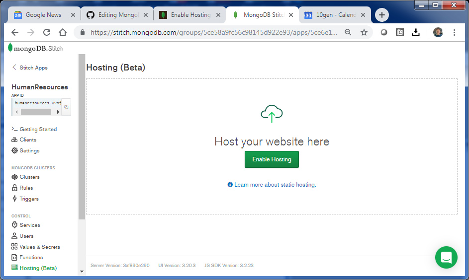
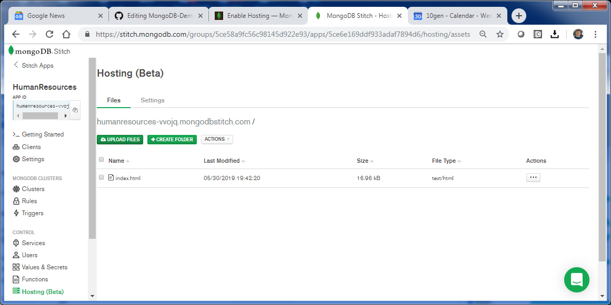
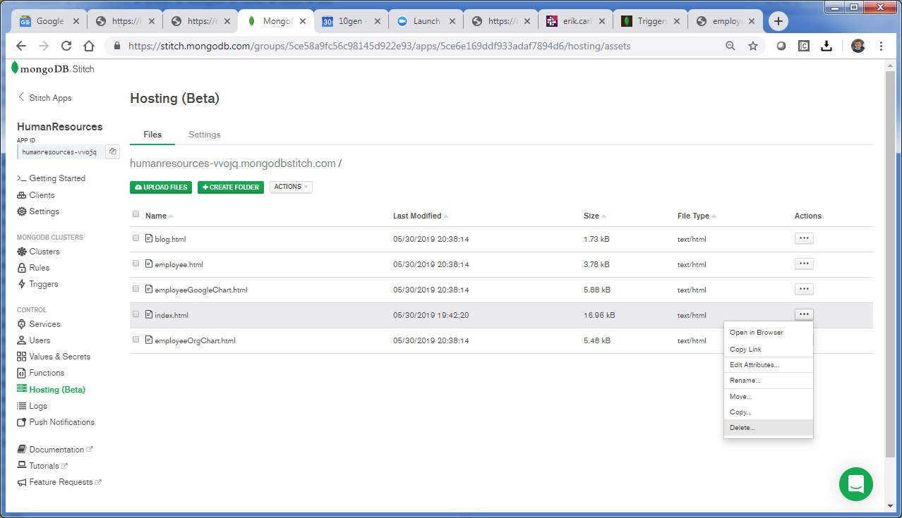

## Stitch Application Hosting
_SA Author_: [Britton LaRoche](mailto:britton.laroche@mongodb.com)   
(Note this tutorial build's on the [Employee Tutorial](../employee))

## Tutorial Contents 
(Note: All tutorials are hands on and should take an estimated time of less than 20 minutes)
1. [MongoDB blog tutorial](https://github.com/brittonlaroche/MongoDB-Demos/edit/master/Stitch/blog)
2. [Atlas Triggers and Functions: HR Employee tutorial](https://github.com/brittonlaroche/MongoDB-Demos/edit/master/Stitch/employee/)
3. [Stitch Query Anywhere tutorial](https://github.com/brittonlaroche/MongoDB-Demos/edit/master/Stitch/rest)
4. [Embed Atlas Charts in your app tutorial](https://github.com/brittonlaroche/MongoDB-Demos/edit/master/Stitch/charts)
5. [Embed Google Charts tutorial](https://github.com/brittonlaroche/MongoDB-Demos/edit/master/Stitch/charts-google) 
6. [Embed an Org Chart tutorial](https://github.com/brittonlaroche/MongoDB-Demos/edit/master/Stitch/charts-org) 
7. [Host your application tutorial](https://github.com/brittonlaroche/MongoDB-Demos/edit/master/Stitch/hosting) 


### Hosting Overview
Stitch Hosting allows you to host, manage, and serve your application’s static media and document files. You can use Hosting to store individual pieces of content or to upload and serve your entire client application. Stitch hosts your application’s content behind a unique domain name. By default, Stitch uses domains of the following form: ```<Your App ID>.mongodbstitch.com```. You can configure Stitch to host content at a custom domain name that you own in addition to the default hosting domain.

For further infromation read the [hosting documentaion](https://docs.mongodb.com/stitch/hosting/) for an overview. Its a two step process to [enable hosting](https://docs.mongodb.com/stitch/hosting/enable-hosting/) and then [upload content](https://docs.mongodb.com/stitch/hosting/upload-content-to-stitch/). 

### 1. Enable hosting
Navigate to the Hosting Configuration Page:   
To open the hosting configuration page, click "Hosting" in the left-hand navigation of the Stitch UI.



On the Hosting configuration page, click Enable Hosting. Stitch will begin provisioning hosting for your application.  You can no access your defaul index page by typing inthe following url into your browser:

 ```<your-app-id>.mongodbstitch.com```
 

### 2. Upload your files


Press the button labeled __"upload your files"__ and select all the html files you have been working on.   

__blog.html__   
__employee.html__   
__employeeGoogleChart.html__   
__employeeOrgChart.html__   

You can now access them at <your-app-id>..mongodbstitch.com!  For example try   
  
 ```<your-app-id>.mongodbstitch.com/blog.html```
 
Lets have fun and delete the old index file by selecting the "..." menu item in the list of files.  Next lets replace the old index by renaming __employeeOrgChart.html__ or one of your other files to index.html.  



Lets see your new employee app in action! Type in the default address 

 ```<your-app-id>.mongodbstitch.com```

Notice how you can access the database directly from the web.  __***Note:***__  you may need to select the  __"Actions"__ drop list in the hosting console and "Flush CDN Cache" to view your changes.

### Next Steps
Note: the employee.html app is bare bones on purpose, if you wish to add some style after this tutorial you might want to check out the [Adding Style](../style) tutorial.
