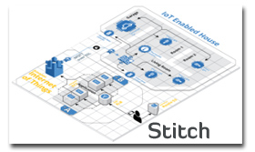
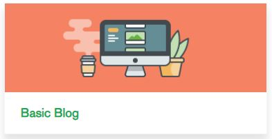

# MongoDB Stitch

_SA Author_: [Britton LaRoche](mailto:britton.laroche@mongodb.com)   

   

## Tutorial Contents 
(Note: All tutorials are hands on and should take an estimated time of less than 20 minutes)
1. [MongoDB blog tutorial](https://docs.mongodb.com/stitch/tutorials/blog-overview/)
2. [Atlas Triggers and Functions: HR Employee tutorial](https://github.com/brittonlaroche/MongoDB-Demos/edit/master/Stitch/employee/)
3. [Stitch Query Anywhere tutorial](https://github.com/brittonlaroche/MongoDB-Demos/edit/master/Stitch/rest)
4. [Embed Atlas Charts in your app tutorial](https://github.com/brittonlaroche/MongoDB-Demos/edit/master/Stitch/charts)
5. [Embed Google Charts tutorial](https://github.com/brittonlaroche/MongoDB-Demos/edit/master/Stitch/charts-google) 
6. [Embed an Org Chart tutorial](https://github.com/brittonlaroche/MongoDB-Demos/edit/master/Stitch/charts-google) 
7. [Host your application tutorial](https://github.com/brittonlaroche/MongoDB-Demos/edit/master/Stitch/hosting) 

The MongoDB Stitch serverless platform makes it easy to build modern, cross-platform applications on top of MongoDB. Stitch removes the need for tedious boilerplate and automatically manages your app’s backend so you can focus on building what matters.

Read below for an overview, and then lets get started. Within 30 minutes you should have completed your first stitch application. What Does Stitch Provide? At a high level Stitch provides the following features:

### Stitch QueryAnywhere

Exposes the full power of working with documents in MongoDB and the MongoDB query language, directly from your web and mobile application frontend code. A powerful rules engine lets developers declare fine-grained security policies. 
  [QueryAnwhere Documentation](https://docs.mongodb.com/stitch/getting-started/configure-rules-based-access-to-mongodb/)

### Stitch Functions

Allows developers to run simple JavaScript functions in the Stitch serverless platform, making it easy to implement application logic, securely integrate with cloud services and microservices, and build APIs  
  [Stitch Functions Documentation](https://docs.mongodb.com/stitch/functions/)

### Stitch Triggers

Executes functions in real time in response to changes in the database or user authentication events.  
  [Stitch Trigger Documentation](https://docs.mongodb.com/stitch/triggers/)

### Stitch Mobile Sync (Beta)

Automatically synchronizes data between documents held locally in MongoDB Mobile and the backend database.  
  [Stitch Mobile Sync Documentation](https://docs.mongodb.com/stitch/mongodb/mobile-overview/)

## Getting Started

### MongoDB Stitch Tutorials
The easiest way to get started is to follow the [MongoDB stitch tutorials](https://docs.mongodb.com/stitch/tutorials/). The best tutorial to begin with is the basic [blog tutorial](https://docs.mongodb.com/stitch/tutorials/blog-overview/). This tutorial walks you through the steps of creating your own free tier MongoDB Atlas cluster, introduces you to the stitch application web based GUI and shows you how to create your first application.  This tutorial provides a great deal of information to help you get started, and does so in an easy way in about 15 minutes.

### MongoDB Stitch Application Hosting
Once you have created your first application you are ready to now host it for the world to see! Read the [hosting documentaion](https://docs.mongodb.com/stitch/hosting/) to get started. Its a two step process to [enable hosting](https://docs.mongodb.com/stitch/hosting/enable-hosting/) and then [upload content](https://docs.mongodb.com/stitch/hosting/upload-content-to-stitch/). 

Create your blog and upload it!  You have taken your first step into a brave new world of serverless applications!

### Complete your training

Follow up and learn with hands on tutorials more about what stitch has to offer.   

2. [Atlas Triggers and Functions: Employee tutorial](https://github.com/brittonlaroche/MongoDB-Demos/edit/master/Stitch/employee/)
3. [Stitch Query Anywhere tutorial](https://github.com/brittonlaroche/MongoDB-Demos/edit/master/Stitch/rest)
4. [Embed Atlas Charts in your app tutorial](https://github.com/brittonlaroche/MongoDB-Demos/edit/master/Stitch/charts)
5. [Embed Google Charts tutorial](https://github.com/brittonlaroche/MongoDB-Demos/edit/master/Stitch/charts-google) 
6. [Embed an Org Chart tutorial](https://github.com/brittonlaroche/MongoDB-Demos/edit/master/Stitch/charts-google) 
7. [Host your application tutorial](https://github.com/brittonlaroche/MongoDB-Demos/edit/master/Stitch/hosting) 
