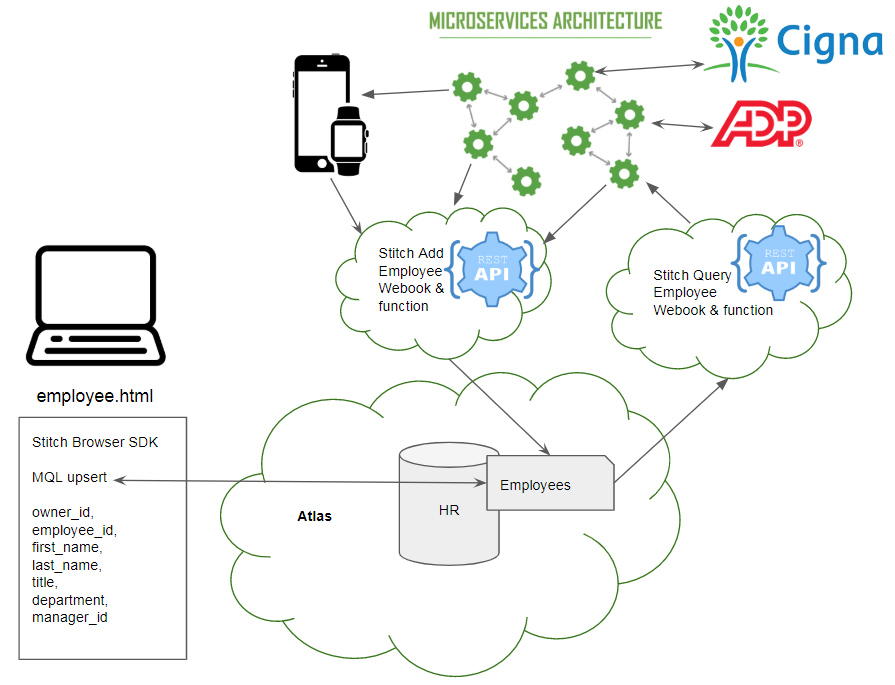

## Overview

In this section we will cover the Stitch query anywhere functionality through a REST based API.  We will create two webhooks that allow employee data to be queried or modified through a REST based API layer.  This surfaces the HR application we built to a wide range of producers and consumers of employee data. Examples include payroll processors, health care providers and mobile devices that allow employees to keep up to date on their payment and benefits data.
