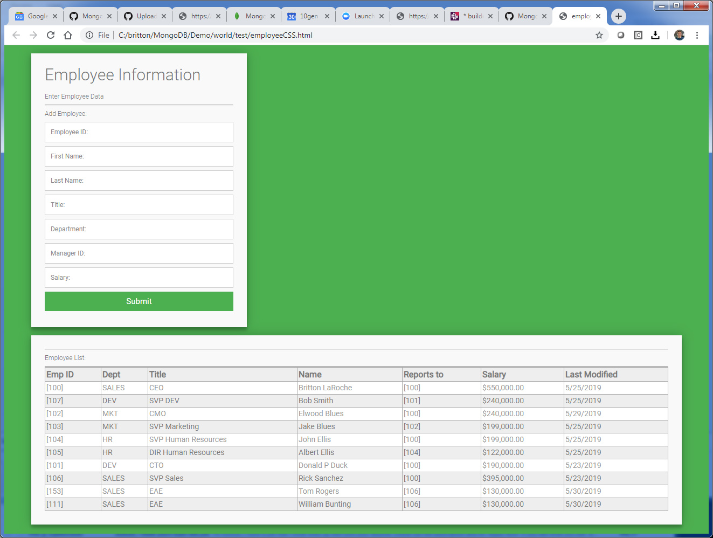

## Adding some style


### Tutorial Contents 
(Note: All tutorials are hands on and should take an estimated time of less than 20 minutes)
1. [MongoDB blog tutorial](https://docs.mongodb.com/stitch/tutorials/blog-overview/)
2. [Atlas Triggers and Functions: HR Employee tutorial](https://github.com/brittonlaroche/MongoDB-Demos/edit/master/Stitch/employee/)
3. [Stitch Query Anywhere tutorial](https://github.com/brittonlaroche/MongoDB-Demos/edit/master/Stitch/rest)
4. [Embed Atlas Charts in your app tutorial](https://github.com/brittonlaroche/MongoDB-Demos/edit/master/Stitch/charts)
5. [Embed Google Charts tutorial](https://github.com/brittonlaroche/MongoDB-Demos/edit/master/Stitch/charts-google) 
6. [Embed an Org Chart tutorial](https://github.com/brittonlaroche/MongoDB-Demos/edit/master/Stitch/charts-org) 
7. [Host your application tutorial](https://github.com/brittonlaroche/MongoDB-Demos/edit/master/Stitch/hosting) 


### Style sheets overview
Style sheets, also known as CSS files, are the gateway drug to development frameworks like Bootstrap, and then full on platforms like Angular and React. One devaites quickly from the path pure html and javascript into a dark and seedy developement underwold. Obviously CSS and these frameworks and development platforms provide rich beautiful interfaces, but at a small cost of complexity.  That complexity was avoided in these initial tutorials.  Our plan is to provide tutorials for React in the future in this github repository. For now we deviate only slightly into the realm of CSS for a nice looking style.

### 1. Adding a style sheet
The process begins innocently enough by inluding a style sheet.  Its a simple link.  Next we make slight modifications to some of the div and table classes. Then we simply gut the input table and replace it with __fieldset__ tags around our inputs.   

Lets get started.  We will need the [employee.html](../employee/employee.html) file from the [Atlas Triggers and Functions: HR Employee tutorial](https://github.com/brittonlaroche/MongoDB-Demos/edit/master/Stitch/employee/) and our new css file right here in this directory [mystyle.css](mystyle.css). Copy both files into the text editor of your choice and save them in the same directory as employee.html and mystyle.css respectively.  If you finished the employee tutorial, you may use the employee.html file created in the tutorial earlier if you wish.  Simply add mystyle.css to the same directory. 

Be sure to change the application id to the application id displayed in your stitch console inside the employee.html, if you have not done so already.

```
const client = stitch.Stitch.initializeDefaultAppClient('your-app-id');
```

Now we link the mystyle.css style sheet into the employee.html file right after the "head" tag as seen below:

```
html>
  <head>
	<link rel="stylesheet" type="text/css" href="./mystyle.css">
    <script src="https://s3.amazonaws.com/stitch-sdks/js/bundles/4.4.0/stitch.js"></script>
    <script>
```

The style sheet has two main classes we wish to use one is named "contact" and the other is "blueTable."  Lets start by updating our display employees table first. We will make sure we add the following line to the displayEmployees function.

```
<table class=\"blueTable\">
```

It looks like this when finished:

```
      function displayEmployees() {
          const tStrt = "<div><table class=\"blueTable\"><tr><th>Emp ID</th><th>Dept</th><th>Title</th>" +
                "<th>Name</th><th>Reports to</th><th>Salary</th><th>Last Modified</th></tr>";
          db.collection('employees').find({}, {limit: 1000}).asArray()
            .then(docs => {
              const html = docs.map(c => "<tr><td>[" +
                  c.employee_id +  "]</td><td>" +
                  c.department +  "</td><td>" +
                  c.title + "</td><td>" +
                  c.first_name + " " +
                  c.last_name + "</td><td>" +
                  "[" + c.manager_id + "] </td><td>" +
                  "$" + parseFloat(c.salary).toFixed(2).replace(/\d(?=(\d{3})+\.)/g, '$&,') + "</td><td>" +
                  c.last_modified.toLocaleDateString() + "</td>" +
                  "</tr>").join("");
              document.getElementById("employees").innerHTML = tStrt + html + "</table></div>";
            });
        }
```

### 2. Doing the body work

We take the inout section and wrap it in a new div tag with an id of contact like so:

```
<div id="contact" class="container">
```

Then we replace the old input table with field set tags around our input variables.

```
<body onload="displayEmployeesOnLoad()">
	<div id="contact" class="container">
		<h3>Employee Information</h3>
		<div id="content">
		  Enter Employee Data
		</div>
		<hr>
		  Add Employee:
			<fieldset><input type="text" placeholder="Employee ID:" id="employee_id"></fieldset>
			<fieldset><input type="text" placeholder="First Name:" id="first_name"></fieldset>
			<fieldset><input type="text"  placeholder="Last Name:" id="last_name"></fieldset>
			<fieldset><input type="text"  placeholder="Title:" id="title"></fieldset>
			<fieldset><input type="text"  placeholder="Department:" id="department"></fieldset>
			<fieldset><input type="text"  placeholder="Manager ID:" id="manager_id"></fieldset>
			<fieldset><input type="text"  placeholder="Salary:" id="salary"></fieldset>
			<button type="submit" id="contact-submit" onClick="addEmployee()">Submit</button>
	</div>
```
Now we create a new div for our table output section also using the contact id.

```
<div id="contact" class="contact">
```

This goes directly beneath the input div tag

```
	<div id="contact" class="contact">
      <hr>
      Employee List:
      <hr>
      <div id="employees"></div>
	</div>
  </body>
</html>
```

We have now updated our employee.html file with some style.  Double click the file and look at the beatiful style in action.  If you goofed... no worries we have a completed copy here [employeeCSS.html](employeeCSS.html)

### Next Steps

Upload your beatiful creation by hosting it with the [Host your application tutorial](https://github.com/brittonlaroche/MongoDB-Demos/edit/master/Stitch/hosting) 

