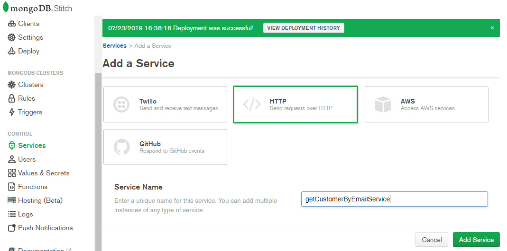
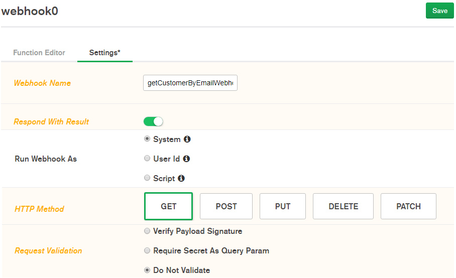

# Atlas and Stitch - Quick Start Hands on Workshop
_Solution Architect Author_: [Britton LaRoche](mailto:britton.laroche@mongodb.com)   
_Solution Architect Contributing Members_: [Felix Reichenbach](mailto:felix.reichenbach@mongodb.com), [Brian Leonard](mailto:brian.leonard@mongodb.com), [Matt Kalan](mailto:matt.kalan@mongodb.com), [Ryan Vander Zanden](mailto:rvz@mongodb.com), [James Osgood](mailto:james.osgood@mongodb.com), [Blaine Mincey](mailto:blaine.mincey@mongodb.com)

## Contents
[1. Create your first Atlas cluster](#-create-your-first-atlas-cluster)   
[2. Load Sample Data](#-load-sample-data)   
[3. Query the Sample data](#--query-the-sample-data)   
[4. Create a Stitch Application](#-create-a-stitch-application)     
[5. Create Stitch functions to query customer data](#-create-stitch-functions-to-query-customer-data)  
[6. Create a Stitch service to expose the search function as a REST API](#-create-a-stitch-service-to-expose-the-search-function-as-a-rest-api)   
[7. Create a webpage to show the document from the search service](#-create-a-webpage-to-show-the-document-from-the-search-service)   
[8. Create a user with an API key](#-create-a-user-with-an-api-key)   
[9. Create a web application for a marketing promotion](#-create-a-web-application-for-a-marketing-promotion)   
[10. Create a trigger to capture changes to sales data](#-create-a-trigger-to-capture-changes-to-sales-data)   
[11. Modify the trigger to capture marketing data](#-modify-the-trigger-to-capture-marketing-data)   
[12. Create an Atlas Chart](#-create-an-atlas-chart)   
[13. Embed the Atlas chart in your application](#-embed-the-atlas-chart-in-your-application)   
[14. Host your application](#-host-your-application)   
[15. Stitch Command Line - CICD Integration](#-stitch-command-line---cicd-integration)   

# Overview
Our lab is designed to teach Atlas and Stitch as quickly as possible with no dependencies.  You will only need a browser and a text editor. We will create a free tier Atlas cluster, load in some sample data and explore document data model.  We will learn some basic queries against the document datamodel.  Next we will create our first stitch application and query the database.  We will enable the Stitch serverlss REST API to access and update data.  We will create a stitch trigger and finally a QueryAnywhere browser SDK application.


The diagram above shows us all the objects we will be creating in this quick tutorial and how they interact.  The next 12 steps will give you the understanding you need to develop your own application using Atlas and Stitch.

##  Create your first Atlas cluster

Open a modern browser and go to https://cloud.mongodb.com.  Register for an atlas account by clicking the __"get started free"__ button.


Click the __"get started free"__ button.  This will bring up a screen for you to enter your personal information.

   

Fill in your personal information.  Feel free to use your work or personal email address, either is fine as this is your personal "free for life" development environment.  Agree to the terms of service and click the __"get started free"__ button.  


   

This will bring up window promptin you to build your first cluster.  Click the __"build your first cluster"__ button.  When prompted select "Learning MongoDB" as to the reason you are interested in Atlas. After clicking the Click the __"build your first cluster"__ button, you will be prompted to name your cluster.  "

   

__"Cluster0"__ is the default name and works well for importing data and projects later. Click the __"Create Cluster"__ button at the bottom and your cluster will be ready in the next 7 to 10 minutes.

##  Load Sample Data

Once we have our cluster created the next step is to load data and explore the document structure.  Atlas provides sample data that helps viusalize some examples.  

   
On the main screen for the __"Cluster0"__ home page you will notice four buttons, "Connect", "Metrics", "Collections" and  three dots "..." Click the button labeled with three dots __"..."__ to see a menu list of items.  Select the menu item __"Load Sample Dataset"__

After the sample data is loaded, we will want to see the data and explore the document datamodel.  Lets click the __"Collections"__ button and explore the databases and collections we just loaded.

 

Navigate to the __"samples_supplies"__ database namespace and expand the database to see the sales collection.  Click the __"sales"__ collection and the sales data is displayed in document format.  If you hover over the first document a __">"__ arrow will appear in the upper left, pressing the button will expand the document and show all the values in nested arrays.

##   Query the Sample data

We can create a simple query to pull back sales data for the store located in austin with the following document query:   

```{"storeLocation": "Austin"}```   

Type this in query in the filter section and press the __"Find"__ button.

 

We can try other locations as well.   
```{"storeLocation": "Denver"}```   

We can do a more advanced find.  We have been asked to generate a report on customers who were of retirement age to offer a promotion and a special discount on their next purchase.  The customer is an object embeded in the sales document and we need to refrence the age demographic value.  A simple nested query with dot notaion will allow us to get all the customers greater than or equal to 65 years of age.   

``` 
{"customer.age":  {$gte: 65}}
```  
After looking at the data Denver has been selected to test the theory that offering a discount on supplies will create an incentive for people who have retrired to greatly increase the number of items they purchase.   

##  Create a Stitch Application   
Our next step is to create an application to query the sales data and offer promotional discounts to customers who live in Denver and are of retirement age.  We will begin by creating our stitch application.  This task is accomplished by selecting __"Stitch"__ from the left hand navigation menu of the cluster we just created.


We click the large green button labeled __"Create new Application"__ and give the application a name.  In this case we will name our application __"sales"__   


Click the little green __"Create"__ button in the lower right hand of the popup window.  The stitch application console will appear as soon as the application has been created and linked with the cluster. 

##  Create stitch functions to query customer data
There are some basic ways to query data via the stitch REST based API.  One is through a GET with a query parameter. Another method is through a POST by passing in a searhc document.  We will cover both methods.

### Query Parameters
Lets begin with building a function that takes a query parameter.  From the left hand navigation menu of the Stitch console select __"Functions"__  click the __"Create New Function"__ button and give the new function an name of __"findCustomerByEmail"__.  Make sure the function runs as system to bypass rules as we have not set up any rules at this point in the workshop.  


Click the save button and you will be preseneted with the function editor.  Cut and paste the code below.

```js
exports = async function(arg){

    var collection = context.services
        .get("mongodb-atlas").db("sample_supplies").collection("sales");
    var doc = await collection.findOne({ "customer.email": arg});
    if (typeof doc == "undefined") {
        return `No customers with email ${arg} were found.`;
    }
    return doc;
}
```
Notice two important key words; __"async"__ and __"await"__ these keywords are not the default.  You have to specify this function is async and tell it to await the result from the findOne query to return a document.  


Click on the console tab and type in the following email parameter to find a sales document with a customer email.


```exports('div@me.it')```   
click the run button and view the returned document in the __"results"__ tab.


### Search Document
Our first function took in an email address and returned a matching sales document.  This is a great first step.  Now we have to write a new function for every possible argument or combination of arguments.  Perhaps we want to know all purchases that were online in denver.  We now have to wriet a function that takes in the __"purchaseMethod"__ and __"storeLocation"__.  What about store location and age?  It quickly beomes apparent that we need away to pass in multiple arguments and conduct a query based on them.  How do we do this?  We use a search document.

Lets create a new function that takes a search document.  Select __"Functions"__ from the left hand navigation menu of the stitch console and click the __"Create New Function"__ button.  Name the function __"findCustomer"__   


Click the save button and the function editor appears. It seems hard to beleive but three lines of code allows us to write our document search function. Cut and paste the code below, click save and deploy the changes.
```js
exports = async function( aSearchDoc ){
  var sales = context.services.get("mongodb-atlas").db("sample_supplies").collection("sales");
  var doc = await sales.findOne(aSearchDoc);
  return doc;
};
```
The above 3 lines of code a quite terse but extremely powerful.  Sometimes it helps to do a bit of debugging.  Logging data to the console is helpful.  In order to log the contents of a document we have a helper function __"JSON.stringify"__. An example of logging the documents passed into and out of the search function is provided below.  If you would like to add some logging to our search function cut and paste the code below into the __"findCustomer"__ function.

```js
exports = async function( aSearchDoc ){
  console.log("Function findCustomer called ... executing..." );
  var sales = context.services.get("mongodb-atlas").db("sample_supplies").collection("sales");
  console.log("Function findCustomer Search document");
  console.log(JSON.stringify(aSearchDoc));
  var doc = await sales.findOne(aSearchDoc);
  console.log("return document");
  console.log(JSON.stringify(doc));
  return doc;
};
```


Now lets test the function by passing in a search document.  Click the console tab at the bottom left.  At the bottom of the console after the comment section is a method called export.  Cut and paste the following export function below that passes in a search document.
```js
exports({"customer.email": "div@me.it"})
```

Press the Run button in the upper right and view the returned document in the results tab.


We are no longer limited to searching for any one particular field.  Lets find a customer by store location age and gender.

```js
exports({"customer.age": 65, "customer.gender": "F", "storeLocation": "Denver"})
```

##  Create a Stitch service to expose the search function as a REST API
The functions we created are useful but in order to build an application we need to expose these functions.  There are a number of ways to expose the functions.  One possible way is through the stitch SDK.  We can creat an application that authenticates through the stitch SDK and then executes our fucntions remotely.  Another way to expose these functions is through an HTTP Service.

We will now create two HTTP services for our find customer functions.   

1. Our __getCustomerByEmailService__ will use a GET request with a query parameter.
2. Our __getCustomerService__ will use a POST request with a json document body.

### getCustomerByEmailService

Lets begin by creating the get customer by email service. Select __"Services"__ from the left hand navigation menu in the stitch console. Since this is our fisrt service we are presented with a green button prompting us to add a new service.  Click the __"Add a Service"__ button.  And we are presented with a screen that shows a number of options.  We have native integration with GitHub, Twilio, AWS and HTTP services.  Select __"HTTP"__ and give the service the name __"getCustomerByEmailService"__


Click the __"Add Service Button"__ and the webhook screen will appear.  The webhook is responsible for executing stitch serverless functions and providing an external URL to expose our service.  We will give the webhook the name __"getCustomerByEmailWebhook"__.  We will be sure to move the slider to __"Respond With Result"__ and run the webhook as system as we have not created any users at this point in our workshop.  We will select the "GET" method and we will not require validation.  Click the __"Save"__ button to save our work.



We are now presented with the webhook function editor.  We will call our __"findCustomerByEmail"__ function that we created in the previous step.  Cut and paste the code below and click __"Save"__
```js
exports = function(payload) {

    var queryArg = payload.query.arg1 || '';
    return context.functions.execute("findCustomerByEmail", queryArg);

};
```
We have created our first service and webhook!  This service is limited to one thing and one thing only, it will search for a customer by email and return the document.  Its a good start but it is limited to one argument and extending it will take considerable time to handle more arguments.  Lets move on to the flexibility provided by passing in a json document with any number of search parameters.

We can test the webhook from a broswer using the webhook url and set arg1 equal to an email adress.  Rememebr we have to url encode the @ symbol as %40.  If we want to search for the email "div@me.it" we would pass that argument as "div%40me.it" 

The url would use the format:

```
<webhook url>?arg1=div%40me.it
```

To get the webhook url go back to the getCustomerByEmailService edit the webhook and select the settings tab.  Click the copy button for the webhook url and click paste in the browser, add in the argument and URL encoded email address, then hit enter.  We will do more on testing the service in the next section. We will create a purpose built HTML application using javacript to test our services.

### getCustomerService
We are now ready to create a flexible search based on any number of parameters passed in a json document.  The process for creating the service is the same.  Select __"Services"__ from the left hand navigation menu of the stitch console.  We will now be presented with a list of services and we can see our __"getCustomerByEmailService"__ listed.  Press the green button labaled __"Add a Service"__ and the add service window is back.  We will select __"HTTP"__ and give our new service the name __"getCustomerService"__.  Click the __"Add Service"__ button to bring up the webhook editor.


Give the webhook a name of __"getCustomerWebhook"__ and be sure to move the slider for __"Respond With Result"__ as we are returning a json document. Be wure to select __"POST"__ as the HTTP method.  Again we will select __"Do Not Validate"__.  Press the __"Save"__ button.


The webhook function editor will appear and we will call the __"findCustomer"__ function we created earlier by passing in the json document that is part of the body of the HTTP request.  We need to parse the body to get the json document.  We use the following code to accomplish the parsing of the json document.

```
body = EJSON.parse(payload.body.text());
```

We then pass the body as the search document argument with the following code   

```
result = await context.functions.execute("findCustomer", body);
```

Cut and paste the following code into the webhook function editor and click __"Save"__.

```js
// This function is the webhook's request handler.
exports = async function(payload) {
    // Data can be extracted from the request as follows:

    var body = {};
    var result = {};
    console.log("inside getCustomerWebhook");
    if (payload.body) {
      console.log("Payload body");
      console.log(JSON.stringify(payload.body));
      body = EJSON.parse(payload.body.text());
      console.log("Parsed Payload body");
      console.log(JSON.stringify(body));
      result = await context.functions.execute("findCustomer", body);
    }
    return  result;
};
```


We have created two functions and exposed them as servcies, it is now time to test the services we created.

##  Create a webpage to show the document from the search service
Its important to be able to test our services and the return documents. In this section we will create a small HTTP app similiar to POSTMAN. We will call our application "Postrapper." We do this because most modern office sites often have security policies in place that block ports or require access to https via a broswer proxy.  Its simple to create an application that uses https through the browser and its a great learning opportunity for the use of a REST based API.

It is quite simple to create a fetch request that passes in a json document as an argument to a POST method of an HTTP request.  The sntax is below.

```js
        const response = await fetch(webhook_url, {
          method: httpVerb,
          body: inputDoc, // string or object
          headers: {
            'Content-Type': 'application/json'
          }
```

What we need is to be able to handle both a GET request with a query parameter (no json body), and a POST request with a json body.  We will build a simple html and javascript application that checks to see if we have an input json document, uses the correct HTTP method (verb) and makes the request to the right url.

```js
<!DOCTYPE html>
<html>
  <head>
    <meta charset="UTF-8" />
    <title>Postrapper</title>
    <!-- When you need to test a json body in a REST API call, but don't have access to postman. -->
    <!-- Britton LaRoche's Postrapper can get you the results you need!  -->
    <!-- Let's use Bootstrap improve the default look a bit -->
    <link
      rel="stylesheet"
      href="https://maxcdn.bootstrapcdn.com/bootstrap/3.4.0/css/bootstrap.min.css"
    />
  </head>
  <style>
    div {
      margin-left: 40px;
    }
    table td {
      padding: 5px;
    }
  </style>
  <body>
    <div>
      <h2>Postrapper</h2>
      <p>
        This simple page demonstrates json REST based API calls
      </p>

      <form>
        <table>
          <tr><td style="padding: 10">URL:</td><td> <input style="min-width: 1000px;" type="text" id="input_url" name="input_url"/></td></tr>
          <tr><td> VERB:</td><td> <input type="text" id="input_verb" name="input_verb" value="POST" /></td></tr>
          <tr><td> Input Document:</td><td> <textarea class="form-control" id="input_json" rows="5"></textarea></td></tr>
          <tr><td> Results: </td><td> <textarea class="form-control" id="results" rows="10"></textarea></td></tr>
        </table>
      </form>
      <br>
      <button type="submit" onclick="sendJson()">Send</button>
    </div>

    <script>
      const sendJson = async () => {
        var txt = "";
        var httpVerb = document.getElementById("input_verb").value;
        var webhook_url = document.getElementById("input_url").value;
        var inputDoc = document.getElementById("input_json").value;
        var response = "";

        console.log(webhook_url);
        //Check to see if we have an input document or not
        if (inputDoc != "") {
          response = await fetch(webhook_url, {
            method: httpVerb,
            body: inputDoc, // string or object
            headers: {
              'Content-Type': 'application/json'
            }
          });
        } else {
          response = await fetch(webhook_url, {
            method: httpVerb
          });
        }

        const myJson = await response.json(); //extract JSON from the http response
        console.log(myJson);
        document.getElementById("results").innerHTML = JSON.stringify(myJson, undefined, 2);
      };
    </script>
  </body>
</html>
```
Cut and paste the code above into your text editor and save the file as [postrapper.html](../html/postrapper.html).  Double click the file to open it in your browser.  Then copy and paste the webhook url from the webhook settings as seen below.

   

Perform a search for the email below by cutting and pasting the seacrh document into the input section and pressing the __"Send"__ button.

```{"customer.email": "div@me.it"}```   


Try the following complex query and view the result.

```{"customer.age": 65, "customer.gender": "F", "storeLocation": "Denver"}```

__Note:__ If you are experiencing trouble you can view the console log in the browser.  In chrome select the "Hamburger" menu item (three verticle dots) then select the menu item __"More Tools"__ --> __Developer Tools"__ and click the console tab.

Our test has been successful.  Lets create an application using the broswer SDK that provides the search capability we need and formats the results as rows and columns so we can quickly inspect the results of many documents at once.  To do this properly we need to create a user or some form of authentication.

##  Create a user with an API key
We begin by adding a bit of security and creating an API Key and assoicated user permissions.  This is not necessary as we could create an anonymous user, use a third party athentication method (facebook, google, AWS Cognito, JWT etc..)  Let us quickly explore our options.  Click on the __"Users"__ menu item in the left hand navigation pane in the stitch console.  The users window will display a list of users (we have not created any). Lets click the providers tab at the top of the users window.  We are presented with a list of options as seen below.


Third party providers such as facebook and google provide an excellent way for customers to access data and will be covered at a point in the future.  For now explore the custom option as you can see how to integrate with a Single Sign On (SSO) provider like AWS cognito, or something you are using in house through Java Web Tokens (JWT) as this eliminates the headache of user management for your application.

For now we will generate an API Key.  Select the __"API Keys"__ option and click the edit button.


Type in a name for the API Key, something like "BackOffice" or "WebAccess" and click save.  A private key will be displayed.  Copy that key and paste it into a text editor of your choice.  Then create the api key.  We will use that key to access the database through the stitch browser SDK.

##  Create a web application for a marketing promotion

We will be using the [Mongo DB Stitch Browser SDK](https://docs.mongodb.com/stitch-sdks/js/4/index.html) to create a web based application that turns the browser into a fully functional stitch client.  The client will be able to execute the MongoDb Query Language (MQL) directly from the browser.  This will help us build an application to select specific customers for a promotional offering.

Beofre we can access any data with the stitch browser SDK we must allow stitch to access our collections.  We do this by establishing rules.  Click the __"Rules"__ menu item from the left hand navigation pane on the stitch console.  This displays the rules we have defined.  

There are two ways to add rules for a collection.  One is by selecting the __"..."__ button to the right of the "mongodb-atlas" tree item.  The other is by clickin the __"Add Collection"__ button.   

   

Adding a new collection requires us to specify the database name, the collection name and pick a template.  Templates allow us to define who has access to the data in a predefined way that gives us an example to follow.  This is the place to talk about rules in depth, but as we have a limited time and a lot to cover we will simply state that the templates are only a starting point.  With rules you have the ability to filter and redact data, to remove all but the last 4 digits of a social security or credit card number for example.  Only the owner of the data could see the full account number, the CSR could only see the last 4 digits.  There is a lot to explore here.  For now we simply select "No Template" as we wish to allow anyone to see the data.


We are now in the rules editor and we wish to allow reads and writes to all the fields.  We have to check the boxes __"Read"__ and __"Write"__ to allow our application access to the sales data.  Click the save button once the cahnges are made.   


When we deploy our changes the rules we have specified are displayed for us in json format.

### Our HTML Application
We have a prebuilt QueryAnywhere.html file that shows us how to use the browser SDK file.

Copy the code from the [QueryAnywhere.html](../html/QueryAnywhere.html) file.  Right click and select "open file in new tab" on the [QueryAnywhere.html](../html/QueryAnywhere.html) link. Click the __"view raw file"__ button and select all the text. Copy it and paste it in your text editor.  Save the file as QueryAnywhere.html

Inside the file we haveto make a few chnags before we can connect. Replace your your-api-key with the private api key you generated in step 8. You may have to repeat step 8 if you forgot to copy the private API key.  Replace your-app-id with the stitch APP-ID located in the upper left of the stitch console.
```js
      const credential = new stitch.UserApiKeyCredential("your-api-key");
      const client = stitch.Stitch.initializeDefaultAppClient('your-app-id');
```
Example
```js
      const credential = new stitch.UserApiKeyCredential("1kJ3BEMz4LGyvKGhcxqyWi8wAUnFJ8y3O6clY6WAQLIv8D45xM9Az9rVPEjribVZ");
      const client = stitch.Stitch.initializeDefaultAppClient('sales-oxwdn');
```

Double click the file, it will open in your browser and you should see someting very similar to the following image.


The ability to connect to the Atlas database and use the Mongo Query Language directly is accomplished by including the browser SDK in the line below (its aready in the file we are just calling your attention to it.
```js
<script src="https://s3.amazonaws.com/stitch-sdks/js/bundles/4.5.0/stitch.js"></script>
```

The next section is where we define our API Key Credential and use it to connect to the database.  We also use our API key to establish connection to our stitch application.   

```js
    <script>
       /* NOTE: handle your API key with another method than what is provided in this example
       * (dont paste your API key in your code its easily obtained by the browser view source)
       * API key is pasted here for a simple prototype example with out key management
       */
      const credential = new stitch.UserApiKeyCredential("1kJ3BEMz4LGyvKGhcxqyWi8wAUnFJ8y3O6clY6WAQLIv8D45xM9Az9rVPEjribVZ");
      const client = stitch.Stitch.initializeDefaultAppClient('sales-oxwdn');
      const db = client.getServiceClient(stitch.RemoteMongoClient.factory,"mongodb-atlas").db('sample_supplies');
      function displayCustomersOnLoad() {
        client.auth
          .loginWithCredential(credential)
          .then(displayCustomers)
          .catch(console.error);
      }
  ```

The body tag of the application calls the __displayCustomersOnLoad__ function shown above.  This function logs in with our credentials and then displays a list of customers.  Take a moment to search the data by filling in the input variables and clicking the __"Search"__ button.

The best getting started guide with the browser client SDK is [the blog tutorial](https://docs.mongodb.com/stitch/tutorials/blog-overview/).  It consists of two main parts, the [Blog tutorial back end](https://docs.mongodb.com/stitch/tutorials/guides/blog-backend/), and the [Blog tutorial front end](https://docs.mongodb.com/stitch/tutorials/guides/blog-web/).  We will offer a condensed version of the blog tutorial with a couple of new concepts.  It is highly recommended to complete the blog tutorial when you have time.

Additional information on the application of rules and third party authentication can be found in the [todo web app tutorial](https://docs.mongodb.com/stitch/tutorials/todo-overview/)   

##  Create a trigger to capture changes to sales data
Create a new trigger by selecting __"Triggers"__ on the left navigation pane in the stitch console. 


Save the trigger then open the open the newly created function by selecting __"Functions"__ from the left navigation pane in the stitch console.   


Cut and paste the following code in to the function editor.  Save the function and then deploy the changes.
```js
exports = function(changeEvent) {
  
  var sales = context.services.get("mongodb-atlas").db("sample_supplies").collection("sales");
  var history = context.services.get("mongodb-atlas").db("sample_supplies").collection("history");
  var fullDocument = changeEvent.fullDocument;
  var fullCopy = fullDocument;
  
  //update the shipping document with the new package information
  console.log("fncSalesHistoryMarket ... executing..." );
  console.log("fullDocument");
  console.log(JSON.stringify(fullDocument));

  //track all changes to the sales document in the history collection
  fullCopy.parent_id = fullDocument._id;
  delete fullCopy._id;
  history.insertOne(fullCopy);

};
```

Use the QueryAnywhere.html app to select a customer and update the Promo Code field.  Use the data explorer to see the change in the database.  A new history collection with the sales document is added.  Notice the promo code value and last modified time as well as the parent_id field.  

Use the QueryAnywhere.html app to update the Promo Code field to a new value for the same customer.  View the history collection again and you can now see the history of changes to the sales document.  We have implemented [document versioning](https://www.mongodb.com/blog/post/building-with-patterns-the-document-versioning-pattern) through a trigger.  This is part of [building MongoDB Applications with design patterns](https://www.mongodb.com/blog/post/building-with-patterns-a-summary)


##  Modify the trigger to capture marketing data

Edit the function __"fncSalesHistoryMarket"__ and add the logic to update a new marketing collection that has a single document to show only the customer's current promotion.  Copy and paste the code below, save the fucntion and deploy the changes. 

```js
exports = function(changeEvent) {
  
  var sales = context.services.get("mongodb-atlas").db("sample_supplies").collection("sales");
  var history = context.services.get("mongodb-atlas").db("sample_supplies").collection("history");
  var market = context.services.get("mongodb-atlas").db("sample_supplies").collection("market");
  var fullDocument = changeEvent.fullDocument;
  var fullCopy = fullDocument;
  var nDate = new Date();
  
  //update the shipping document with the new package information
  console.log("fncSalesHistoryMarket ... executing..." );
  console.log("fullDocument");
  console.log(JSON.stringify(fullDocument));

  //track all changes to the sales document in the history collection
  fullCopy.parent_id = fullDocument._id;
  delete fullCopy._id;
  history.insertOne(fullCopy);
  
  market.updateOne(
      { email: fullDocument.customer.email },
      {$set: {
          age: fullDocument.customer.age,
          gender: fullDocument.customer.gender,
          promoCode: fullDocument.promoCode,
          storeLocation: fullDocument.storeLocation,
          purchaseMethod: fullDocument.purchaseMethod,
          last_modified: nDate
          },
      },
      {upsert: true}
    );

};
```

Update the QueryAnywhere.html promotion app with a new promo code and view the changes in the new market collection app.


This exersize shows how a single trigger can update multiple collections.  The history collection with versioning shows changes to a document over time, but might be expensive in size, as the number of documents inserted in the collection could grow very large.  The market collection shows how a single small document can constructed and accessed to get the current promotion code in a flat document structure.  Triggers have the power to perform versioning and transform the document structure based on your application needs.


### Bonus
While we don't have the time to create this in the lab you can, create a new HTTP Service __"outgoingHttpService"__ and return here to add a call to the service.  Modify the trigger to send a message with the full document from the trigger to an external source.  This completes the loop and allows you to pass information from the trigger to another external service.

```js
...
    
    const http = context.services.get("outgoingHttpService");
    http.post({
      "encodeBodyAsJSON": true,
      "url": "https://jsonplaceholder.typicode.com/posts",
      "headers": { "Content-Type": ["application/json"] },
      "body": fullDocument
    })
    .then((data) => {
      console.log("Successfully sent the post request!", JSON.stringify(data));
    });
...
```

##  Create an Atlas chart 
We want to be able to graphically determine if offering a promotional discount to senior citizens in the Denver store actually increases the number of items they buy.  Do they indeed stock pile office supplies when they are on sale? Our job is to graphically represent the current number of items purchased by each age demographic. Select Charts from the left hand navigation panel of the Atlas Cluster and enable charts.      


Add a new data source.


Select the cluster (we only have one at this time, but we can have more in the future)   


Select the datasource __"Sample_Supplies"__ and then select the __"sales"__ collection to have some familiar data to build a chart against.   


Now we build our chart. We will select a circular chart type.  We name the chart __"Item Quantity by Customer Age."__  Drag customer.age into the __"Label"__ category.  Set the binning on and the numeric value to 25.  This will break the age demographic into groups of 25 years. 

Next we expand the items array and select __"quantity"__, and drag the field into the __"Arc"__ category of the graph. Be sure to unwind the array and sum the quantity for each item.


We now have our chart and we see that the Age 50-75 demographic represents a healthy portion of all items sold.  

##  Embed the Atlas chart in your application

##  Host your application

##  Stitch Command Line - CICD Integration


