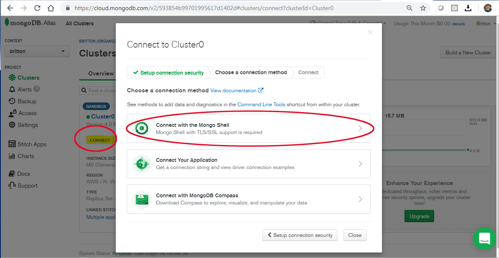
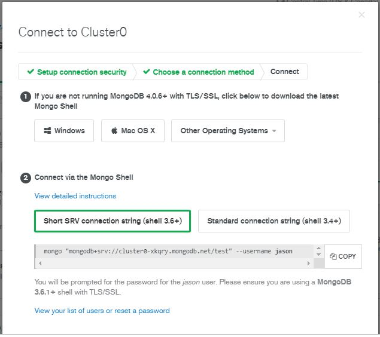
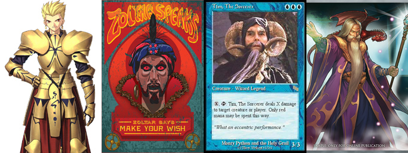

# Transactions

MongoDB has the ability to update multiple different records as part of a single ACID transaction which is guaranteed to either succeed or fail as a whole.

_SA Maintainer_: [Britton LaRoche](mailto:britton.laroche@mongodb.com)


## Description

MongoDB 4.0 and greater is able handle multi document ACID compliant transactions, implemented in a way that is idiomatic for your chosen programming language, and feel familiar to anyone who has used relational databases. A transaction will allow inserting/updating multiple documents which can be commited upon succesful completion of all steps, or rolled back if an error occurs. A transaction in a database system must maintain Atomicity, Consistency, Isolation, and Durability − commonly known as ACID properties − in order to ensure accuracy, completeness, and data integrity.

Our example will focus on an __online game that requires transactions__ for the following activities; trades made between players, new game referrals and updates to the documents which represent player characters.  If all the commands in the transaction are succesful the updates and inserts to player documents are committed and the changes are permanent.  If any errors occur the transaction is rolled back and the player data remains unchanged.

## Setup
__1. Create a Mongo DB Atlas Account__
* If you do not have an existing account you can create free tier account at https://cloud.mongodb.com/
* Registration for a new account is here https://cloud.mongodb.com/user#/atlas/register/accountProfile
* Create a new free tier (M0) cluster with MongoDB version 4.0 or greater.

__2. Download the MongoDB Command Shell__
* The command shell is bunlded with the latest relase of MongoDB https://www.mongodb.com/download-center
* Alternatively you can use curl and command line tools. An example is provided below for Mac users:

```
curl -O https://downloads.mongodb.com/osx/mongodb-osx-x86_64-enterprise-4.0.0-rc0.tgz
tar -xvzf mongodb-osx-x86_64-enterprise-4.0.0-rc0.tgz
rm mongodb-osx-x86_64-enterprise-4.0.0-rc0.tgz
mv mongodb-osx-x86_64-enterprise-4.0.0-rc0  mongodb
```

__3. Start the MongoDB Shell and Connect to your Cluster__
* Obtain the connect string information from your atlas cluster
```
Navigate to the cluster you created and click the connect button.
```

```
Select the "Connect with the Mongo Shell" Option
```



* From the directory in the steps above:
```
cd ./mongodb/bin
Start the mongo shell with the connect information for your cluster
./mongo "mongodb+srv://cluster0-xkqry.mongodb.net" --username zencoder
```

    
## Execution


### Create the game database and insert player data

After connecting to the MongoDB Atlas Cluster we creat the game database with the mongo shell command "use game." Next, we create players by inserting player documents into the player collection.  The final step is to create a unique index on the player name, so no two players can have the same name in the game.

```
// create player collection in the game database with 2 Players 
use game;

db.player.insert({"name": "Zoltar", "class": "Mage", "Gold": 100, "Apples": 10 });
db.player.insert({"name": "Gilgamesh", "class": "Ranger", "Gold": 100, "Apples": 10});

db.player.createIndex( { "name": 1 }, { unique: true } );
```

## Execution
Run each of the following tests sequentially via the Mongo Shell (note later tests may rely on earlier tests having been first run, so ensure you run the tests in order).

### TEST 1: Session Isolation
Multiple sessions are a natural part of database activity as multiple users and processes access the same data at the same time. In this example we create two new sessions _s1_ and _s2_. Session _s1_ will create a new player that will not be visible to session _s2_ until the transaction has been committed. Here we demonstrate read isolation between sessions until data is committed. To provide an isolation level of snapshot with repeatable read from a majority of updated replicas, the following settings are made in the code below on the transaction `s1.startTransaction({readConcern: {level: 'snapshot'}, writeConcern: {w: 'majority'}})`
  ```js
  // Create two sessions, s1 and s2 and start a transaction with s1
  var s1 = db.getMongo().startSession();
  var s2 = db.getMongo().startSession();
  var s1Player = s1.getDatabase('game').getCollection('player');
  var s2Player = s2.getDatabase('game').getCollection('player');
  s1.startTransaction({readConcern: {level: 'snapshot'}, writeConcern: {w: 'majority'}});
  
  // Insert player 3, inside a transaction/session1
  s1Player.insert({"name": "Merlin", "class": "Mage", "Gold": 100, "Apples": 10});
  
  // Use session 2 and find the documents from collection and session1
  s2Player.find();
  // EXPECTED RESULT:
  // {"name": "Zoltar", "class": "Mage", "Gold": 100, "Apples": 10 }
  // {"name": "Gilgamesh", "class": "Ranger", "Gold": 100, "Apples": 10}
  
  // Notice that the insert on session1 is only visible to it.
  s1Player.find()
  // EXPECTED RESULT:
  // {"name": "Zoltar", "class": "Mage", "Gold": 100, "Apples": 10 }
  // {"name": "Gilgamesh", "class": "Ranger", "Gold": 100, "Apples": 10}
  // {"name": "Merlin", "class": "Mage", "Gold": 100, "Apples": 10}"}
  
  // Commit & end the session (if not committed within 60 secs transaction will timeout)
  s1.commitTransaction();
  
  // show the documents after committing the transaction
  s2Player.find();
  // EXPECTED RESULT:
  // {"name": "Zoltar", "class": "Mage", "Gold": 100, "Apples": 10 }
  // {"name": "Gilgamesh, "class": "Ranger", "Gold": 100, "Apples": 10}
  // {"name": "Merlin, "class": "Mage", "Gold": 100, "Apples": 10}"}
  ```

__RESULT 1__: Before the transaction commits, _s2player_ should not see the newly added _Merlin_ record, but after the transaction is committed it should be visible to _s2player_

Here the transaction was committed but because the default transaction timeout is 60 seconds, the transaction would be timed-out and automatically aborted if the above code is not executed quickly enough. This is desired behaviour for transactions in the real world to prevent long running transactions from excessively consuming system resources.


### TEST 2: Multiple Document Updates, Atomicity and Session Isolation
In the game Merlin decides to buy an apple from Zoltar for 2 gold.  This is an exchange of in game currency and items across two player documents. The transaction occurs in session 1 and the updated information is not available in other sessions until the commit is final.  Should an error occur the transaction is rolled back. Here we demonstrate both isolation and the atomicity of the transaction, neither document is actually updated until the changes on both documents are committed.
  ```js
  // Start transaction with Merlin buying an apple from Zoltar for 2 gold
  s1.startTransaction({readConcern: {level: 'snapshot'}, writeConcern: {w: 'majority'}});
  s1Player.updateOne({"name": "Zoltar"}, {"$inc": {"Gold": 2, "Apples": -1} });
  s1Player.updateOne({"name": "Merlin"}, {"$inc": {"Gold": -2, "Apples": 1} });
  
  s1Player.find();
  // EXPECTED RESULT:
  // {"name": "Zoltar", "class": "Mage", "Gold": 102, "Apples": 9 }
  // {"name": "Gilgamesh, "class": "Ranger", "Gold": 100, "Apples": 10}
  // {"name": "Merlin, "class": "Mage", "Gold": 98, "Apples": 11}"}
  
  s2Player.find();
  // EXPECTED RESULT:
  // {"name": "Zoltar", "class": "Mage", "Gold": 100, "Apples": 10 }
  // {"name": "Gilgamesh, "class": "Ranger", "Gold": 100, "Apples": 10}
  // {"name": "Merlin, "class": "Mage", "Gold": 100, "Apples": 10}"}
  
  s1.commitTransaction();
  
  s2Player.find();
  // EXPECTED RESULT:
  // {"name": "Zoltar", "class": "Mage", "Gold": 102, "Apples": 9 }
  // {"name": "Gilgamesh, "class": "Ranger", "Gold": 100, "Apples": 10}
  // {"name": "Merlin, "class": "Mage", "Gold": 98, "Apples": 11}"}
  ```

__RESULT 2__: Before the transaction commits, _s2player_ should see the older values of _gold_ and _apples_ for both _Zoltar_ and _Merlin_, but after the transaction is committed the new values should be visibile to _s2player_


### TEST 3: Multiple Document Updates with Atomicity, Consistency with a Rollback
In this example Zoltar refers a friend. Any friend who successfully creates an account yields a 10 gold reward to the player who referred the friend. Unaware that the name "Merlin" was taken, Zoltar's friend fails to create an account, the transaction is rolled back and Zoltar's player data remains unchanged, he never receives the 10 gold bonus. Here we demonstrate atomicity and consistency as the player data is protected by a rollback when an error occurs.
  ```js
  // Start a transaction with Zoltar refers a friend and gets 10 gold for the account creation
  s1.startTransaction({readConcern: {level: 'snapshot'}, writeConcern: {w: 'majority'}});
  
  s1Player.find({"name": "Zoltar"});
  // EXPECTED RESULT:
  // {"name": "Zoltar", "class": "Mage", "Gold": 102, "Apples": 9 }
  
  s1Player.updateOne({"name": "Zoltar"}, {"$inc": {"Gold": 10} });
  
  s1Player.find({"name": "Zoltar"});
  // EXPECTED RESULT:
  // {"name": "Zoltar", "class": "Mage", "Gold": 112, "Apples": 9 }
  
  s1Player.insert({"name": "Merlin", "class": "Wizard", "Gold": 100, "Apples": 10 });
  // EXPECTED RESULT:
  // WriteCommandError({
  //        "operationTime" : Timestamp(1549657865, 3),
  //        "ok" : 0,
  //        "errmsg" : "E11000 duplicate key error collection: game.player index: name_1 dup key: { : \"Merlin\" }",
  //        "code" : 11000,
  //        "codeName" : "DuplicateKey",
  // })
  
  s1.abortTransaction();
  
  s1Player.find({"name": "Zoltar"});
  // EXPECTED RESULT:
  // {"name": "Zoltar", "class": "Mage", "Gold": 102, "Apples": 9 }
  ```

__RESULT 3__: Before the transaction commits, _s1player_ should see the seemingly updated _gold_ value of _112_ for _Zoltar_, but once the transaction has aborted and hence rolled back, the original value should be seen


### TEST 4: Multiple Document Updates and Retries Leading to Commit
Zoltar's friend tries again to create the account after receiving the error that the name "Merlin" was taken. He retries with a new player name of "Tim" and he is successful. When the transaction commits Zoltar gets the 10 gold. Session 2 can not see the change until the commit completes.
  ```js
  // Start a transaction with Zoltar refers a friend and gets 10 gold for the account creation
  s1.startTransaction({readConcern: {level: 'snapshot'}, writeConcern: {w: 'majority'}});
  
  s1Player.find({"name": "Zoltar"});
  // EXPECTED RESULT:
  // {"name": "Zoltar", "class": "Mage", "Gold": 102, "Apples": 9 }
  
  s1Player.updateOne({"name": "Zoltar"}, {"$inc": {"Gold": 10} });
  
  s1Player.find({"name": "Zoltar"});
  // EXPECTED RESULT:
  // {"name": "Zoltar", "class": "Mage", "Gold": 112, "Apples": 9 }
  
  s2Player.find({"name": "Zoltar"});
  // EXPECTED RESULT:
  // {"name": "Zoltar", "class": "Mage", "Gold": 102, "Apples": 9 }
  
  s1Player.insert({"name": "Tim", "class": "Wizard", "Gold": 100, "Apples": 10 });
  
  s1.commitTransaction();
  
  s2Player.find({"name": "Zoltar"});
  // EXPECTED RESULT:
  // {"name": "Zoltar", "class": "Mage", "Gold": 112, "Apples": 9 }
  
  ```

__RESULT 4__: Before the transaction commits, _s1player_ should see the seemingly updated _gold_ value of _112_ for _Zoltar_ and _s2player_ should still see the original value, but once the transaction has committed, the new value should be visible to _s2player_


## Measurement

For the four tests, the four respective __RESULT__ results shown above should be observed. In summary the observations should be:

* __RESULT 1__: Before the transaction commits, for a single update, other sessions should not see changes made by a separate transaction, and only see them when the transaction is committed
* __RESULT 2__: Before the transaction commits, for multiple updates, other sessions should not see changes made by a separate transaction, and only see them when the transaction is committed
* __RESULT 3__: Before the transaction commits, the transaction section that updates some fields should be able to see those changes, but once the transaction has aborted and rolled-back, the session should now see the original values
* __RESULT 4__: Before the transaction commits, the transaction section that updates some fields should be able to see those changes whereas the other session should only see the original values, but once the transaction has committed, all sessions should see the new values


### 5. Multiple document updates and retrys leading to commit
Zoltar's friend retries to create the account after recieveing an error that the name "Merlin" was taken.  He retries with a new player name of "Tim" and he is succesful.  When the transaction commits Zoltar gets the 10 gold.  Session 2 can not see the change until the commit completes.

```
s1.startTransaction({readConcern: {level: 'snapshot'}, writeConcern: {w: 'majority'}});

s1Player.updateOne({"name": "Zoltar"}, {"$inc": {"Gold": 10} });
s1Player.find({"name": "Zoltar"});
// {"name": "Zoltar", "class": "Mage", "Gold": 112, "Apples": 9 }

s2Player.find({"name": "Zoltar"});
// {"name": "Zoltar", "class": "Mage", "Gold": 102, "Apples": 9 }

s1Player.insert({"name": "Tim", "class": "Wizard", "Gold": 100, "Apples": 10 });
s1.commitTransaction();

s2Player.find({"name": "Zoltar"});
// {"name": "Zoltar", "class": "Mage", "Gold": 112, "Apples": 9 }


```

### 6. Insuring isolation, working with functions, wrapping transactions in retry logic
The MongoDB shell allows us to wrap logic in functions. Lets explore the ability to retry a transaction that may have a conflict with another transaction running at the same time.  Let's examine the function below

```
function commitWithRetry(session) {
    while (true) {
        try {
            session.commitTransaction(); // Uses write concern set at transaction start.
            print("Transaction committed.");
            break;
        } catch (error) {
            // Can retry commit
            if (error.hasOwnProperty("errorLabels") && error.errorLabels.includes( "UnknownTransactionCommitResult") ) {
                print("UnknownTransactionCommitResult, retrying commit operation ...");
                continue;
            } else {
                print("Error during commit ...");
                throw error;
            }
       }
    }
}
```
The function above allows us to catch an "UnknownTransactionCommitResult."  We can replace the error text with an error of our choosing to handle multiple types of possible transaction errors.  Assume we have a new auction system that allows players to sell auction items to eachother.  Our new system is advanced in that it allows partial purchases based on quantity and transfers gold and items directly into the player accounts.  In this example Gilgamesh is selling 10 healing potions at 3 gold each.

```
db.auction.insert({"auctionId": 101, "name": "Gilgamesh", "Item": "HeathPotion", "Quantity": 10, "UnitPrice": 3 });
db.auction.createIndex( { "auctionId": 1 }, { unique: true } );
```

The following function will allow a player to purchase the health potions or any other item in partial quantities.

```
function purchaseAuctionItem(session, aAuctionId, aPName, aQuantity) {
    playerC = session.getDatabase("game").player;
    auctionC = session.getDatabase("game").auction;
   
    session.startTransaction( { readConcern: { level: "snapshot" }, writeConcern: { w: "majority" } } );

    try{
    	var vAuction = auctionC.findOne({"auctionId": aAuctionId});
    	var vSellingPlayerName =  vAuction.name;
    	var vPlayer = playerC.findOne({"name": aPName});
    	var vQuantity = vAuction.Quantity;
    	var vItem = vAuction.Item;
    	var vUnitPrice = vAuction.UnitPrice;
    	var vGold = vPlayer.Gold;
    	var vTotalQuantity = aQuantity;
    	
	//Can only buy what is there
	if ( vQuantity < aQuantity ) {
		vTotalQuantity = vQuantity;
	}
	    	
	var vTotalPrice = vUnitPrice * vTotalQuantity;
    	
	//Check if the player can afford the auction item and quantity
	if ( vTotalPrice <= vGold ) {
	   //Transact the quantity and price:  
	   //Deduct price from buying player gold, incriment quantity of item
	   //Decriment quantity of auction
	   //Increment gold on selling player
	   playerC.updateOne({"name": aPName}, {"$inc": {"Gold": vTotalPrice * -1, [vItem]: vTotalQuantity} }); 
	   auctionC.updateOne({"auctionId": aAuctionId}, {"$inc": {"Quantity": vTotalQuantity * -1} });
	   playerC.updateOne({"name": vSellingPlayerName }, {"$inc": {"Gold": vTotalPrice} });
    	}
    
    } catch (error) {
        print("Caught exception during transaction, aborting.");
        session.abortTransaction();
        throw error;
    }

    commitWithRetry(session);
}
```

Notice that this function takes advantage of the "commitWithRetry" function.  This is useful if we have locking and concurrency issues as mutliple players try to buy the items at the same time.   Suppose we have Zoltar and Merlin trying to buy the helaing postions at the same time.  Zoltar wishes to buy 6 while Merlin wants to buy 5.  If the session is locked we can fail and let the player retry or put the transaction in a retry loop.  Both players combined want to by 11 healing potions, when only 10 are in the auction house inventory.

```
//run the auction functions
purchaseAuctionItem(s1, 101, "Zoltar", 6);
purchaseAuctionItem(s2, 101, "Merlin", 5);

//End the sessions
s1.endSession()
s2.endSession()

//look at the player and auction data
db.player.find()
db.auction.find()
```


## Measurement

In this POV we have demonstrated atomitcy, consitency, isolation, and by durability bydefault with Atlas. Commits and rollbacks across mutliple documents insuring ACID compliance with MongoDB 4.0 Transactions. Further definitions of each component of ACID compliance are listed below.

__Atomicity__: Database transactions, like atoms, can be broken down into smaller parts. When it comes to your database, atomicity refers to the integrity of the entire database transaction, not just a component of it. In other words, if one part of a transaction doesn’t work like it’s supposed to, the other will fail as a result—and vice versa. For example, if you’re collecting a referral bonus on an online game site, you must have a friend complete the sign up process in order to get the bonus. What you can’t do is get paid for a player that’s not created in the game. (Your friend can start the sign up process, but that database transaction won’t be complete, and thus not ‘atomic’, until the player is created).

__Consistency__: For any database to operate as it’s intended to operate, it must follow the appropriate data validation rules. Thus, consistency means that only data which follows those rules is permitted to be written to the database. If a transaction occurs and results in data that does not follow the rules of the database, it will be ‘rolled back’ to a previous iteration of itself (or ‘state’) which complies with the rules. On the other hand, following a successful transaction, new data will be added to the database and the resulting state will be consistent with existing rules.

__Isolation__: It’s safe to say that at any given time on an online game, there is far more than one transaction occurring on the platform. In fact, an incredibly huge amount of database transactions are occurring simultaneously. For a database, isolation refers to the ability to concurrently process multiple transactions in a way that one does not affect another. So, imagine you and your neighbor are both trying to buy something from the same in game auction house at on the platform at the same time. There are 10 items for sale: your neighbor wants five and you want six. Isolation means that one of those transactions would be completed ahead of the other one. In other words, if your neighbor clicked first, they will get five items, and only five items will be remaining in stock. So you will only get to buy five items. If you clicked first, you will get the six items you want, and they will only get four. Thus, isolation ensures that eleven items aren’t sold when only ten exist.


__Durability__: All technology fails from time to time… the goal is to make those failures invisible to the end-user. In databases that possess durability, data is saved once a transaction is completed, even if a power outage or system failure occurs. Imagine a team of your players storms the castle slays the dragon and after hours of work gets an incredibly rare loot drop. The team is excited, especially the player that obtained the item.  However if that database lacks durability, even after the rare item was obtained and confirmed, if the database suffers a failure incident that transaction would still be lost! As you might expect, this is a really bad thing to happen for an online gaming site, so transaction durability is a must-have.

