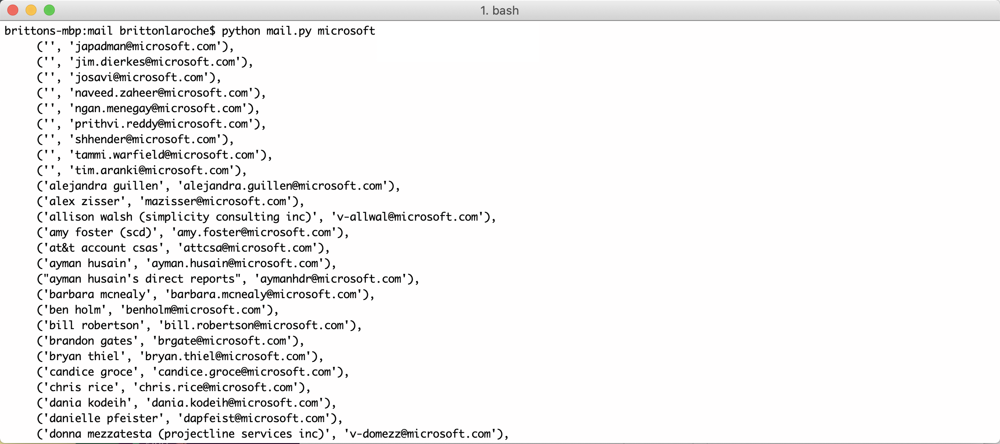

# Gmail contact creator

## Getting started
Its a 5 step process to be a pro at creating your own personal contact list based on your gmail account.  Any email or meeting invite sent via email will have a list of contacts you can search with this script. This script gathers everyone in the email chain, from, to and cc and gathers their first and last name if provided and generates a list while removing everyone from mongodb or 10gen.

1. Be sure you have python istalled.
2. Copy the source file ---> [here](https://raw.githubusercontent.com/brittonlaroche/MongoDB-Demos/master/util/mail/source/mail.py) <--- and save it as mail.py.
3. Set up a google app password 
4. Run the program and specify the company name you wish to generate email contacts for
5. Clean the output and import into google sheets

The whole file is here for simplicity
```py
import imaplib, email, sys
from pprint import pprint as pp
#--------------------------------------------------------------------------------------
#-- Author: Britton LaRoche
#-- Company: MongoDB
#-- Date: 04/03/2020
#--------------------------------------------------------------------------------------
#- Notes:
#- You will need to modify the login and password with a google app pasword key
#- See the following url to get the app password: 
#- https://support.google.com/accounts/answer/185833
#
#- Replace this line with your information:
#- mail.login('your.name@10gen.com','yourapppassword')
#
#- Original file by Jerry Neumann: https://www.quora.com/ post on how to get addresses 
#- from your own gmail account.
#- This file was modified to look for a particluar company name in the to address field
#- It will search the whole thread and give you a list of all the TO, CC and From 
#- addresses in your inbox
#- It has been modified to filter out all the MongoDB and 10gen email adresses.
#- simply call:
#- 
#- python mail.py companyname
#- to export to a file use the redirect command
#- python mail.py companyname > companyname.txt
#--------------------------------------------------------------------------------------
def split_addrs(s):
    #split an address list into list of tuples of (name,address)
    if not(s): return []
    s = s.lower()
    outQ = True
    cut = -1
    res = []
    check = 0
    for i in range(len(s)):
        if s[i]=='"': outQ = not(outQ)
        if outQ and s[i]==',':
            check = check_unwanted(str(email.utils.parseaddr(s[cut+1:i])))
            if (check == -1):
                res.append(email.utils.parseaddr(s[cut+1:i]))
            cut=i
    check = check_unwanted(str(email.utils.parseaddr(s[cut+1:i+1])))
    if (check == -1 ):
        res.append(email.utils.parseaddr(s[cut+1:i+1]))
    return res

def check_unwanted(sAddr):
    #check for our company and filter out the results
    found = -1
    found = sAddr.find('10gen')
    if (found > 0 ):
        return found
    found =  sAddr.find('mongodb')  
    return found

mail=imaplib.IMAP4_SSL('imap.gmail.com')
mail.login('your.name@10gen.com','yourapppassword')
mail.select("inbox")
company = ''
if (len(sys.argv) == 2):
    company = sys.argv[1]
if (len(company) == 0 ):
    company = raw_input("enter company abbreviation in email address ie: 7-11 or att: ")
result,data=mail.search(None,'(TO "' + company + '")')
ids=data[0].split()
msgs = mail.fetch(','.join(ids),'(BODY.PEEK[HEADER])')[1][0::2]
addr=[]
for x,msg in msgs:
    msgobj = email.message_from_string(msg)
    addr.extend(split_addrs(msgobj['to']))
    addr.extend(split_addrs(msgobj['from']))
    addr.extend(split_addrs(msgobj['cc']))
pp(set(addr))
```

## Step 3 - Set up a google app password
Follow the instructions here: https://support.google.com/accounts/answer/185833

1. Go to your [Google Account](https://myaccount.google.com/)   
2. On the left navigation panel, choose Security.   
3. On the "Signing in to Google" panel, choose App Passwords. If you don’t see this option:   
    2-Step Verification is not set up for your account.    
    2-Step Verification is set up for security keys only.   
    Your account is through work, school, or other organization.    
    You’ve turned on Advanced Protection for your account.    
4. At the bottom, choose Select app and choose the app you’re using.   
5. Choose Select device and choose the device you’re using.  (this will be your mac)   
6. Choose Generate.    
7. Follow the instructions to enter the App Password. The App Password is the 16-character code in the yellow bar on your device.
Choose Done.    
    Take this app key and replace the line in the script with your own (line 58). 
``` mail.login('your.name@10gen.com','yourapppassword') ```

## Step 4. Run the program and specify the company name

In this example we run the program to get a list of contacts from your email for our partners at microsoft.  My contacts will most likely be different from yours, and this gives us a personal touch.  You may need to set persmissions on the file.  I open a terminal and use a quick effective way of getting the job done.

```chmod 755 mail.py```

To run the script and get our personal microsoft contacts issue the following form the terminal window:

```python mail.py microsoft```

Notice we just specify "microsoft" and not "microsoft.com" the script appends the ".com" to the company name.

   

The output lists names or emails that are not paired first.  Most of these are not unique and will be found in the secton that lists both names and emails.  Just depends on the emails in your gmail account as to what was included.  You can inspect them and keep them or just use the complete list.

To output the results to a file just use the unix redirect "> microsoft.txt":
```python mail.py microsoft > microsoft.txt```

## Step 5. Clean the output and import into google sheets

I open the .txt file in a text editor or code tool of my choice (I use brackets or vscode) I replace all the "(", ")", single quotes and tab spaces so they are removed and then save the file with a .csv extension.  Then I open a google sheet and import the data.  Once its imported we are ready to split the name into seperate fields use "=SPLIT(A1,",") to split the name field into two fields. Now its ready to cut and paste into the spread sheet for the challenge.
